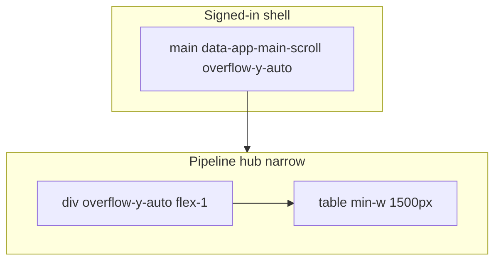

# Mobile architecture assessment

**Audit date:** 2026-05-07 · **Diagnostic only.**

---

## 1. Executive summary

The platform has a **deliberate, advanced shell architecture** (locked body, flex `min-h-0` discipline, overlay drawers with bounded scroll, sticky pipeline file chrome with measured heights). This is **production-grade in intent**.

However, **route-level implementation diverges** from the **canonical single-scroll story**: the **pipeline list** introduces a **nested vertical scrollport** + **wide table**, and **automated CI** (`ci-mobile-scroll`) **fails** because `<main>` is not the element scrolling. That mismatch is **systemic**: it touches docs, tests, and user mental models—not a one-off bug.

**Health grades:**

| System | Grade | Note |
|--------|-------|------|
| App shell / `AppChrome` | **B+** | Solid primitives |
| Mobile chrome controller | **B-** | Powerful; scroll-linked layout risk |
| Pipeline file workspace | **B** | Sticky/RO complexity; prior R-storms |
| Pipeline list (mobile) | **D+** | Nested scroll + desktop table on phone |
| Drawers (task/lender) | **A-** | Matches `AGENTS.md` bounded scroll |
| Portal | **Incomplete** | Unknown parity |
| Testing architecture | **C+** | Good seeds; incomplete route matrix |

---

## 2. Systemic patterns

### Healthy patterns

- **`min-h-0` + `flex-1` + `overflow-y-auto`** on drawers and modals.
- **`touch-scroll-y`** utility for momentum where applied.
- **Tokenized** MD surfaces/shadows — central design system.
- **Section IDs / test IDs** for pipeline workspace — QA-friendly.

### Anti-patterns (recurring)

1. **Nested scrollports** both **intentional** (tables inside main) and **incidental** (lists in panels) without always updating **global scroll philosophy**.
2. **Wide `min-w` tables** as the **primary** mobile pipeline experience.
3. **`touch-pan-xy`** combined with nested scroll — gesture ambiguity.
4. **Documentation drift** (`AGENTS.md` vs `PipelinePageClient` comments vs `PipelineFileWorkspace` reality).

---

## 3. Scroll ownership model (current reality)

On `/pipeline` (narrow), **`T` absorbs vertical overflow** → `<main>` may not scroll → **CI expectation fails**.

**Contrast:** Pipeline **file** page tries to keep vertical scroll on `<main>` with sticky inside — **different** model than hub.

---

## 4. Stable vs unstable layout systems

| System | Stability |
|--------|-----------|
| Locked `html/body` | **Stable** — intentional |
| Drawer aside scroll | **Stable** — if `min-h-0` chain holds |
| Pipeline table inner scroll | **Stable but controversial** — conflicts with global narrative |
| Mobile compact / IO + padding | **Unstable** — prior R1–R2 |
| Dynamic sticky height vars | **Unstable** — prior R3 |

---

## 5. Surgical vs architectural fixes (preview)

| Topic | Surgical | Architectural |
|-------|----------|----------------|
| Wrong comment / docs | ✅ Update `AGENTS.md`, remove false comment | |
| CI scroll test | ✅ Scroll correct element or split contract | |
| Pipeline mobile UX | Partial (column hide) | ✅ Card list / responsive table / virtualize |
| Chrome jitter | Hysteresis, sequence transitions | ✅ Decouple padding from measurement |

---

## 6. Testing architecture gaps

- **Custom devices:** iPhone 15 Pro Max, Android tablet preset.
- **Route matrix:** portal, ledger, documents, settings, lenders deep flows.
- **Keyboard / orientation:** manual or dedicated Playwright projects.

---

*See `mobile-fix-roadmap.md` for ordering.*
