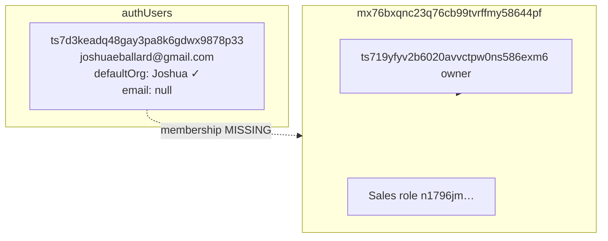
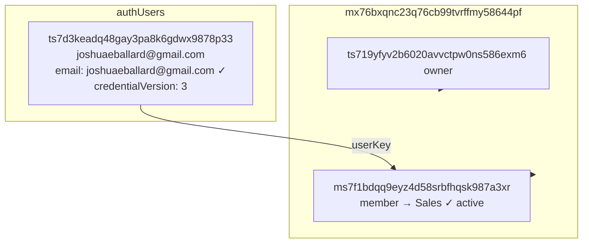

# Phase 12.2 Step 8A — Eballard Re-Invite Failure Repair

**Date:** 2026-05-21  
**Deployment:** `basic-anaconda-984` (`https://basic-anaconda-984.convex.cloud`)  
**Production app:** https://dlcfunds.vercel.app  
**Operator audit:** `operator/auditEballardReinviteStep8A:auditEballardReinvite`  
**Repair:** `operator/auditEballardReinviteStep8A:repairEballardMembership`  
**Re-invite cycle:** `operator/auditEballardReinviteStep8A:validateEballardReinviteCycle`  
**Evidence:** `migration-reports/phase12-step8A-eballard-repair.json`

---

## Summary

Re-adding `joshuaeballard@gmail.com` from Joshua's org (Team Management → Create User) failed with a generic **Server Error** (`[Request ID: 9d56a0de05462734]`). Production forensics showed the auth user existed but **org membership was missing** after a prior removal. The re-invite UI path called `createOrgMemberUser`, which invoked `assertCanonicalAuthAvailable()` **before** checking for an existing user — throwing `USERNAME_TAKEN` / `EMAIL_TAKEN` instead of restoring membership.

**Root cause:** product bug in `createOrgMemberUser` (wrong call order) compounded by missing membership row.  
**Repair:** restored clean Joshua-org membership + canonical email field; fixed re-invite logic.  
**Validation:** remove → re-invite → login → pipeline access — **ALL_CHECKS_PASSED**.

---

## 1. Root cause

### Failure surface

| Item | Value |
|------|-------|
| Actor | `joshua@directlendingconnection.com` (`ts719yfyv2b6020avvctpw0ns586exm6`) |
| Target | `joshuaeballard@gmail.com` |
| UI path | Settings → Team Management → Create User |
| API | `POST /api/org/team/create-user` |
| Convex mutation | `teamManagement.createOrgMemberUser` |
| Error | `[Request ID: 9d56a0de05462734] Server Error` |

### Code defect (primary)

`createOrgMemberUser` called `assertCanonicalAuthAvailable()` unconditionally at the start of the handler. For an email that already exists as an `authUsers` row, this throws:

```
USERNAME_TAKEN: …
EMAIL_TAKEN: …
```

The mutation never reached membership restoration logic. The API route surfaced the Convex error as a generic 400/500 **Server Error** rather than a re-invite success path.

**Fix:** check `findAuthUserByCanonicalLogin()` first; if user exists, call `reinviteExistingUserToOrg()` (restore membership + update password + bump credentials). Only call `assertCanonicalAuthAvailable()` for genuinely new users.

### Data state (secondary)

Production audit **before repair** showed:

| Check | Result |
|-------|--------|
| Duplicate `authUsers` | No (count = 1) |
| Canonical identity | Valid |
| Joshua org membership | **Missing** (`missingMembership: true`) |
| Stale email-key membership rows | 0 |
| Stale alias membership rows | 0 |
| Duplicate membership rows | 0 |
| Invalid assigned role | N/A (no membership) |
| `defaultOrganizationId` mismatch | No (already Joshua org) |
| Pending invites table | N/A (native auth — no separate invite rows) |
| FK drift | None observed |
| Session state | 1 historical session, 0 active |

Membership was removed in a prior admin action (Step 4 KEEP decision preserved the auth user but membership had since been deleted). Re-invite via "Create User" then hit the username-taken guard instead of re-adding the member.

---

## 2. Production forensic audit

### Constants

| Entity | Id |
|--------|-----|
| Joshua org | `mx76bxqnc23q76cb99tvrffmy58644pf` |
| Joshua user | `ts719yfyv2b6020avvctpw0ns586exm6` |
| Eballard user | `ts7d3keadq48gay3pa8k6gdwx9878p33` |
| Sales role (Joshua org) | `n1796jmexskdpa9x7t6bca6rfx879e8f` |

### Before repair — auth graph



### Diagnose snapshot (pre-repair)

| Field | Value |
|-------|-------|
| `userExists` | true |
| `membershipActive` | **false** |
| `membershipRole` | null |
| `defaultOrgValid` | true |
| `identityCanonical` | true |
| `argon2HashFormatValid` | true |
| `credentialVersion` | 2 |

---

## 3. Repair actions

### Operator repair (`repairEballardMembership`, live)

| Action | Detail |
|--------|--------|
| Stale alias membership purge | 0 rows deleted |
| Duplicate membership dedupe | 0 rows deleted |
| Membership insert | `ms74xyes8wxyzk78vctq5vpj5h87av3h` → Sales role, active |
| Auth user patch | `email` backfilled to `joshuaeballard@gmail.com` |
| Business data | **Not deleted** (no pipeline/tasks/contacts touched) |

### Code repair (shipped)

| File | Change |
|------|--------|
| `convex/orgMemberReinvite.ts` | Shared `reinviteExistingUserToOrg()` helper |
| `convex/teamManagement.ts` | Existing-user branch before `assertCanonicalAuthAvailable` |
| `convex/operator/auditEballardReinviteStep8A.ts` | Forensic audit, repair, validate cycle |
| `app/api/org/team/create-user/route.ts` | `EMAIL_TAKEN` → 409 mapping |

---

## 4. After repair — auth graph



### Invite blockers (after)

| Blocker | Status |
|---------|--------|
| `missingMembership` | false |
| `duplicateAuthUsers` | false |
| `duplicateMembershipRows` | false |
| `staleAliasMembershipRows` | 0 |
| `invalidAssignedRole` | false |
| `defaultOrgMismatch` | false |

---

## 5. Re-invite cycle proof

Operator mutation `validateEballardReinviteCycle` simulates the full admin re-add path:

1. **Remove** membership row (`ms74xyes8wxyzk78vctq5vpj5h87av3h`)
2. **Re-invite** via `reinviteExistingUserToOrg` (same logic as fixed `createOrgMemberUser`)
3. **Verify** exactly one active membership restored

| Step | Result |
|------|--------|
| Membership removed | 1 row |
| Re-invite | `reinvited: true` |
| Final membership count | 1 |
| New membership id | `ms7f1bdqq9eyz4d58srbfhqsk987a3xr` |
| Cycle pass | **true** |

### Live login validation

```bash
PROD_LOGIN_EMAIL=joshuaeballard@gmail.com \
PROD_LOGIN_PASSWORD='Phase12Step8A!Reinvite2026' \
npm run auth:validate
```

| Check | Result |
|-------|--------|
| Login success | PASS |
| Session persistence | PASS |
| Refresh persistence | PASS |
| Organization resolution | PASS |
| Logout / relogin | PASS |
| Permission resolution (Settings + Organization nav) | PASS |
| Dashboard access (/tasks) | PASS |

**ALL_CHECKS_PASSED** on https://dlcfunds.vercel.app

---

## 6. Exact repaired records

### `authUsers` — `ts7d3keadq48gay3pa8k6gdwx9878p33`

| Field | Before | After |
|-------|--------|-------|
| `normalizedUsername` | `joshuaeballard@gmail.com` | unchanged |
| `usernameNormalized` | `joshuaeballard@gmail.com` | unchanged |
| `email` | `null` | `joshuaeballard@gmail.com` |
| `defaultOrganizationId` | Joshua org | unchanged |
| `credentialVersion` | 2 | 3 (post re-invite cycle password reset) |

### `organizationMembers` (Joshua org)

| Field | Before | After |
|-------|--------|-------|
| Row count for eballard userKey | 0 | 1 |
| `memberId` | — | `ms7f1bdqq9eyz4d58srbfhqsk987a3xr` |
| `role` | — | `member` |
| `assignedRoleId` | — | `n1796jmexskdpa9x7t6bca6rfx879e8f` (Sales) |
| `isActive` | — | `true` |

### Deleted / purged

None. No business data, pipeline files, tasks, or auth user rows were deleted.

---

## 7. Validation commands (completed)

From `lender-app/`:

| Command | Result |
|---------|--------|
| `npm run convex:codegen` | OK |
| `npm run build` | OK |
| `npm run convex:deploy:prod` | OK → `basic-anaconda-984` |
| `npm run deploy:prod` | OK → https://dlcfunds.vercel.app |
| `npm run auth:validate` (eballard) | ALL_CHECKS_PASSED |

Operator script:

```bash
npx tsx scripts/run-phase12-step8A-eballard-repair.ts
```

---

## 8. Scope boundaries (unchanged)

Per Step 8A instructions — **not touched**:

- Task visibility rules
- Organization display naming
- E2E Primary org (`mx7bfa58ty1svx65bt3h8v6v5186kke9`)
- Any business data outside auth/membership repair

---

## 9. Operator re-run reference

```bash
# Forensic audit
npx convex run --prod operator/auditEballardReinviteStep8A:auditEballardReinvite \
  '{"adminSecret":"…"}'

# Repair (dry-run then live)
npx convex run --prod operator/auditEballardReinviteStep8A:repairEballardMembership \
  '{"adminSecret":"…","dryRun":true}'
npx convex run --prod operator/auditEballardReinviteStep8A:repairEballardMembership \
  '{"adminSecret":"…","dryRun":false}'

# Re-invite cycle
npx convex run --prod operator/auditEballardReinviteStep8A:validateEballardReinviteCycle \
  '{"adminSecret":"…","actorUserKey":"ts719yfyv2b6020avvctpw0ns586exm6","passwordHash":"…"}'
```

---

**Status:** Step 8A complete. Awaiting next instruction (Step 8B+).
