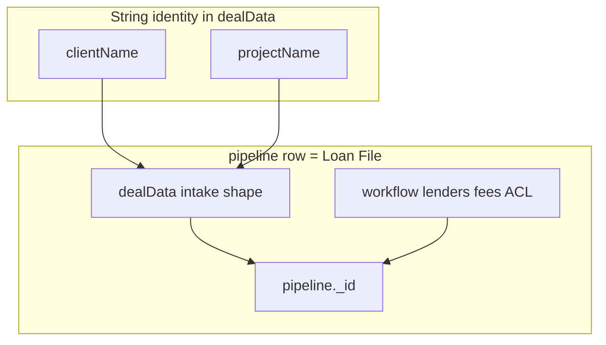

# Phase 13.3 Step 1 — Pipeline architecture forensic audit

**Status:** Read-only audit complete (no schema changes, no data writes, no production deploy)  
**Date:** 2026-05-21  
**Evidence:** `migration-reports/phase13-step3-pipeline-architecture-audit.json`

## Executive summary

Today the product’s **loan file** is a single Convex `pipeline` row. **Client** and **project** identity are **string fields inside the intake-shaped deal payload** (`pipeline.dealData.clientName`, `pipeline.dealData.projectName`, mirrored from legacy `intakeSheets`), not first-class parent entities. Production (canonical org) has **12 loan files**, **12 distinct client+project pairs**, and **zero** cases of multiple files sharing the same client+project key—so the hierarchy is **encoded but not exercised at scale**.

The safest path to **Client → Project → Loan File** is **Path A: new parent tables** with phased backfill and dual-read, not an in-place rename of `pipeline` alone.

---

## 1. Current schema inventory

Legend for classification:

| Class | Meaning |
|-------|---------|
| **client identity** | Who the borrower/client is (name, business legal name, borrowers[]) |
| **project identity** | Named engagement / deal container under a client |
| **loan identity** | One financed opportunity (amount, stage, lenders, fees, file workflow) |
| **presentation-only** | UI labels, display strings, layout state |
| **legacy debt** | Superseded tables/fields still read or synced |
| **candidate for extraction** | Should move to `clients` / `projects` / stay on loan file |

### Core: `pipeline` (loan file row)

| Field / group | Classification | Notes |
|---------------|----------------|-------|
| `fileName` | presentation + loan | Often `{client} – {project}`; not a stable FK |
| `dealData` (full intake shape) | client + project + loan | **Canonical borrower/property/commercial payload**; includes `clientName`, `projectName`, borrowers, cover, loans, business, etc. |
| `intakeSheetId` | legacy debt | Optional link to standalone `intakeSheets`; prod org rows: **0** linked |
| `status` | loan (workflow) | Free-text stage label (legacy string funnel) |
| `stageId`, `subStageId` | loan (workflow) | Org-configurable parent/sub stages (Phase 12.1) |
| `fundingAmount`, `rate`, `term`, fees, `netToUser`, … | loan | File economics shell; see `lib/deal/canonicalDataModel.ts` |
| `commission`, `netRevenue`, `fileSharedState` | loan / revenue | Tracked revenue mirrors |
| `lenders`, `selectedLenderId`, `selectedLenderSentAt` | loan | Per-file lender shopping |
| `scenario`, `scenarioCriteria` | loan | Lender match scratch |
| `contacts[]` (embedded) | client (legacy) | Inline contact objects on file; parallel to `contactFileLinks` |
| `assigneeId`, `sharedWithIds` | loan (legacy scaffolding) | Superseded by `resourceShares` for ACL |
| `ownerUserId`, `ownerUserKey`, `organizationId` | loan (ownership) | Row-level owner; org scope |
| `archivedAt`, `snoozedUntil` | loan | Hub visibility |
| `fileDrawerLayout`, `fileBlockFieldOverrides` | presentation-only | Workspace block order/settings |
| `globalSearchText` | presentation-only | Denormalized search blob |
| `propertyAddress`, `loNmls`, `brokerNmls` | loan / legacy | Prefer `dealData` when deal-backed |
| `projectIntoLedger` | loan | Ledger projection flag |
| `termOptions` | loan | Generate-terms drafts |
| `demoBundleId` | legacy debt | Demo workspace seeding |
| `createdAt`, `updatedAt` | loan | |

**Indexes:** `by_status`, `by_stageId`, `by_organization_createdAt`, `by_intakeSheetId`, `global_search` (+ `global_search_all`).

### `intakeSheets` (legacy standalone deal documents)

| Field | Classification | Notes |
|-------|----------------|-------|
| `clientName`, `projectName` | **client / project identity** (strings) | Indexed `by_client`; only **2** rows prod-wide |
| `fileName`, `fundingType`, borrowers, cover, … | loan payload | Same shape as `dealData` |
| `dealWorkspaceLayout`, `dealAnalysisLayout` | presentation-only | |
| `ownerName` | legacy debt | Pre-auth creator label |

**Relationship:** `pipeline.intakeSheetId` optional; new files use embedded `dealData` only (`createFileWithDeal`).

### Stages

| Table | Role | Classification |
|-------|------|----------------|
| `organizationPipelineStages` | Org funnel parents | loan workflow config |
| `organizationPipelineSubStages` | Nested substages | loan workflow config |

Files reference `stageId` / `subStageId` but **`status` string remains** (dual model).

### Contacts (CRM)

| Table | Role | Classification |
|-------|------|----------------|
| `contacts` | Standalone CRM | client identity (directory) |
| `contactFileLinks` | M:N file ↔ contact | loan attachment (17 prod links) |
| `contactLenderLinks` | M:N contact ↔ lender | directory |
| `contactActivity` | CRM audit | activity (optional `relatedFileId`) |
| `pipeline.contacts[]` | Embedded on file | **legacy debt** |

### Lenders

| Table | Role |
|-------|------|
| `lenders` | Catalog (org-scoped or global) |
| `pipeline.lenders[]`, `selectedLenderId` | Per-**loan file** attachment |

### Tasks

| Field | Classification |
|-------|----------------|
| `tasks.*` | Org-scoped work items |
| `tasks.relatedFileId` | Optional → **one loan file** (1 prod link) |
| `tasks.ownerUserId` | Row owner (56 tasks; ownership backfill separate from files) |

No `relatedProjectId` or `relatedClientId`.

### Activity

| Table | Scope |
|-------|-------|
| `pipelineFileActivity` | Per-file audit (capped); kinds include share_*, deal_patch, etc. |
| `activityFeed` | Org/user scope + optional `fileId` (245 prod rows with fileId) |
| `activityEvents` | Integration/automation events |

Share lines now use **actor username** (Phase 13.2); still **file-scoped** or org-scoped, not project-scoped.

### Notes

| Location | Classification |
|----------|----------------|
| `pipeline.notes` | loan |
| `dealData` primaryObjective / additionalNotes | loan |
| `FileNotesBlock` | presentation |

### Revenue

| Location | Classification |
|----------|----------------|
| `pipeline.commission`, `netRevenue`, `fileSharedState` | loan-level tracked revenue |
| `revenue.aggregateForOrganization` | Sums **per visible file** |
| `ledger` + `payments` | **One ledger row per funded file** (`fileId` FK); 3 prod ledger rows / 3 files |

No project-level revenue rollup table.

### Sharing / ownership

| Table | Role |
|-------|------|
| `resourceShares` | **Canonical ACL** (`resourceType`: `pipeline` \| `task`, `resourceId` string) |
| `resourceAccessDenials` | Explicit denials |
| `pipelineFileShares` | **Legacy debt** (0 prod rows on canonical org) |
| `pipelineSharePendingInvites` | Email pending invites (Phase 13.1A) |
| `ownerUserId` on `pipeline` | Row owner |

ACL is **per loan file**, not per client or project.

### Search

| Mechanism | Classification |
|-----------|----------------|
| `pipeline.globalSearchText` | Denormalized; includes `dealData.clientName`, `dealData.projectName` via `lib/globalSearchText.ts` |
| `globalSearch.search` | Org-scoped; hits are **files**, tasks, contacts, lenders |
| Convex `global_search` index | Filter `organizationId` |

### Saved views / filters / workspace state

| Store | Classification | Notes |
|-------|----------------|-------|
| `lib/pipeline/pipelineHubPersistence.ts` | presentation-only | localStorage hub filters + saved views (`dlc.pipeline.hub.views.v1`) — **not server-backed** |
| `savedFilterPresets` | presentation-only | **Lender browse** smart lists only — not pipeline hub |
| `userPreferences` | presentation-only | Account prefs, drawer defaults |
| `pipelineFileUserTemplates` | presentation-only | New-file templates |
| `pipelineGlobalBlockConfig` | presentation-only | Global block policy |

### Workspace state (per file)

| Field | Classification |
|-------|----------------|
| `fileDrawerLayout` | presentation-only |
| `fileBlockFieldOverrides`, `fileSharedState` | loan workspace “data bus” |
| `PIPELINE_FILE_WORKSPACE_UTILITIES_STORAGE_KEY` | client localStorage |

### Adjacent pipeline-adjacent tables (file FK)

| Table | FK |
|-------|-----|
| `libraryDocumentLinks.pipelineFileId` | loan file |
| `fileMessages.pipelineFileId` | loan file |
| `clientPortalGrants.pipelineFileId` | loan file |
| `signatureEnvelopes` / collaboration | file-scoped |
| `presence` | file-scoped |
| `userNotifications.fileId` | optional file |
| `webhookOutbound` events | `pipeline.file.*` event types |

---

## 2. Relationship reality (production)

**Method:** Read-only Convex inline query on production (`npx convex run --prod --inline-query`, no writes).

### Canonical org `mx76bxqnc23q76cb99tvrffmy58644pf`

| Metric | Count |
|--------|------:|
| Pipeline files | 12 |
| Distinct normalized `clientName + projectName` pairs | 12 |
| Distinct clients | 12 |
| Groups with **>1 file** per client+project | **0** |
| Clients spanning **>1 project** (multiple files) | **0** |
| Files with `dealData` | 12 |
| Files with `intakeSheetId` | 0 |
| Tasks | 56 |
| Tasks with `relatedFileId` | 1 |
| `contactFileLinks` | 17 |
| `resourceShares` (pipeline) | 2 |
| Activity feed rows with `fileId` | 245 |

### Implicit encoding today



- **Multiple files per same client:** Possible in schema (duplicate strings); **not present** in prod.
- **Multiple files per same project:** Same — **not present**.
- **Duplicate client identity across files:** Would appear as repeated `dealData.clientName` strings — **12 unique pairs today**.
- **Duplicate project identity across files:** Same — **no shared project across files**.

**Conclusion:** The architecture **allows** Client → Project → many Loan Files, but production and create flows treat **one loan file as the unit of creation**, with client/project captured once at insert (`createFileWithDeal` requires both strings).

---

## 3. Coupling map (one file = one X)

### One file = one client + project (logical)

| Area | Files / paths |
|------|----------------|
| Create flow | `components/NewPipelineFileDialog.tsx` → `pipeline.createFileWithDeal` (requires `clientName`, `projectName`) |
| Deal defaults | `convex/intakeDocumentDefaults.ts` `buildInitialIntakeDocument` |
| Legacy intake create | `convex/intakeSheets.ts` create |
| Table “Source” column | `convex/pipeline.ts` `buildSourceLabel` (client · project from deal only) |
| File name inference | `inferClientProjectFromFileName` when creating from legacy intake |
| Global search blob | `lib/globalSearchText.ts` embeds client/project from `dealData` |

### One file = one loan (economic + workflow unit)

| Area | Files / paths |
|------|----------------|
| Hub list/board | `pipeline.listTablePreview`, `app/pipeline/PipelinePageClient.tsx`, `PipelineBoardView`, `PipelineTableRow`, `PipelineHubMobileFileCard` |
| File route | `app/pipeline/[fileId]/`, `PipelineFileWorkspace.tsx`, `usePipelineFileWorkspaceData.ts` → `pipeline.getDetail` |
| Mutations | `pipeline.patch`, `pipeline.patchDeal`, `setClientMomentum`, archive/snooze |
| Lenders | `attachLender`, `selectLender`, `pipeline.lenders` |
| Fees / revenue | `pipeline.patch` recompute, `revenue.forFile`, `revenue.aggregateForOrganization` |
| Ledger | `convex/ledger.ts` — `ledger.fileId` |
| Scenario | `scenarioCriteria` on row; scenario match blocks |
| Activity | `pipelineFileActivity`, `activityFeed` optional `fileId` |
| Sharing ACL | `resourceShares` `resourceType: "pipeline"`, `resourceId: String(file._id)` |
| Phase 13.x ownership UI | `resourceOwnershipPresentation`, hub/search/shared rows |

### Navigation & routing keyed by `pipeline._id`

| Surface | Path pattern |
|---------|----------------|
| Deal editor | `/pipeline/[fileId]`, `/pipeline/file/[fileId]/deal` |
| Print | `/pipeline/file/[fileId]/print` |
| Portal | `/portal/file/[fileId]` |
| Shared workspace links | `/pipeline/{id}`, `/tasks?task=` |
| Global search open | `href: /pipeline/{id}` |

### Tasks & contacts attach at file granularity

| Mechanism | Coupling |
|-----------|----------|
| `tasks.relatedFileId` | Optional single file |
| `contactFileLinks` | contact ↔ **file** |
| `pipeline.contacts[]` | Embedded per file |
| `TaskDrawer` file attachments | `tasks.listTaskFiles` |

### Integrations & automation

| Module | Coupling |
|--------|----------|
| `webhookOutbound` | `pipeline.file.created`, `pipeline.file.updated`, … |
| `userSimpleWorkflowExecutor` | `fileId` triggers |
| `pipelineBlockAutomationRunner` | per-file |
| `clientPortal` / grants | per-file |
| `assignments.ts`, `comments.ts`, `presence.ts` | file-scoped |

### Queries that `.collect()` org files (scale risk)

| Query / module | Pattern |
|----------------|---------|
| `pipeline.listTablePreview` | org index + filter member |
| `revenue.aggregateForOrganization` | org index collect |
| `globalSearch` | search index + filter |
| `organizationAccess.filterPipelineRowsForMember` | per-row ACL |

Any hierarchy must redesign **list** paths to avoid N files × hub load becoming N_clients × N_projects × N_loans without indexes.

---

## 4. Migration feasibility

### Path A — Introduce `clients` + `projects` parent tables (recommended)

1. Add `clients` (orgId, displayName, normalizedKey, owner, timestamps).
2. Add `projects` (orgId, clientId, name, status/completion, timestamps).
3. Add `pipeline.projectId` (required for org rows) — row remains **loan file**.
4. Backfill: derive client/project from `dealData` strings; merge duplicates by normalized key.
5. Dual-read period: UI shows hierarchy; writes update both FK and strings (or drop strings from search blob in favor of joined names).
6. Move ACL optional: project-level default shares + file-level overrides.
7. Retarget rollups: revenue, activity, tasks optional at project level.

**Pros:** Stable IDs; true multi-loan per project; project completion state; cross-file rollups; cleaner portal (“all loans in project”).  
**Cons:** Large touch surface; migration scripts; index design for hub.

### Path B — Refactor `pipeline` rows in-place only

Rename/restructure columns without parent tables (e.g. only `clientKey` + `projectKey` string groups).

**Pros:** Smaller schema diff on paper.  
**Cons:** Still no entity for project completion, portal scope, or ACL inheritance; rollups remain string-group hacks; duplicate strings drift; **does not solve** relational integrity.

### Recommendation

**Path A** with phased delivery:

| Phase | Scope |
|-------|--------|
| A1 | Schema + backfill + read-only hierarchy in hub header |
| A2 | Create flows: pick/create client → project → loan |
| A3 | ACL + sharing inheritance at project level |
| A4 | Activity/tasks/revenue rollups at project level |
| A5 | Deprecate duplicate `clientName`/`projectName` in `dealData` (optional long-tail) |

---

## 5. UX impact audit

| Surface | Current key | Redesign need |
|---------|-------------|---------------|
| **Pipeline hub** | Flat file list/board | Client → project grouping or tree; breadcrumbs |
| **Board columns** | Per-file cards | Swimlanes by stage within project or project column |
| **Global search** | File/task hits | Client, project, loan hit types; hierarchy in subtitle |
| **Workspace header** | Single file chrome | Client / project context + loan switcher |
| **Sharing** (`/shared`, file drawer) | Per file | Project-level share + file override |
| **Tasks** | Optional `relatedFileId` | Link to project or client; file optional |
| **Activity** (`/activity`) | Org + optional file filter | Project filter; roll-up feed |
| **Revenue** (`revenue.*`, ledger) | Per file | Project totals; funded loans under project |
| **Reports / analytics** | File aggregates | Client/project dashboards |
| **Hub filters / saved views** | localStorage file filters | Server-backed views per client/project (optional) |
| **New file dialog** | Enter client+project strings | Pick existing client/project or create |
| **Portal** | Per-file grant | Project portal vs single loan |
| **Contacts** | `contactFileLinks` | Optional `contactProjectLinks` / primary project |
| **Mobile hub** | File cards | Nested navigation drill-down |

---

## 6. Proposed target schema

### Entities

```
organizations
  └── clients
        └── projects
              └── loanFiles (today's `pipeline` table)
```

### `clients`

| Field | Purpose |
|-------|---------|
| `_id`, `organizationId` | Tenancy |
| `displayName` | Canonical label (username-style normalization for dedupe) |
| `normalizedKey` | Dedup / merge |
| `ownerUserId` | Default owner |
| `primaryContactId` | Optional FK → `contacts` |
| `globalSearchText` | Hub/search |
| `createdAt`, `updatedAt` | |

### `projects`

| Field | Purpose |
|-------|---------|
| `_id`, `organizationId`, `clientId` | Parentage |
| `name`, `normalizedKey` | Project identity |
| `status` | `active` \| `on_hold` \| `completed` \| `cancelled` |
| `ownerUserId` | May inherit from client default |
| `targetCloseDate` | Optional rollup hint |
| `globalSearchText` | |
| `createdAt`, `updatedAt` | |

### `loanFiles` (evolved `pipeline`)

| Field | Purpose |
|-------|---------|
| `projectId` | **Required** FK for org-scoped rows |
| `dealData` | Loan/borrower/property payload (trim duplicate top-level client/project when mature) |
| Existing workflow fields | `stageId`, lenders, fees, ownership, etc. |

### Cross-cutting rules

| Concern | Target behavior |
|---------|-----------------|
| **Ownership** | Client owner default → project co-owner list → file owner override |
| **ACL inheritance** | `resourceShares` on `client`, `project`, and `pipeline`; resolve max(access) along chain |
| **Task attachment** | `relatedProjectId` required for project work; `relatedFileId` optional |
| **Activity** | `activityFeed` gains `projectId`, `clientId`; file events bubble to project |
| **Revenue rollups** | `projects` cached `commissionTotal`, `netRevenueTotal`; recompute from files |
| **Project completion** | `projects.status = completed` when all loans terminal or manual close |
| **Search** | Three-tier index entries |

---

## 7. Production safety score

| Dimension | Score (1–100, higher = more risk) | Notes |
|-----------|-----------------------------------|-------|
| **Migration complexity** | **72** | 50+ TS modules reference `pipeline._id`; hub is file-centric |
| **Downtime risk** | **18** | Phased dual-read; small prod set |
| **Backfill risk** | **22** | 12 files; all have `dealData`; 0 duplicate pairs today |
| **Query cost impact** | **58** | Hub needs composite indexes `(org, clientId)`, `(org, projectId)` |
| **Convex usage impact** | **52** | More documents + subscriptions if UI loads client→project tree |

**Overall:** Data volume is small; **code and UX coupling** dominate risk.

---

## 8. Architectural blockers (summary)

1. **No relational client/project** — only strings in `dealData`.
2. **Primary key everywhere is `pipeline._id`** — routes, ACL, portal, ledger, webhooks.
3. **Dual deal storage path** — `dealData` vs `intakeSheetId` (code paths remain).
4. **Dual stage model** — `status` string + `stageId`.
5. **Dual contact models** — embedded `contacts[]` vs `contactFileLinks`.
6. **ACL at file (+ task) only** — no inheritance.
7. **Hub saved views are local-only** — no server model for hierarchical views.
8. **Revenue and ledger are file-granular** — project rollups need new aggregation layer.

---

## Validation (this step)

From `lender-app/`:

| Command | Result |
|---------|--------|
| `npm run convex:codegen` | Pass |
| `npm run build` | Pass |

**Explicitly not run:** `convex:deploy:prod`, `deploy:prod`, schema push, migrations, operator mutations that write.

---

## References

- `convex/schema.ts` — table definitions  
- `lib/deal/canonicalDataModel.ts` — pipeline vs deal ownership  
- `convex/intakeSchemaPart.ts` — `clientName`, `projectName` on intake shape  
- `convex/pipeline.ts` — `createFileWithDeal`, `buildSourceLabel`, `listTablePreview`  
- `docs/project-intelligence-summary.md` — current terminology  
- Production counts: readonly inline query captured in JSON evidence  

**Next step (out of scope for 13.3 Step 1):** Step 2 design RFC + backfill dry-run operator (still no prod writes until approved).
