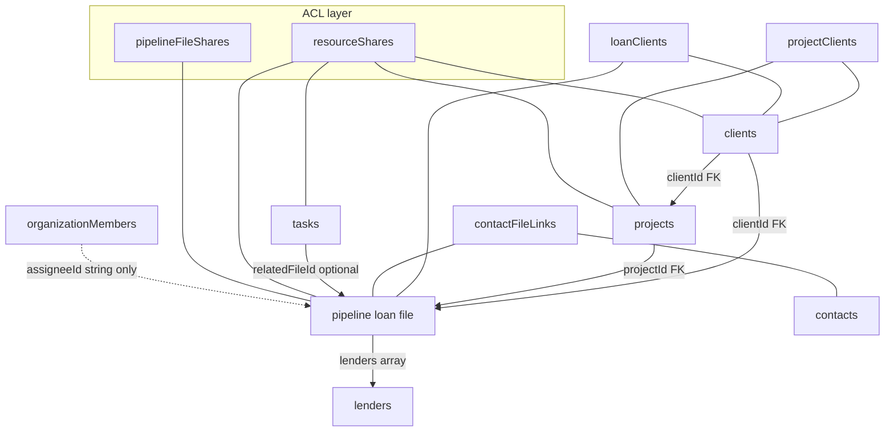

# Phase 15 Step 1 — Full Indexed Graph Architecture Forensic Audit

**Status:** Read-only audit complete — **no schema changes, no UI changes, no production writes, no deploy.**

**Date:** 2026-05-25  
**Canonical org sampled:** Joshua org `mx76bxqnc23q76cb99tvrffmy58644pf` (production, inline read-only queries)

---

## Executive summary

The pipeline already treats **loan files as canonical** (`pipeline._id` is the single workspace identity). Hub and board views **do not duplicate rows** — they client-side group the same `listTablePreview` subscription. However, the **data model is still a certified Client → Project → Loan tree** with **scalar FKs** (`pipeline.clientId`, `pipeline.projectId`) and **partial junction coverage**. Unlimited many-to-many across clients, projects, lenders, referral partners, team members, and tasks is **not yet achievable** without additive junction tables and a projection engine.

**Highest risks for Phase 15:** ACL leakage when new index modes bypass `filterPipelineRowsForMember`; duplicate entity creation on clients/projects; lender/task/team links stored as arrays or scalars; subscription fan-out if each index mode adds independent live queries.

---

## A. Current schema dependency map

### Core entity tables

| Table | Role in graph | Authoritative FKs / identity | Key indexes |
|-------|---------------|------------------------------|-------------|
| **`clients`** | Borrower/sponsor node | `_id`, `organizationId`, `normalizedName` | `by_organization`, `by_org_normalized`, `by_org_owner` |
| **`projects`** | Deal container | `_id`, **`clientId`** (primary client), `organizationId`, `normalizedTitle` | `by_client`, `by_organization`, `by_org_client` |
| **`pipeline`** | **Canonical loan file** | `_id`, **`clientId`**, **`projectId`**, `organizationId`, `ownerUserKey` | `by_clientId`, `by_projectId`, `by_organization_createdAt`, search |
| **`lenders`** | Capital provider directory | `_id`, dedupe keys `companyKey` / `emailKey` / `contactKey` | `by_company_email`, `by_organization`, search |
| **`contacts`** | CRM people (includes referral classification) | `_id`, `emailKey`, `crmRelationshipTypes[]` | `by_organization_emailKey`, search |
| **`tasks`** | Work items | `_id`, optional **`relatedFileId`**, `relatedContactId`, `assigneeId`, `sharedWithIds[]` | `by_relatedFile`, `by_organization`, `by_assignee_updatedAt` |
| **`organizationMembers`** | Org roster (team) | `organizationId` + `userKey` + `role` | `by_organization`, `by_org_user` |

### Junction / link tables (existing)

| Table | Edge | Notes |
|-------|------|-------|
| **`projectClients`** | client ↔ project | Phase 14; typed roles; primary mirrored on `projects.clientId` |
| **`loanClients`** | client ↔ pipeline file | Phase 14; primary mirrored on `pipeline.clientId` |
| **`contactFileLinks`** | contact ↔ file | CRM; `relationshipType` includes `referral` |
| **`contactLenderLinks`** | contact ↔ lender | CRM |
| **`projectCapitalSources`** | project ↔ file (optional) | Capital stack; not general graph |
| **`projectCapitalAllocations`** | source ↔ requirement | Capital stack only |
| **`pipelineFileShares`** | member ↔ file | Legacy ACL junction |
| **`resourceShares`** | member ↔ client/project/task/pipeline | Canonical ACL |
| **`pipelineSharePendingInvites`** | email ↔ file (pending) | Pre-ACL |

### Embedded / scalar links (not junction)

| Location | Relationship | Limitation |
|----------|--------------|------------|
| `pipeline.lenders[]` | file ↔ lender | Array on file row; no per-link metadata index |
| `pipeline.selectedLenderId` | workflow selection | Single chosen lender |
| `pipeline.contacts[]` | legacy embedded contacts | Duplicates CRM model |
| `pipeline.assigneeId` | single assignee string | Not M:N |
| `pipeline.sharedWithIds[]` | ad-hoc share list | Overlaps shares tables |
| `tasks.relatedFileId` | task → one file | Not M:N from task side |
| `tasks.assigneeId` / `sharedWithIds[]` | task team | Scalar / array |

### ACL & ownership tables

| Table | Purpose |
|-------|---------|
| **`resourceShares`** | Owner-scoped share grants (`view` / `edit`) per resource type |
| **`resourceAccessDenials`** | Append-only denial audit |
| **`pipelineFileShares`** | Legacy file shares (merged at read time) |

### Referral partners (no dedicated table)

Referral partners are **`contacts`** with `crmRelationshipTypes: ["referral"]` and/or **`contactFileLinks.relationshipType === "referral"`**. RBAC persona `external_partner` is auth-only, not a graph node.

### Dependency diagram (current certified hierarchy)



---

## B. Coupling map — modules requiring projection awareness

Any index mode switch must preserve: **same file IDs**, **same ACL-filtered row set**, **same workspace route** (`/pipeline/[fileId]`).

### Convex queries (must filter through canonical file visibility)

| Module | Entry point | Projection coupling |
|--------|-------------|---------------------|
| **`convex/pipeline.ts`** | `listTablePreview`, `listLight`, `getByStatus` | Primary hub/board feed; enriches hierarchy + capital rollups per row |
| **`convex/pipelineHierarchyQueries.ts`** | `listClients`, `listProjectsForClient`, `listFilesForProject` | Assumes tree traversal |
| **`convex/pipelineHierarchyFilterQueries.ts`** | client involvement filters | Client-centric file discovery |
| **`convex/globalSearch.ts`** | `search` | File hits use `filterPipelineRowsForMember`; grouped by client/project labels |
| **`convex/revenue.ts`**, **`convex/analytics.ts`** | org aggregates | Pipeline rows filtered per member |
| **`convex/sharedWorkspace.ts`** | share feed | Per-item `assertCanReadPipelineRow` |
| **`convex/tasks.ts`** | `getAll`, `byRelatedFile` | **Does not inherit file ACL** |
| **`convex/resourceAccess.ts`** | all resolvers | Hierarchy visibility index drives pipeline list ACL |

### Convex mutations (relationship writes)

| Module | Risk if graph expanded |
|--------|------------------------|
| **`pipelineHierarchyMutations.ts`** | Creates clients/projects/files with scalar FKs only |
| **`pipelineMultiClientMutations.ts`** | Junction CRUD for clients only |
| **`pipeline.ts`** | `attachLender` / `detachLender` mutates array |
| **`projectCapitalStackMutations.ts`** | Project-scoped; optional `pipelineId` on source |
| **`contacts.ts`** / **`contactFileLinks.ts`** | CRM links; email dedupe on contacts |
| **`tasks.ts`** | Single `relatedFileId` patch |

### Client UI (grouping = projection today)

| Path | Assumption |
|------|------------|
| **`app/pipeline/PipelinePageClient.tsx`** | Single `listTablePreview` → hub tree + board + filters |
| **`lib/pipeline/hubHierarchyTree.ts`** | Client → Project → Loan build |
| **`lib/pipeline/boardHierarchyGroups.ts`** | Board groups by client+project keys |
| **`components/pipeline/PipelineHubHierarchyView.tsx`** | Expandable tree; file open → `selectFile(id)` |
| **`components/PipelineFileWorkspace.tsx`** | Canonical workspace for one `fileId` |
| **`components/pipeline/LinkedClientsEditor.tsx`** | Multi-client on project/file |
| **`components/pipeline/ProjectCapitalStackEditor.tsx`** | Project-scoped |
| **`components/GlobalSearchPalette.tsx`** | File hits → same file route |
| **`components/TaskDrawer.tsx`** | Task file picker via `listLight` |

### Cross-cutting systems

| System | Coupling |
|--------|----------|
| **Search** | `globalSearchText` on pipeline; capital notes in row `searchText` |
| **Notifications** | `fileId` on pipeline events |
| **Activity** | `pipelineFileActivity`, collaboration events keyed by `pipelineFileId` |
| **Ownership presentation** | `resourceOwnershipPresentation.ts` per resource type |
| **Ledger / payments** | 1:1 with file via `fileId` |
| **Integration HTTP** | `pipeline.listLight` (ACL filtered) |

### ACL resolver chain (must not fork per index mode)

```
resolveViewerKey
  → impersonationGrantsOrgResourceVisibility? → edit (all org rows)
  → owner? → edit
  → resourceShares (+ legacy pipelineFileShares for files)
  → hierarchy inheritance (project → client) for pipeline rows
```

Pipeline list gate: **`filterPipelineRowsForMember`** in `convex/resourceAccess.ts`.

---

## C. Duplicate risk report

### Canonical identity rules (target)

| Entity | Normalization today | Enforced on create? |
|--------|---------------------|---------------------|
| **CRM contacts** | `normalizeEmailKey` → lowercase trim | **Yes** — `assertNoDuplicateEmailInOrg` |
| **Lenders** | `normalizeEmail`, `companyKey`, upsert keys | **Yes** — `lenders.upsert` idempotent |
| **Clients (`clients`)** | `normalizedName` index exists | **No** — always insert |
| **Projects** | `normalizedTitle` | **No** — always insert |
| **Team members** | `userKey` on `organizationMembers` | **Partial** — org+user unique by usage |
| **Referral partners** | Same as contacts | Only if created via `contacts.create` with email |
| **Phone E164** | Digit normalization in lender merge; **not E164** | **No** for clients/projects |

### Duplicate creation paths (exact failure chains)

#### 1. Client duplicate by display name

**Chain:** User → `NewPipelineHierarchyCreateDialog` / `createClientProjectAndLoanFile` → `pipelineHierarchyMutations` → `insert("clients")` with `normalizedName` but **no pre-insert lookup**.

**Result:** Two `clients` rows with same normalized name in one org (index allows; no unique constraint).

**Missing protection:** `findClientByCanonical` exists in backfill only, not wired to create mutations.

#### 2. Client duplicate via multi-client editor

**Chain:** `pipelineMultiClientMutations.createOrgClient` → unconditional insert.

**Same gap** as above.

#### 3. Project duplicate under same client

**Chain:** `createProjectUnderClient` / stack create → `insert("projects")` without `(org, clientId, normalizedTitle)` uniqueness check.

**Result:** Multiple projects with identical title under one client.

#### 4. Legacy file without FK dedupe

**Chain:** `pipeline.createFileWithDeal` → deal stores `clientName`/`projectName` strings only → no `clients`/`projects` row until backfill.

**Result:** Parallel legacy namespace until Phase 13 backfill; synthetic hub keys `legacy-client:` / `legacy-project:`.

**Mitigation in prod (Joshua org):** `filesMissingFk: 0` (sampled).

#### 5. Dual contact representation on files

**Chain:** User adds contact via embedded `pipeline.contacts[]` **and** separate `contactFileLinks` / CRM.

**Result:** Same person, two representations; search/CRM graph diverges.

#### 6. Lender duplicate (lower risk)

**Chain:** Direct `insert("lenders")` bypassing upsert (operator/import paths).

**Mitigation:** Primary UI uses upsert with `(companyKey, emailKey)`.

#### 7. Referral partner duplicate

**Chain:** Create `contacts` row with `referral` type without email → **no emailKey dedupe** → duplicate names allowed.

**Chain B:** Referral tracked only as deal `sourceType` string — not linked to contact entity at all.

#### 8. Team member duplicate assignment

**Chain:** `assigneeId` string + `sharedWithIds[]` + `pipelineFileShares` + `resourceShares` — four parallel mechanisms; no normalized “same user linked twice” junction integrity.

#### 9. Task ↔ file multiplicity

**Chain:** Multiple tasks may reference same file via `relatedFileId`; no duplicate task prevention. Inverse: **one task cannot link multiple files** (scalar FK).

#### 10. Junction pair duplicates (clients — protected)

**Chain:** `addProjectClientLink` / `addLoanClientLink` check existing pair.

**Sampled prod:** `projPairDup: 0`, `loanPairDup: 0`.

### Missing merge protection summary

| Gap | Severity |
|-----|----------|
| Client create without normalizedName lookup | **High** |
| Project create without title dedupe | **Medium** |
| No E164 phone identity for clients/lenders/contacts | **Medium** |
| Referral not first-class → duplicate contact names | **Medium** |
| Embedded vs linked contacts | **Medium** |
| Lender/file via array (no junction dedupe beyond array ops) | **Low** |

---

## D. Projection performance analysis

**Baseline today:** One Convex subscription — `api.pipeline.listTablePreview` — returns **O(F)** rows (F = visible files). Hub/board regroup client-side **O(F)**.

### Per-mode grouping cost (recommended: regroup same ACL-filtered file set)

| Index mode | Grouping key source | Build complexity | Notes |
|------------|--------------------|--------------------|-------|
| **Clients** | `clientId` + `projectClients` / `loanClients` | **O(F + J)** | Current hub tree; J = junction rows |
| **Projects** | `projectId` | **O(F)** | Collapse client layer |
| **Loan files** | file id | **O(F)** | Flat list (table mode) |
| **Lenders** | `pipeline.lenders[]` union junction (future) | **O(F × L̄)** | L̄ = avg lenders/file; needs reverse index for scale |
| **Referral partners** | `contactFileLinks` / referral contacts | **O(F + C)** | C = contact links; no index on org referral yet |
| **Team members** | shares + assignee + org members | **O(F + S + M)** | Highest ACL coupling; must not double-fetch files |
| **Tasks** | `tasks.relatedFileId` → file | **O(T + F)** | T tasks; most tasks may lack file link |

### Subscription explosion risk

| Anti-pattern | Risk |
|--------------|------|
| Separate live query per index mode (7 subscriptions) | **High** — multiplies Convex bandwidth & rerenders |
| Per-group file fetch (`listFilesForProject` × P projects) | **High** — N+1 queries |
| **`listTablePreview` enrichment** (capital rollups, linked clients per project) | **Medium** — already batching per projectId set; grows with P |
| Global search + hub + board simultaneously | **Low** today — shared row source |

**Recommendation:** Phase 15 Step 4 introduces **`buildGraphProjection(mode, visibleFiles, junctionIndexes)`** pure function + optional server-side **`listGraphIndexPreview`** that returns `{ nodes, fileMemberships }` without duplicating file payloads.

### Joshua org fan-out estimates (production sample)

| Metric | Value |
|--------|-------|
| Visible files F | 20 |
| Clients | 18 |
| Projects | 18 |
| Distinct lenders on files | 7 |
| Org members | 3 |
| Tasks | 56 (1 with `relatedFileId`) |
| `listTablePreview` payload rows | 20 (one row per file — **no duplication**) |

At F≈20, all modes are trivial. **Risk threshold:** F > 500 or L̄ > 5 → require lender reverse index + virtualization.

---

## E. Required additive schema (future phases)

**Principle:** Keep **`pipeline._id`** as sole file identity. Junctions hold unlimited edges; scalar FKs become **primary/default** links only (backward compatible).

### File-centric junctions

| Proposed table | Edge | Indexes |
|----------------|------|---------|
| **`fileProjects`** | file ↔ project (M:N) | `by_file`, `by_project`, `by_file_project`, `by_org` |
| **`fileLenders`** | file ↔ lender (replace array) | `by_file`, `by_lender`, `by_file_lender`, `by_org` |
| **`fileReferralPartners`** | file ↔ contact (referral role) | `by_file`, `by_contact`, `by_org` |
| **`fileTeamMembers`** | file ↔ userKey (role, sort) | `by_file`, `by_user`, `by_file_user`, `by_org` |
| **`fileTasks`** | file ↔ task (M:N) | `by_file`, `by_task`, `by_org` |

> **`loanClients`** already covers client ↔ file (extend for unlimited + deprecate sole `pipeline.clientId` as authoritative-only primary).

### Project-centric junctions

| Proposed table | Edge | Indexes |
|----------------|------|---------|
| **`projectLenders`** | project ↔ lender | `by_project`, `by_lender`, `by_org` |
| **`projectReferralPartners`** | project ↔ contact | `by_project`, `by_contact`, `by_org` |
| **`projectTeamMembers`** | project ↔ userKey | `by_project`, `by_user`, `by_org` |
| **`projectTasks`** | project ↔ task | `by_project`, `by_task`, `by_org` |
| **`projectFiles`** | optional explicit M:N if files span projects | `by_project`, `by_file`, `by_org` |

### Entity identity hardening (additive columns)

| Table | Additive fields |
|-------|-----------------|
| **`clients`** | `primaryEmailKey`, `primaryPhoneE164`, unique `(organizationId, primaryEmailKey)` where set |
| **`contacts`** | `phoneE164` optional; merge registry |
| **`lenders`** | already has dedupe keys — add explicit `phoneE164` index optional |

### Normalization registry (optional Step 3)

| Table | Purpose |
|-------|---------|
| **`entityMergeLog`** | Append-only merge audit (survivor id, merged id, actor) |

**Do not remove** `pipeline.lenders[]`, `pipeline.clientId`, `pipeline.projectId` until backfill + UI cutover certified.

---

## F. Implementation phase plan

### Step 2 — Schema foundation (additive only)

- Add junction tables in §E with org scoping + timestamps + relationship metadata (`role`, `sortOrder`, `relationshipType`).
- Add indexes for reverse lookups (lender → files, userKey → files, contact → files).
- Extend `MANIFEST.json` / governance docs; **no UI**.

### Step 3 — Backfill + normalization

- Backfill `fileLenders` from `pipeline.lenders[]` (preserve order as `sortOrder`).
- Backfill `fileProjects` from `pipeline.projectId` (primary flag).
- Mirror `loanClients` / `projectClients` into new junctions where missing.
- Backfill `fileReferralPartners` from `contactFileLinks` where `relationshipType === "referral"`.
- Client/project dedupe pass: merge candidates by `normalizedName` / email / phone with **`entityMergeLog`**.
- Read-only integrity operator + dry-run report (pattern: Phase 13/14 operators).

### Step 4 — Query projection engine

- New module: `convex/graphProjection.ts` + `lib/pipeline/graphProjection.ts`.
- **`listGraphIndexPreview`** query:
  1. Call existing **`filterPipelineRowsForMember`** → canonical visible file id set.
  2. Load junction indexes for requested mode.
  3. Return `{ mode, groups: [{ nodeId, label, fileIds, rollups }] }` — **file IDs only**, no copied file rows.
- Refactor **`listTablePreview`** to remain file-centric SSOT; projection consumes it client-side or via secondary query.
- Update **`globalSearch`**, **`revenue`**, **`analytics`** to use shared visibility helper (no new leakage paths).
- Task mode: **`filterTaskRowsForMember`** + join to visible file set when `relatedFileId` set.

### Step 5 — UI mode switcher

- **`PipelinePageClient`**: index mode toggle (Clients | Projects | Files | Lenders | Referrals | Team | Tasks).
- Replace hard-coded `buildHubHierarchyTree` with mode-specific grouping function over **same filtered rows**.
- File open always **`router.push(/pipeline/${fileId})`** — workspace unchanged.
- Filters persist per mode (`localStorage` keys); capital + client involvement filters compose.
- View-only banners per resource edit level (unchanged ACL semantics).

### Step 6 — Certification + production proof

- Operator proof: same file opens from every index mode; ACL matrix (owner, view share, edit share, impersonation, revoke).
- No duplicate file rows in DOM / network payload.
- Performance budget: single primary subscription at F≤500.
- Docs + `migration-reports/phase15-step6-*.json`.
- **`npm run qa:governance`**, **`deploy:prod`**, prod smoke.

---

## G. Safety score

Scores: **1 (low risk) → 5 (critical risk)**

| Dimension | Score | Rationale |
|-----------|-------|-----------|
| **Migration complexity** | **4** | Many parallel link representations (arrays, FKs, junctions, CRM); backfill must not break certified hierarchy |
| **Query risk** | **3** | Central ACL helper exists; task/search/integration paths need audit when adding modes |
| **ACL risk** | **4** | New groupings must not expose file IDs via junction traversal without `filterPipelineRowsForMember`; task/file ACL asymmetry today |
| **Duplication risk** | **4** | Client/project create lacks dedupe; referral/team not normalized |
| **Production blast radius** | **3** | Additive schema + dual-read can limit blast radius; UI mode switch touches primary hub |

**Overall:** Proceed with **strict additive migration**, **single file SSOT**, and **ACL-first projection engine** before UI mode switch.

---

## H. Production sampling proof (read-only)

**Method:** Convex CLI **`run --prod --inline-query`** (readonly; no mutations).  
**Org:** `mx76bxqnc23q76cb99tvrffmy58644pf`  
**Sampled:** 2026-05-25

### Counts

| Entity | Count |
|--------|------:|
| Clients | 18 |
| Projects | 18 |
| Pipeline files | 20 |
| `projectClients` junction rows | 21 |
| `loanClients` junction rows | 19 |
| CRM contacts | 19 |
| Referral-tagged contacts | 0 |
| Contact ↔ file links (org files) | 17 |
| Referral links on files | 0 |
| Distinct lenders on files | 7 |
| Lender link instances (sum of array lengths) | 7 |
| Tasks | 56 |
| Tasks with `relatedFileId` | 1 |
| Org members | 3 |
| `resourceShares` (org) | 3 |
| Capital requirements / sources | 3 / 3 |
| Files missing `clientId` or `projectId` | **0** |

### Duplicates detected

| Check | Result |
|-------|--------|
| Client `normalizedName` collisions | **0** |
| CRM contact emailKey collisions | **0** |
| Duplicate `projectClients` pairs | **0** |
| Duplicate `loanClients` pairs | **0** |

### Relationship cardinalities

| Metric | Value |
|--------|------:|
| Avg lenders per file | 0.35 |
| Files with multiple lenders | 0 |
| ProjectClients per project (avg) | ~1.17 |
| LoanClients per file (avg) | ~0.95 |

### Projection fan-out estimates (Joshua org)

| Index mode | Top-level groups |
|------------|-----------------:|
| Clients | 18 |
| Projects | 18 |
| Loan files | 20 |
| Lenders | 7 |
| Referral partners | 0 |
| Team members | 3 |
| Tasks | 56 |

**Canonical file rule verified:** 20 files → 20 unique `_id` values; hub/table/board all derive from one row per file (no extra file records in sample).

---

## Validation performed (audit step)

| Command | Result |
|---------|--------|
| `npm run convex:codegen` | ✅ Pass |
| `npm run build` | ✅ Pass |
| `npm run deploy:prod` | ⏭ **Skipped** (audit-only) |
| Production writes | ⏭ **None** |

---

## STOP — awaiting review

No implementation work beyond this document. Next approved step: **Phase 15 Step 2 — schema foundation**.
