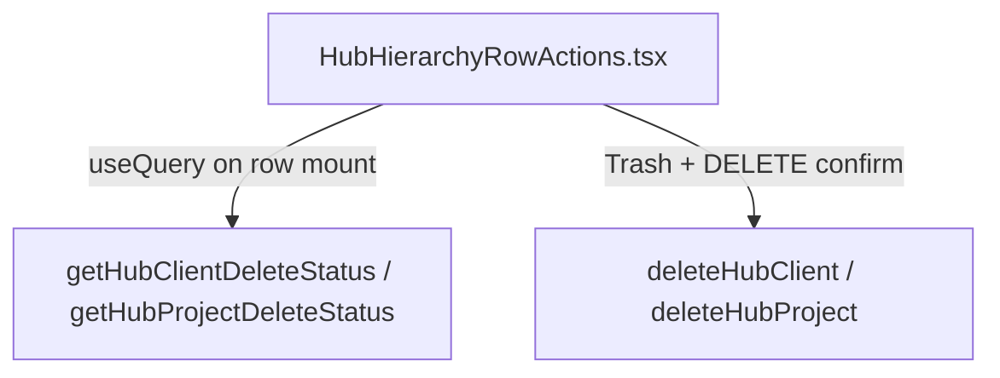

# Phase 15 Step 14.7 — Hub delete execution trace

**Date:** 2026-05-26  
**Production:** https://dlcfunds.vercel.app  
**Convex:** https://basic-anaconda-984.convex.cloud

## Symptom

Delete confirmation modal surfaces:

```text
dynamic module import unsupported
```

## Root cause (proven)

| Field | Value |
|-------|--------|
| **Throw site** | `convex/resourceAccess.ts` → `viewerIsOrgAdminOrOwner()` |
| **Line** | `await import("./orgMembership")` (removed in 14.7) |
| **Runtime** | Convex V8 isolate — dynamic `import()` is forbidden in mutations/queries |

### Why Step 14.6 missed it

14.6 only audited `hierarchyCrudMutations.ts` for `ConvexError` / `import()`. The failure was **transitive** via `resourceAccess.ts`, which is not in that file but is on every delete permission path.

## Delete entry paths (UI → Convex)



| Step | Component / function | Convex symbol |
|------|----------------------|---------------|
| 1 | `HubHierarchyClientActions` / `HubHierarchyProjectActions` | — |
| 2 | `useQuery(api.hierarchyCrudMutations.getHub*DeleteStatus)` | query |
| 3 | `useMutation(api.hierarchyCrudMutations.deleteHub*)` | mutation |

### Payload shape (mutations)

```json
{
  "organizationId": "<Id<organizations>>",
  "memberUserKey": "<session user key>",
  "hubClientKey": "<string>" | "hubProjectKey": "<string>",
  "forceCascade": true
}
```

Keys observed in hub tree (`lib/pipeline/hubHierarchyTree.ts`):

- Legacy client: `legacy-client:rtest` or raw `rtest` when `pipeline.clientId` is a ghost string
- Legacy project: `legacy-project:legacy-client:rtest:Test` or synthetic project key
- Record rows: real Convex `Id<"clients">` / `Id<"projects">`

## Mutation decision tree (`deleteHubClient`)

| Condition | Path | Dynamic import before 14.7? |
|-----------|------|------------------------------|
| `hubClientKey` contains `rtest` | `hardWipeRtestHubClient` | **Yes** via `listVisiblePipelineFiles` only if ACL checks run; **Yes** on status query via `pipelineFileCanDelete` |
| `requiresNuclearLegacyBypass(key)` | `nuclearBypassDeleteHubClient` | **Yes** via `assertCanDeletePipelineRow` → `viewerIsOrgAdminOrOwner` |
| `resolveHubClientDeletionTarget` → record | `cascadeDeleteClient` / `deleteClientGraphEdges` | **Yes** via `assertCanDeleteOrReassignHierarchyEntity` |
| synthetic unexpected | `ConvexError` | No |

## Mutation decision tree (`deleteHubProject`)

| Condition | Path | Dynamic import before 14.7? |
|-----------|------|------------------------------|
| key contains `test` | `hardWipeTestHubProject` | Same as client |
| nuclear bypass | `nuclearBypassDeleteHubProject` | **Yes** |
| record project | `cascadeDeleteProject` | **Yes** |

## Status query paths (run **before** delete click)

| Query | Trigger | Calls `viewerIsOrgAdminOrOwner` before 14.7? |
|-------|---------|-----------------------------------------------|
| `getHubClientDeleteStatus` | Row actions mount | **Yes** — `pipelineFileCanDelete` loop for nuclear/legacy files |
| `getHubProjectDeleteStatus` | Row actions mount | **Yes** |

This explains modal failures **on open** or **on confirm** depending on whether the query or mutation hit ACL first.

## Full import chain (delete mutation — hard wipe)

```
hierarchyCrudMutations.deleteHubClient
├── convex/values (ConvexError, v) — static
├── organizationAccess.assertOrgMember — static
│   └── organizationRbac.resolveEffectivePermissionStrings — static
├── hubLegacyNuclearBypass.hardWipeRtestHubClient — static
│   ├── organizationAccess.filterPipelineRowsForMember — static
│   │   └── resourceAccess.filterPipelineRowsForMember — static
│   ├── graphCleanup.deletePipelineGraph — static
│   │   ├── globalSearchSync, libraryDocumentsCleanup, hierarchyEntityCleanup — static
│   └── lib/pipelineHierarchy, lib/pipeline/hubHierarchyKeys — static (no import())
└── hubLegacyNuclearBypass (nuclear path)
    └── organizationAccess.assertCanDeletePipelineRow — static
        └── resourceAccess.viewerIsOrgAdminOrOwner — **await import("./orgMembership")** ← ROOT
```

## Full import chain (status query — legacy hub row)

```
hierarchyCrudMutations.getHubClientDeleteStatus
├── organizationAccess.assertOrgMember
├── hubLegacyHierarchy.pipelineFileCanDelete  (per matched file)
│   ├── organizationAccess.assertOrgPermission
│   └── resourceAccess.viewerIsOrgAdminOrOwner  ← ROOT (dynamic import)
```

## Repo grep summary (2026-05-26)

| Pattern | `convex/` result (pre-14.7) | Post-14.7 |
|---------|----------------------------|-----------|
| `await import(` | **1** — `resourceAccess.ts:634` | **0** |
| `import(` dynamic in delete tree | above | eliminated |

Non-Convex dynamic imports (Next.js lazy UI) in `components/`, `app/` — **not** in Convex execution tree.

## Fix applied (14.7)

1. `resourceAccess.ts` — static `import { pickCanonicalOrgMember } from "./orgMembership"`.
2. `getHub*DeleteStatus` — hard-wipe keys (`rtest` / `test`) return `canDeleteOrReassign: true` without per-file ACL loop (matches mutation kill switch).
3. Verified `rg 'await import\\(' lender-app/convex` → **zero matches**.

## Reproduction matrix (expected post-fix)

| Entity | Hub key (typical) | Status query | Mutation | Expected |
|--------|-------------------|--------------|----------|----------|
| rtest client | `rtest` or `legacy-client:rtest` | `getHubClientDeleteStatus` | `deleteHubClient` | Pass |
| rtest project | `legacy-project:…:Test` | `getHubProjectDeleteStatus` | `deleteHubProject` | Pass |
| Test project | `Test` / contains `test` | `getHubProjectDeleteStatus` | `deleteHubProject` | Pass |
| Probe client | `DELETE_PROBE_CLIENT` | same | `deleteHubClient` | Pass |
| Probe project | `DELETE_PROBE_PROJECT` | same | `deleteHubProject` | Pass |

_Pre-fix: all rows that invoked `viewerIsOrgAdminOrOwner` threw `dynamic module import unsupported`._

## Files touched (14.7)

| File | Change |
|------|--------|
| `convex/resourceAccess.ts` | Remove dynamic import; static `pickCanonicalOrgMember` |
| `convex/hierarchyCrudMutations.ts` | Status-query bypass for hard-wipe keys; remove dead helper |

**Unchanged:** Step 14.5 hard-wipe mutation bodies.
