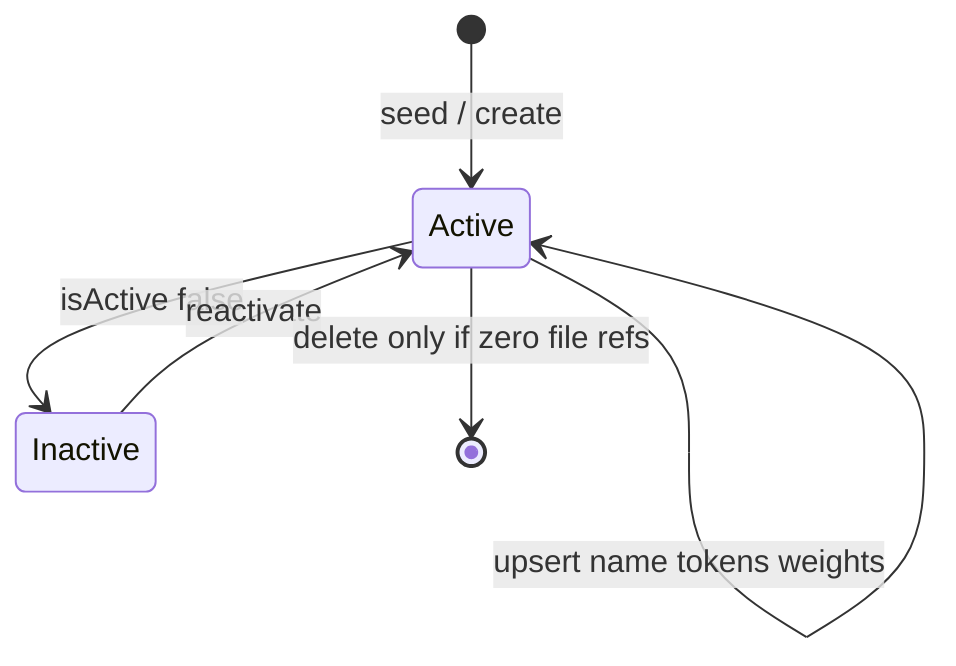
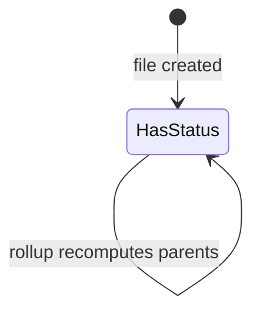

# Phase 24.1 — Operational status engine: final readiness report

**Purpose:** Final architecture verification before **any** schema work (24.1a).  
**Date:** 2026-05-28  
**Status:** Documentation only — **no implementation, no schema, no Convex deploy, no UI**  
**Lock artifacts:** `docs/phase24-1-status-engine-architecture-lock.md` (v3), `migration-reports/phase24-1-status-engine-architecture-lock.json` (v3)

---

## 0. Dual-track gate (mandatory)

Two tracks are active. **Track B must not start until Track A is production-stable.**

### Track A — Stabilize existing UX (finish first)

| Issue | Risk if ignored |
|-------|-----------------|
| Delete modal inconsistent on pipeline hierarchy rows | Data loss / user distrust |
| Pipeline view clipping / overflow | Broken mobile + scroll contract |
| Task creation (recently repaired) | Needs sustained prod validation |
| Hub hierarchy actions (7+ reconstruction passes) | Regressions during status rollout |
| Delete architecture not fully prod-validated | Status engine adds more hub surfaces |

**Track A exit criteria (product sign-off):**

- Delete flow verified on client / project / file rows in prod (iOS Safari, Android Chrome, desktop)
- Hub/table no critical clipping on primary pipeline views
- Task create confirmed stable (plain, label, schedule) for 48h+ in prod
- No P0 open bugs on hierarchy row actions

### Track B — Operational status engine (this document)

Major platform subsystem: schema, library, rollups, provenance, dashboards, future SLA/automation. **Not cosmetic.**

**Track B entry criteria:**

1. Track A exit criteria met  
2. Architecture lock v3 accepted  
3. This readiness report reviewed  
4. Explicit **“24.1 approved”** → then **24.1a schema only**

---

## 1. System separation (verified)

| System | Purpose | Data owner | Must not pretend to be |
|--------|---------|------------|------------------------|
| **Pipeline stage** | Where deal is in **funnel** | `organizationPipelineStages`, `pipeline.stageId` | Operational stuck state |
| **Task label** | **Task** attention | `organizationTriageLabels`, `tasks.triageLabelId` | File blocker / rollup bubble |
| **Operational status** | **Where deal is stuck** (primary pipeline OS) | `organizationPipelineStatuses`, `pipeline.statusId` | Funnel stage or task |
| **Visual state** | How row **looks** | Derived: `rowColor`, `pillColor`, `icon`, `severity` styling | Source of truth |

**Failure mode if merged:** stages as statuses, statuses as tasks, labels as blockers → unmaintainable at scale.

**Verdict:** v3 lock preserves separation. ✅

---

## 2. Status lifecycle

### 2.1 Library lifecycle (admin)



| Event | Behavior |
|-------|----------|
| Org created | Seed 18 locked statuses + `New File` default |
| Admin upsert | Validates `statusCategory`, `severity`, `automationEligible`; syncs `isClosed` from category |
| Admin deactivate | `isActive: false` — hidden from assign; existing `statusId` on files remain valid |
| Admin reorder | `sortOrder` only — **does not** change rollup (uses `priorityWeight`) |

### 2.2 File lifecycle (operator)



| Step | Fields written |
|------|----------------|
| File insert | `statusId` = org default (`New File`), `statusUpdatedAt`, `statusUpdatedBy` |
| Status change | `statusId`, `statusUpdatedAt`, `statusUpdatedBy`; optional future `statusOwnerUserId` |
| Side effect | Recompute `projects.*` and `clients.*` effective fields + `effectiveStatusSourceId` |

**Invariant:** `statusId` never null after backfill.

### 2.3 Terminal lifecycle

| statusCategory | Rollup | Attention counts | automationEligible (typical) |
|----------------|--------|------------------|------------------------------|
| `completed` | Excluded | Excluded | `false` |
| `closed` | Excluded | Excluded | `false` |

File row still displays terminal status (e.g. Funded green); parents do not inherit.

---

## 3. Rollup lifecycle

### 3.1 Project rollup

```text
TRIGGER: file statusId / projectId / clientId / delete / visibility change
INPUT: projectId, visible files in project
ELIGIBLE = files where:
  - member can read
  - status.showInRollups
  - status.statusCategory ∉ {completed, closed}
WINNER = file with max(status.priorityWeight)
WRITE:
  projects.effectiveStatusId = winner.statusId
  projects.effectiveStatusSourceId = winner.fileId
  projects.effectiveStatusSourceKind = "pipeline"
  projects.effectiveStatusUpdatedAt = now
```

### 3.2 Client rollup

```text
INPUT: clientId
For each project: use project's effectiveStatusId + source file
WINNER = project with max(winning status.priorityWeight)
WRITE:
  clients.effectiveStatusId
  clients.effectiveStatusSourceId = winning project's source file id
  clients.effectiveStatusSourceKind = "pipeline"
```

### 3.3 Effective severity on rollups

Parent row **inherits winner’s status record** — therefore inherits winner’s `severity` and `statusCategory` for display and dashboard buckets. No separate `effectiveSeverity` column required in 24.1.

### 3.4 Provenance UX

```text
Compliance Hold
From: ABC Trucking SBA Loan
```

Without `effectiveStatusSourceId`, client-level red rows are opaque → **required for 24.1c**.

---

## 4. Ownership lifecycle (reserved)

| Phase | `statusOwnerUserId` | UX |
|-------|---------------------|-----|
| 24.1a | Column exists, optional | Hidden |
| 24.2 | Set on status change (optional) | “Assigned to” on file workspace |
| 24.3+ | Query index | “Waiting on me” filter |

**Semantic:** Who owns the **next action** while file is in this status — orthogonal to `severity` and `statusCategory`.

Pairing example: `Waiting On Borrower` + `statusOwnerUserId = loan_officer_key` → dashboard filter.

---

## 5. Severity model

### 5.1 Definition

| severity | Operator meaning | System use |
|----------|------------------|------------|
| `normal` | Expected state | Baseline dashboard |
| `attention` | Follow up soon | Attention queues |
| `warning` | Material issue | Escalation candidate |
| `critical` | Hard stop | Highest notification priority |

### 5.2 Independence (verified)

| Question | Field |
|----------|-------|
| What kind of state? | `statusCategory` |
| Who wins rollup? | `priorityWeight` |
| How loud is it? | `severity` |

Example: `Compliance Hold` — `blocked` + `critical` + weight `1000`.  
Example: `Waiting On Borrower` — `waiting` + `attention` + weight `300`.

### 5.3 UI derivation (no extra schema)

| UI behavior | Source |
|-------------|--------|
| Pill emphasis ring | `severity` |
| Row tint intensity | `severity` + `rowColor` token |
| Dashboard “critical deals” | `severity === "critical"` ∧ ¬terminal |
| Sort within filter | `severity` ordinal then `daysInStatus` |

**v3 change:** `isWarning` **not** stored — use `severity in (warning, critical)` if legacy boolean needed in queries.

---

## 6. Automation model

### 6.1 Library flag

`automationEligible: boolean` on each `organizationPipelineStatuses` row.

| Value | Meaning |
|-------|---------|
| `true` | Automation engine may register enter / stay / duration rules |
| `false` | Terminal or no-automation statuses — engine skips |

### 6.2 Future events (Phase 30+ — no status-table migration)

Payload built from **existing fields**:

| Field | Source |
|-------|--------|
| `statusId`, `name`, `statusCategory`, `severity` | Library row |
| `automationEligible` | Library row |
| `fileId`, `organizationId` | Pipeline |
| `enteredAt` | `statusUpdatedAt` |
| `daysInStatus` | computed |
| `statusOwnerUserId` | pipeline (optional) |
| `effectiveStatusSourceId` | rollup context |

**Example rules (future):**

```text
WHEN status becomes "Compliance Hold" AND automationEligible
  → create task from template X

WHEN status stays "Waiting On Borrower" AND daysInStatus > 14
  → notify statusOwnerUserId
```

### 6.3 Optional future tables (not 24.1a)

| Table | Purpose |
|-------|---------|
| `operationalStatusAutomationRules` | Org rules referencing `statusId` |
| `operationalStatusSlaPolicies` | Per-status duration thresholds |
| `operationalStatusChangeLog` | Audit / analytics |

Status library table **does not** need new columns for these.

---

## 7. Future compatibility analysis

| Capability | Supported by v3 schema without migration? | Mechanism |
|------------|-------------------------------------------|-----------|
| Automation triggers | ✅ | `automationEligible` + events from `statusUpdatedAt` |
| SLA timers | ✅ | `statusUpdatedAt` + UI/runtime `daysInStatus` + `statusCategory` |
| Escalation workflows | ✅ | `severity` + duration + `statusOwnerUserId` |
| Notification routing | ✅ | `severity` + owner + category |
| Dashboard prioritization | ✅ | `statusCategory`, `severity`, `showInDashboard` |
| Category filters | ✅ | `statusCategory` index |
| Rollup provenance | ✅ | `effectiveStatusSourceId` |
| Per-entity status override | ✅ (later) | Reserved `projects.statusId`, `clients.statusId` |
| Cross-entity automation | ✅ (later) | Optional rules table referencing `statusId` |

**Verdict:** v3 library row is **automation- and SLA-ready** without another redesign.

---

## 8. Migration risk assessment

| Risk | Likelihood | Impact | Mitigation |
|------|------------|--------|------------|
| Track A regressions during 24.1 | High if parallel | High | **Gate Track B** |
| Legacy `pipeline.status` string confusion | Medium | Medium | Keep stage selector + status pill separate labels in UI |
| Rollup wrong winner | Medium | High | Unit tests on `priorityWeight`; provenance line |
| Funded files polluting client bubble | Low if category exclusion enforced | High | `completed`/`closed` excluded — tested |
| Performance: org-wide rollup job | Medium | Medium | Recompute on change only; batch repair mutation |
| Backfill null `statusId` on old files | Low | Medium | Default `New File` before NOT NULL enforcement |
| `ownerUserKey` class bug on tasks | N/A to status | — | Already fixed — do not repeat on status insert helpers |
| Schema field `ownerUserKey` on wrong table | Low | High | Use `ownerUserIdFieldsForInsert` pattern for tasks only; status uses no owner spread on library |

**Additive-only migration:** No destructive drops in 24.1a.

---

## 9. Surfaces touched (scope awareness)

When Track B ships, expect touches to:

| Surface | Change type |
|---------|-------------|
| Pipeline file workspace | Status select (required) |
| Hub hierarchy rows | Pill + row frame + source line |
| Pipeline table / board | Pill column + category filters |
| Settings → Organization | Status library CRUD by category |
| Operational dashboard | Category + severity widgets |
| Convex queries | `getMap`, rollup on mutations |
| Activity feed | `operational_status_changed` |
| Future: webhooks, automations | Event hooks |

**Not in 24.1:** Replacing `PipelineStageSelector`; merging task triage into status.

---

## 10. Schema summary (locked for 24.1a — not deployed)

### `organizationPipelineStatuses`

Required fields: `statusCategory`, `severity`, `automationEligible`, `priorityWeight`, visual tokens, flags.

### `pipeline`

`statusId` (required), `statusUpdatedAt`, `statusUpdatedBy`, `statusOwnerUserId` (reserved).

### `projects` / `clients`

`effectiveStatusId`, `effectiveStatusUpdatedAt`, `effectiveStatusSourceId`, `effectiveStatusSourceKind`.

---

## 11. Readiness verdict

| Criterion | Status |
|-----------|--------|
| Four-system separation | ✅ Locked v3 |
| Primary OS framing | ✅ Locked v3 |
| Categories + severity + automation | ✅ Locked v3 |
| Rollup + provenance | ✅ Locked v3 |
| Seed catalog (18) | ✅ Locked v3 |
| Future extensibility without status-table migration | ✅ §7 |
| Track A / Track B gate | ✅ §0 |
| Implementation started | ❌ **Correct — not started** |

### Recommended sequence

1. **Finish Track A** — prod validation checklist §0  
2. **Review this report** — product + engineering sign-off  
3. **Approve architecture v3** — reply “24.1 approved”  
4. **24.1a only** — schema + seed + backfill + rollup module (no hub UI yet)  
5. **24.1b–d** — UI, filters, dashboard, QA, deploy  

---

## 12. Approval signatures (fill when ready)

| Role | Track A stable? | Architecture v3? | Ready for 24.1a? |
|------|-----------------|------------------|------------------|
| Product | ☐ | ☐ | ☐ |
| Engineering | ☐ | ☐ | ☐ |

**Do not check “Ready for 24.1a” until Track A and architecture are both checked.**

---

## 13. References

- `docs/phase24-1-status-engine-architecture-lock.md` (v3)
- `migration-reports/phase24-1-status-engine-architecture-lock.json` (v3)
- `docs/tasks-create-failure-report.md`
- `docs/phase22-flexible-triage-labels.md`
