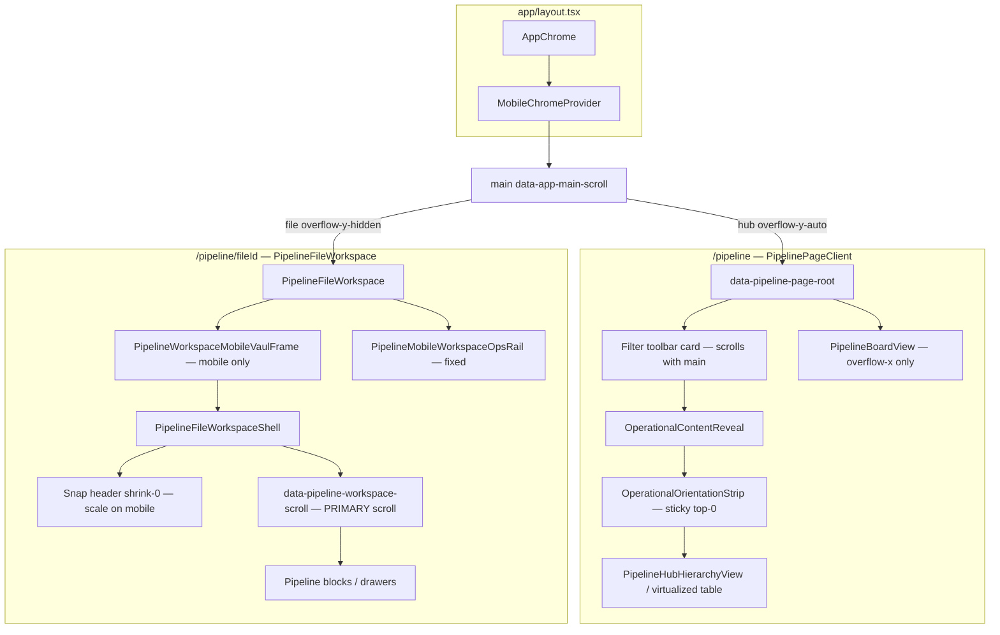

# Phase 24.4A — Pipeline Scroll Forensics (Audit)

**Status:** Investigation only — no code changes (Phase 24.4B not started).  
**Date:** 2026-05-28  
**Scope:** Entire repo (`lender-app/` primary); pipeline hub (`/pipeline`) and file workspace (`/pipeline/[fileId]`).

## Constraints acknowledged

- Single vertical scroll owner per route (`docs/scroll-architecture-rules.md`, `docs/governance/runtime-workspace-scroll-authority.md`).
- Hub: `AppChrome` `<main data-app-main-scroll>`.
- File: `[data-pipeline-workspace-scroll]`; `<main>` is `overflow-y-hidden` (`data-main-scroll-mode="workspace-delegated"`).

---

## Executive summary

Pipeline scroll instability is **not one bug** — it is **multiple scroll-linked presentation systems** stacked on the same scrollports:

| Route | Primary scroller | Scroll-linked chrome (evidence) |
|-------|------------------|----------------------------------|
| **Hub** `/pipeline` | `AppChrome` `<main>` | Mobile: `MobileChromeController` + hub `mobileScrollCollapse*` rows; Desktop/tablet: `useMasterScrollCompression` → `MasterHeaderShell` transforms; In-content: sticky `OperationalOrientationStrip`; CSS `scroll-behavior: smooth` on `<main>`. |
| **File** `/pipeline/[fileId]` | `[data-pipeline-workspace-scroll]` | Mobile: IO-driven compact + header `scale`/`opacity`; Vaul snap sheet; fixed `PipelineMobileWorkspaceOpsRail`; sticky access banner; programmatic `scrollIntoView`. Desktop: master compression **disabled** (workspace-delegated). |

**User-reported “collapsing / minimizing top area”** maps to **documented, intentional** systems — not accidental CSS. Removal is a product decision (Phase 24.4B), not a one-line fix.

---

## Step 1 — Repo-wide scroll-related inventory

Search terms from the brief were run across `lender-app/` (TS/TSX/CSS). Below: **file → component/hook → purpose → routes → pipeline impact**.

### A. Primary scroll ownership & registration

| File | Symbol / marker | Purpose | Pages | Affects pipeline |
|------|-----------------|---------|-------|------------------|
| `components/AppChrome.tsx` | `<main id="app-main-scroll" data-app-main-scroll>` | Default app vertical scrollport; `overflow-y-auto` except file workspace | All authenticated routes | **Yes** — hub scrolls here; file route: hidden scroll |
| `components/AppChrome.tsx` | `registerMainScrollContainer` ref | Registers `<main>` with `MobileChromeProvider` | All | **Yes** |
| `components/AppChrome.tsx` | `isPipelineFileWorkspace`, `data-main-scroll-mode` | Switches main to `workspace-delegated` on `/pipeline/[fileId]` | File workspace | **Yes** (file only) |
| `components/PipelineFileWorkspaceShell.tsx` | `[data-pipeline-workspace-scroll]` | Sole vertical scroll on file route | `/pipeline/[fileId]` | **Yes** (file only) |
| `components/PipelineFileWorkspaceShell.tsx` | `registerPipelineWorkspaceScroll` | Mobile chrome listens on workspace scroller | File workspace | **Yes** (file only) |
| `app/pipeline/PipelinePageClient.tsx` L2207–2210 | Comment + structure | Documents hub: no nested `overflow-y` list | `/pipeline` hub | **Yes** |
| `app/globals.css` L445–448, L627–677 | Body/main/workspace scroll contract | `body` locked; smooth scroll + overscroll on main/workspace | Global | **Yes** |

### B. Scroll listeners & scroll-driven state

| File | Lines (approx) | Mechanism | Pipeline impact |
|------|----------------|-----------|-----------------|
| `hooks/useMasterScrollCompression.ts` | 63–128 | `scroll` on `[data-app-main-scroll]` → RAF lerp → `translateY`/`scale`/`opacity` | **Hub: tablet/desktop only** (`shell !== "mobile"`). **File: off** (`scrollDelegatedToWorkspace`) |
| `components/MobileChromeController.tsx` | 224–264 | `scroll` + RAF on `effectiveScrollEl` (main or workspace); 14px hysteresis | **Hub: mobile** (no sentinel). **File: mobile** when sentinel registered |
| `components/MobileChromeController.tsx` | 172–222 | `IntersectionObserver` on `data-dlc-main-compact-sentinel` | **File mobile** (hub has no sentinel) |
| `lib/navigation/useResponsiveNavLayout.ts` | 175–198 | `visualViewport` resize/scroll → keyboard inset | Indirect — layout shell, bottom nav reserve |
| `components/pipeline/PipelineMobileWorkspaceOpsRail.tsx` | 44–68, 101–134 | `visualViewport` + workspace `scroll` + IO | **File mobile/tablet** only |
| `lib/ui/scrollContinuity.ts` | 14–69 | Read/write `scrollTop` on main or workspace | **Hub:** projection switch L1601. **File:** workspace restore |
| `app/pipeline/PipelinePageClient.tsx` | 1068–1078 | `scrollIntoView({ behavior: "smooth" })` for hub focus row | **Hub** |
| `components/PipelineFileWorkspace.tsx` | 435–443, 605–608, 1410–1420 | `scrollTop = 0`, `scrollIntoView`, double rAF | **File** |
| `components/pipeline/tasks/triage/TaskTriageQuickEditPopover.tsx` | 290 | capture-phase `scroll` reposition | File tasks UI |
| `components/pipeline/ClientMomentumStars.tsx` | 150 | capture-phase `scroll` | Hub/board rows |
| `components/pipeline/PipelineBlockDrawerSettings.tsx` | 128 | capture-phase `scroll` | File blocks |
| `components/ProductTourOverlay.tsx` | 67 | capture-phase `scroll` | If tour on pipeline |
| `components/SnoozeMenu.tsx` | 155 | capture-phase `scroll` | File snooze |

### C. Transform / scale / opacity (scroll-linked or scroll-adjacent)

| File | Lines | What changes | Pipeline |
|------|-------|--------------|----------|
| `components/layout/MasterHeaderShell.tsx` | 46–47 | `translate3d`, `scale`, `opacity` from compression | Hub tablet/desktop |
| `components/AppChrome.tsx` | 179–183 | Connectivity strip `opacity`, `pointerEvents` vs compression | Hub tablet/desktop |
| `lib/mobileCompactChrome.ts` | 23–40 | `grid-rows-[0fr]`, `-translate-y-2`, `opacity-0` when compact | **Hub mobile** (`PipelinePageClient`) |
| `components/PipelineFileWorkspaceShell.tsx` | 199–206 | Header inner `scale-[0.94|0.97|1]`, `opacity` by snap | **File mobile** |
| `components/MobileBottomNav.tsx` | 9–11, 66+ | `translate-y-full` in focus mode | Hub mobile (not file workspace chrome path) |
| `components/pipeline/PipelineHubVirtualizedLists.tsx` | 178 | `translateY` for row virtualization | Hub table — **not** scroll chrome; list perf |
| `components/pipeline/PipelineMobileWorkspaceOpsRail.tsx` | 145–177 | Shadow from `scrollLift` | File mobile |

### D. Sticky positioning

| File | Lines | Element | Pipeline |
|------|-------|---------|----------|
| `components/ui/OperationalOrientationStrip.tsx` | 121–157 | `sticky top-0` (default `sticky=true`) | **Hub** — used in `PipelinePageClient` L2212 without `sticky={false}` |
| `components/PipelineFileWorkspaceShell.tsx` | 228 | Sticky access banner inside workspace scroller | **File** |
| `app/pipeline/PipelinePageClient.tsx` L1561 | Filter toolbar card | `relative z-10` + `backdrop-blur` — **not** `position: sticky` | Hub — visual “chrome” but scrolls away with content |

### E. CSS global scroll behavior

| File | Lines | Effect | Pipeline |
|------|-------|--------|----------|
| `app/globals.css` | 667–676 | `scroll-behavior: smooth` on `[data-app-main-scroll]` and workspace scroll | **Both** — can feel like manipulated scroll |
| `app/globals.css` | 674–676 | `overflow-anchor: none` on scrollports | Both |
| `app/globals.css` | 635–663 | `scroll-padding-top` / `scroll-margin-top` on workspace | File anchors |

### F. Animation / motion libraries

| Search | Result |
|--------|--------|
| `framer-motion`, `from "motion"` | **No matches** in `lender-app/` |
| Vaul `Drawer` | `components/PipelineWorkspaceMobileVaulFrame.tsx` — mobile file sheet snap (not scroll listener, resizes embed) |
| `OperationalContentReveal` | Opacity fade on mount (hub list wrapper L2211) — not scroll-driven |
| `ShellMotionReadyContext` | Defers header transforms until first frame |

### G. Viewport / keyboard / resize (non-scroll but layout shift)

| File | Purpose | Pipeline |
|------|---------|----------|
| `lib/navigation/useResponsiveNavLayout.ts` | `visualViewport` → `keyboardInsetBottom` | Shell-wide |
| `lib/useVisualViewportMaxHeightStyle.ts` | Max-height style from VV | Overlays/drawers |
| `components/pipeline/PipelineMobileWorkspaceOpsRail.tsx` | Fixed dock `bottom` from keyboard inset | File |

### H. Viewport-width “collapse” (not scroll-driven)

| File | Purpose | Pipeline |
|------|---------|----------|
| `components/ui/ResponsiveToolbarGroup.tsx` | `hidden sm:flex` / `hidden lg:flex` priority groups | **Hub** toolbar L1640+ — **not** scroll-linked |
| `components/layout/MobileTopNav.tsx` | Comment: scroll morph only in `MasterHeaderShell` | SaaS shell |

### I. Tests & docs (behavioral contract — proves intent)

| File | Proves |
|------|--------|
| `tests/phase9-master-experience.spec.ts` L44–73 | Main scroll **compresses header** (`translate3d` becomes more negative) |
| `tests/e2e/pipeline-scroll.spec.ts` L570–622 | Hub mobile: `data-dlc-mobile-compact` toggles with `<main>` scroll |
| `tests/mobile/scroll/phase5-mobile-native.spec.ts` | Hub main scroll continuity |
| `docs/responsive-shell-audit.md` | Documents overlap: mobile compact grid + master compression |
| `lender-app/docs/phase9-master-experience-certification.md` | Certifies `useMasterScrollCompression` |

### J. Dead / unused pipeline imports (forensics note)

| File | Note |
|------|------|
| `components/PipelineFileWorkspace.tsx` L172–173 | Imports `mobileScrollCollapseGridClass` / `mobileScrollRevealInnerClass` — **no usage** in file (stale imports only). |

---

## Step 2 — Active pipeline scroll path

### Component hierarchy

### Scroll container matrix

| Layer | Hub `/pipeline` | File `/pipeline/[fileId]` |
|-------|-----------------|---------------------------|
| `document` / `body` | No vertical scroll (`overflow: hidden`) | Same |
| `AppChrome` `<main>` | **Primary** `overflow-y-auto`, `data-main-scroll-mode="primary"` | **Non-scrolling** `overflow-y-hidden`, `workspace-delegated` |
| Hub list shell | No `overflow-y` (comment L2207) | N/A |
| Board view | `overflow-x-auto` only (`data-testid="pipeline-board-scroll"`) | N/A |
| Workspace | N/A | **`[data-pipeline-workspace-scroll]`** `overflow-y-auto` |
| Nested | Popovers/sheets (`max-h` + `overflow-y-auto`), triage sheet | Inspector bodies `[data-nested-scroll]`, block activity lists |

### Scroll listener attachment (runtime)

| Listener owner | Target element | Hub | File |
|----------------|----------------|-----|------|
| `useMasterScrollCompression` | `[data-app-main-scroll]` | Active if tablet/desktop + not reduced motion | **Disabled** |
| `MobileChromeProvider` | `main` OR workspace scroll | `scroll` + RAF (mobile) | `IntersectionObserver` on sentinel (mobile) |
| `MobileBottomNav` | (subscribes focus snapshot only) | Hides via transform when compact | N/A on file minimal chrome |
| `PipelineMobileWorkspaceOpsRail` | workspace scroll | No | Yes (mobile/tablet) |

### Sticky ownership (hub)

1. **App master header** — fixed in flex column above `<main>` (not sticky; transforms visually “collapse”).
2. **Hub filter card** — in document flow inside `<main>` (not sticky).
3. **`OperationalOrientationStrip`** — **sticky `top-0`** inside `<main>` below filter card — second sticky band while scrolling.

---

## Step 3 — Layout mutations on scroll (exact locations)

### Master / app chrome (all pipeline routes using full chrome)

| Mutation | File:line | Trigger |
|----------|-----------|---------|
| `transform: translate3d + scale` | `MasterHeaderShell.tsx:46` | `useMasterScrollCompression` → `main.scrollTop` |
| `opacity` header shell | `MasterHeaderShell.tsx:47` | Same |
| Connectivity strip `opacity` | `AppChrome.tsx:179-181` | `masterCompression.compression` |
| `pointer-events: none` | `AppChrome.tsx:182-183` | `compression > 0.88` |
| Header border/shadow class | `AppChrome.tsx:286-287`, `424-425` | `compression > 0.06` |
| `max-md:max-h-14 overflow-hidden` | `AppChrome.tsx:285`, `294` | SaaS mobile header clip |

### Mobile compact / focus (hub + global mobile)

| Mutation | File:line | Trigger |
|----------|-----------|---------|
| `data-dlc-mobile-compact` on `<html>` | `MobileChromeController.tsx:277-279` | `compactChrome` state |
| `data-dlc-mobile-focus` | `MobileChromeController.tsx:281-283` | Same |
| Grid `grid-rows-[0fr]` | `mobileCompactChrome.ts:26` | `isMobileCompactMode` |
| Inner `opacity-0 -translate-y-2` | `mobileCompactChrome.ts:37` | Same |
| Hub title `max-md:text-base` | `PipelinePageClient.tsx:1454-1455` | Same |
| Hub collapsed rows | `PipelinePageClient.tsx:1479-1481`, `1588-1593`, `1910-1915` | Same |
| Bottom nav `translate-y-full` | `MobileBottomNav.tsx` + `mobileCompactChrome.ts:45-46` | `useMobileBottomNavFocusMode()` |

### Hub-only content

| Mutation | File:line | Trigger |
|----------|-----------|---------|
| Sticky orientation band | `OperationalOrientationStrip.tsx:155-157` | Always sticky on hub (default prop) |
| `scrollIntoView` smooth | `PipelinePageClient.tsx:1073-1076` | `hubFocusFileId` effect |
| `scrollTop` restore | `scrollContinuity.ts:26` via `PipelinePageClient.tsx:1601` | Projection mode change |
| List fade-in | `OperationalContentReveal.tsx:33` | Mount (not scroll) |

### File workspace

| Mutation | File:line | Trigger |
|----------|-----------|---------|
| Header `scale` / `opacity` | `PipelineFileWorkspaceShell.tsx:202-206` | `data-workspace-snap` compact/comfort/expanded |
| Sticky access banner | `PipelineFileWorkspaceShell.tsx:228` | Scroll inside workspace (CSS sticky) |
| `scrollTop = 0` | `PipelineFileWorkspace.tsx:442` | Navigation reset |
| `scrollIntoView` | `PipelineFileWorkspace.tsx:608, 1411-1420` | Section navigation |
| Vaul snap heights | `PipelineWorkspaceMobileVaulFrame.tsx:48-104` | User drag / snap index |
| Fixed dock shadow | `PipelineMobileWorkspaceOpsRail.tsx:145-177` | `scrollTop / 72` |

### CSS (not JS) but affects scroll feel

| Mutation | File:line | Notes |
|----------|-----------|-------|
| `scroll-behavior: smooth` | `globals.css:669` | Applies to hub `<main>` and file workspace |
| `scroll-padding-top` | `globals.css:636-638` | File workspace anchor clearance |

---

## Step 4 — Root cause classification (evidence-based)

### Hub `/pipeline`

| Class | Verdict | Evidence |
|-------|---------|----------|
| **A. Collapsing header** | **Confirmed (mobile)** | `MobileChromeController` + `PipelinePageClient` `mobileScrollCollapse*`; e2e `pipeline-scroll.spec.ts` L570–622 expects `data-dlc-mobile-compact`. |
| **B. Transform-based scroll effect** | **Confirmed (tablet/desktop)** | `useMasterScrollCompression` + `MasterHeaderShell`; phase9 test L44–73 asserts `translate3d` changes with `scrollTop`. |
| **C. Nested scroll conflict** | **Not primary on hub** | Explicit no nested `overflow-y` on list (L2207); board is horizontal only. Secondary: popovers/filters with local `overflow-y-auto`. |
| **D. Sticky element reflow** | **Contributing** | `OperationalOrientationStrip` sticky inside same `<main>` as compressing header — sticky reflow + header transform = unstable viewport. |
| **E. Viewport resize interaction** | **Minor on hub** | `useResponsiveNavLayout` keyboard inset affects shell padding, not hub list directly. |
| **F. Animation library** | **N/A (framer)** | No framer-motion; Vaul not used on hub. |
| **G. Multiple simultaneous causes** | **Primary classification** | Mobile: **A + D + smooth scroll (CSS) + scrollIntoView**. Desktop: **B + D + smooth scroll**. |

### File `/pipeline/[fileId]`

| Class | Verdict | Evidence |
|-------|---------|----------|
| **A** | **Confirmed (mobile)** | IO compact sentinel L232–237; `data-workspace-snap` scale L202–206. |
| **B** | **Off on file** | `useMasterScrollCompression` returns neutral when `scrollDelegatedToWorkspace` (`useMasterScrollCompression.ts:69-70`). |
| **C** | **By design, not bug** | Delegated scroll; `<main>` hidden — correct architecture. Risk: nested `[data-nested-scroll]` inside workspace only. |
| **D** | **Contributing** | Sticky access banner inside workspace scroller. |
| **E** | **Contributing (mobile)** | `PipelineMobileWorkspaceOpsRail` visualViewport + fixed positioning. |
| **F** | **Vaul (mobile)** | `PipelineWorkspaceMobileVaulFrame` changes embed height / snap — gesture fight potential, not native page scroll. |
| **G** | **Primary classification** | Mobile file: **A + D + E + F + programmatic scrollIntoView**. Desktop file: mostly **native workspace scroll** + sticky banner + smooth behavior. |

---

## Step 5 — Removal plan

See **`docs/phase24-4A-scroll-removal-plan.md`** (companion doc).

---

## Step 6 — Validation answers

### What code is currently causing…

**Jumpiness**

1. **Scroll-linked React state** on the same frame as native scroll: `MobileChromeController` (`startTransition` + compact toggles) and `useMasterScrollCompression` (RAF lerp continuing after scroll stops).
2. **Layout-affecting collapse** on hub mobile: `grid-rows-[0fr]` / `opacity` / `translate-y` on filter/toolbar rows (`PipelinePageClient` + `mobileCompactChrome.ts`) — changes content height while scrolling.
3. **`scroll-behavior: smooth`** on `[data-app-main-scroll]` (`globals.css:669`) — browser animates scroll position; stacks with programmatic `scrollIntoView({ behavior: "smooth" })` (`PipelinePageClient.tsx:1073-1076`).
4. **`withOperationalScrollPreserved`** forcing `scrollTop` after projection changes (`PipelinePageClient.tsx:1601`).
5. **File mobile:** IO debounce 48ms at sentinel boundary (`MobileChromeController.tsx:192-198`) — compact mode flip near top.
6. **Virtualization** `translateY` on rows is normal and should not cause chrome jump — only row positioning.

**Collapsing / minimizing top area**

1. **Mobile masterpage compact** — `MobileChromeController` (documented State A/B).
2. **Hub mobile row collapse** — `mobileScrollCollapseGridClass` / `mobileScrollRevealInnerClass` in `PipelinePageClient`.
3. **Tablet/desktop master header compression** — `useMasterScrollCompression` + `MasterHeaderShell` (user explicitly does not want this).
4. **File mobile snap chrome** — `PipelineFileWorkspaceShell` scale/opacity tiers + Vaul snap (`PipelineWorkspaceMobileVaulFrame`).
5. **SaaS mobile header clip** — `max-md:max-h-14 overflow-hidden` on `<header>` (`AppChrome.tsx:285`).

**Scroll manipulation (feels non-native)**

1. RAF-smoothed header compression (not 1:1 with `scrollTop`).
2. `scroll-behavior: smooth` on primary scrollports.
3. Programmatic `scrollTop` restore (`scrollContinuity`).
4. Programmatic `scrollIntoView` for hub focus and file sections.
5. Focus mode bottom nav transform (does not change scrollTop per comment in `MobileChromeController.tsx:99-100` — but changes perceived viewport).

### Can we restore fully native scrolling with zero feature loss?

| Interpretation | Answer |
|----------------|--------|
| **Zero UX feature loss** (keep compact chrome, header morph, focus mode, Vaul snap, smooth focus scroll) | **No** — those features *are* the non-native scroll coupling. |
| **Zero data / workflow loss** (pipeline data, filters, navigation, file workspace, triage, virtualized tables) | **Yes** — removing scroll-linked chrome does not require removing Convex data, routes, or block architecture. |
| **Restore native scroll feel** | **Yes**, by removing or disabling categories A+B mobile hub collapse + CSS smooth scroll + optional sticky orientation strip, while keeping single-scroll contract and virtualization. |

**Recommended Phase 24.4B scope (for approval):** disable scroll-linked chrome first (master compression, mobile compact, hub row collapse), set `scroll-behavior: auto` on pipeline scrollports, keep `scrollContinuity` only where proven necessary — then re-run `npm run qa:governance` + manual mobile hub/file scroll.

---

## Files to read first (hot path)

1. `components/MobileChromeController.tsx`
2. `hooks/useMasterScrollCompression.ts`
3. `components/layout/MasterHeaderShell.tsx`
4. `components/AppChrome.tsx`
5. `app/pipeline/PipelinePageClient.tsx` (L370, L1454+, L2207+, L2212)
6. `lib/mobileCompactChrome.ts`
7. `components/PipelineFileWorkspaceShell.tsx`
8. `app/globals.css` (L627–681)
9. `components/ui/OperationalOrientationStrip.tsx`

---

*End of Phase 24.4A audit. No patches applied.*
