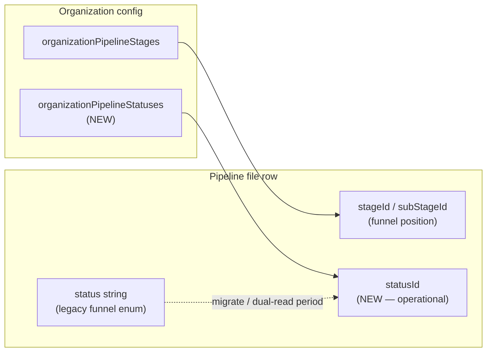

# Phase 24.0 — Pipeline operational status architecture (review only)

> **Superseded for implementation** by **`docs/phase24-1-status-engine-architecture-lock.md`** (visual state engine, `priorityWeight` rollups, required `New File` default, closed-file exclusion). This 24.0 draft remains historical context only.

**Status:** Architecture review — **no implementation in this document**  
**Date:** 2026-05-28  
**Deployment context:** `basic-anaconda-984` / Direct Lending Connection  
**Prerequisite:** `tasks:create` root cause fixed (`ownerUserKey` schema mismatch — see `docs/tasks-create-failure-report.md`)

---

## 1. Purpose

Deliver an **operational workflow status** system that answers: *“Where is this deal in day-to-day operations?”* — distinct from task activity markers and distinct from funnel **stage** position.

Users assign status **on pipeline files**. The same status library and pill UI propagate to **project** and **client** rows via **rollup (bubbling)**. One component, one color token, one name — everywhere.

---

## 2. What this is NOT (hard boundaries)

| System | Owner | Must NOT be used for |
|--------|--------|----------------------|
| **Task triage labels** (`organizationTriageLabels`, `tasks.triageLabelId`) | Task composer / `getHubTriageHighlightMap` | File/project/client operational state |
| **Pipeline funnel stages** (`organizationPipelineStages`, `pipeline.stageId`) | Kanban funnel, `PipelineStageSelector` | Borrower-waiting, compliance hold, docs-out workflow |
| **Legacy `pipeline.status` string** | `lib/pipelineStatus.ts` canonical enum + free text | New operational semantics (coexist during migration only) |

**Forbidden architecture:**

```text
Task label → mutates file status   ❌
Task highlight map → operational status pill   ❌
```

**Correct split:**

```text
Task labels        = activity / attention markers on tasks
Pipeline status    = operational state on files (canonical write)
Project/Client     = effectiveStatusId (derived read model)
```

Phase 21–22 **triage highlights** (`HubTriageHighlightFrame`, colored borders from open tasks) may **coexist visually** on hub rows but are a **separate query and component path**. Operational status pills are authoritative for workflow state; triage remains optional overlay.

---

## 3. Relationship to existing platform concepts

### 3.1 Three parallel “status-like” dimensions on a file



| Dimension | Storage | UI today | Phase 24 |
|-----------|---------|----------|----------|
| Funnel stage | `pipeline.stageId`, `subStageId` | `PipelineStageSelector` on hub/file | Unchanged |
| Legacy status label | `pipeline.status` | `getPipelineStatusInfo()` text in rows | Keep; do not delete in 24.0 |
| **Operational status** | `pipeline.statusId` (new) | **Does not exist** | **New dropdown + pills** |

### 3.2 Hierarchy (existing normalized model)

```text
clients (organizationId)
  └── projects (clientId)
        └── pipeline files (projectId, clientId)
```

Rollups use the same hierarchy resolution as triage: `safeResolveFileHierarchy` / `pipelineHierarchyCompat` patterns — **but a dedicated rollup module**, not `taskHighlights.ts`.

---

## 4. Schema (proposed)

### 4.1 `organizationPipelineStatuses`

Admin-configurable library per organization.

| Field | Type | Required | Notes |
|-------|------|----------|-------|
| `organizationId` | `Id<"organizations">` | yes | Tenant scope |
| `name` | `string` | yes | Display: “Waiting On Borrower” |
| `colorToken` | `string` | yes | Maps to DLC semantic / preset token (not raw hex in DB). Reuse pattern from `organizationTriageLabels.colorId` → org presets, or extend `taskColorPresets` with operational tokens. |
| `sortOrder` | `number` | yes | **Workflow progression order** for rollup winner selection (see §5). Lower = earlier; higher = further along. |
| `isActive` | `boolean` | yes | Inactive hidden from assign dropdown; existing assignments remain valid |
| `isDefault` | `boolean` | yes | At most one `true` per org — applied on new file create (optional 24.0) |
| `isClosed` | `boolean` | yes | Terminal state (Funded, Closed, Archived) — affects rollup (§5.3) |
| `isFunding` | `boolean` | yes | Reporting/automation hook; does not change rollup by itself |
| `isWarning` | `boolean` | yes | Pill emphasis (amber/warning ring); optional precedence boost (§5.2) |
| `createdAt` | `number` | yes | Unix ms |
| `updatedAt` | `number` | yes | Unix ms |
| `updatedByUserKey` | `string` | optional | Audit |

**Indexes:**

- `by_organization` → `["organizationId"]`
- `by_organization_order` → `["organizationId", "sortOrder"]`

**Invariants (enforced in mutations):**

- Unique `name` per org (case-insensitive normalized compare).
- Exactly one `isDefault` when any default is set (or explicit “no default”).
- Deactivating a status does not delete; reassignment required before delete if rows reference it.

### 4.2 `pipeline` (additive fields)

| Field | Type | Notes |
|-------|------|-------|
| `statusId` | `optional Id<"organizationPipelineStatuses">` | **Canonical write** — user assigns in file workspace |
| `statusUpdatedAt` | `optional number` | Unix ms |
| `statusUpdatedBy` | `optional string` | `memberUserKey` / auth user id string |

**Index (recommended):**

- `by_organization_status` → `["organizationId", "statusId"]` (filters, automation)

**Unchanged:** `stageId`, `subStageId`, `status` string remain for backward compatibility.

### 4.3 `projects` (additive fields)

| Field | Type | Notes |
|-------|------|-------|
| `effectiveStatusId` | `optional Id<"organizationPipelineStatuses">` | **Derived** — recomputed from child files |
| `effectiveStatusUpdatedAt` | `optional number` | Last rollup recompute |

### 4.4 `clients` (additive fields)

| Field | Type | Notes |
|-------|------|-------|
| `effectiveStatusId` | `optional Id<"organizationPipelineStatuses">` | **Derived** — recomputed from projects/files |
| `effectiveStatusUpdatedAt` | `optional number` | Last rollup recompute |

**Design choice:** Denormalized `effectiveStatusId` on project/client for fast hub/table reads (same pattern as stored `globalSearchText`). Recompute synchronously on file status mutation (bounded child set per project) — not a nightly batch for 24.0.

---

## 5. Bubbling & precedence rules

### 5.1 Canonical write path

Only **pipeline files** receive direct user assignment:

```text
User selects status in file workspace
  → mutation setPipelineFileOperationalStatus(fileId, statusId)
  → patch pipeline.statusId + statusUpdatedAt + statusUpdatedBy
  → recompute project.effectiveStatusId (if projectId)
  → recompute client.effectiveStatusId (if clientId)
  → append activity feed event (optional 24.0)
```

Projects and clients **never** accept direct `statusId` writes from the main UX in 24.0 (admin repair tools excepted).

### 5.2 Winner selection among sibling files

For a given **project**, consider all **visible, org-scoped** child files linked via `pipeline.projectId` (and indexed graph edges if dual-read required).

Pick **one winning status** by maximum **precedence score**:

```text
precedenceScore(status) =
  base: status.sortOrder
  + (status.isWarning ? WARNING_BOOST : 0)    // e.g. +10_000 — holds block “forward progress” display
  + (status.isClosed ? 0 : ACTIVE_BOOST)      // optional: prefer non-closed when any active file exists
```

**Default rule (matches product examples):** Among active (non-closed) files, choose the status with the **highest `sortOrder`**. If all files are closed, choose highest `sortOrder` among closed.

**Example:**

| File | status | sortOrder |
|------|--------|-----------|
| A | Waiting On Borrower | 40 |
| B | Underwriting | 70 |

Project + client effective status → **Underwriting** (70 > 40).

**Compliance hold example:** Configure `Compliance Hold` with high `sortOrder` and `isWarning: true` so it wins over “Processing” when any file is on hold — mirrors user’s priority list without coupling to tasks.

### 5.3 Client rollup

For each **client**, gather winning status per child **project** (using §5.2), then apply the **same winner function** across those project winners (not all files flat — avoids double-counting when projects are the hub grouping unit).

Fallback when hierarchy is incomplete:

| Case | Rollup source |
|------|----------------|
| File has `projectId` | Project rollup from files under project |
| File has `clientId` only | Client rollup from files with that `clientId` |
| Legacy file (no FK) | File’s own `statusId` only; no project/client pill until backfill |

Use existing `safeResolveFileHierarchy` for client/project keys — **do not invent parallel FK logic**.

### 5.4 Recompute triggers

| Event | Action |
|-------|--------|
| File `statusId` set/cleared | Recompute owning project + client |
| File moved between projects | Recompute old + new project/client |
| File archived/snoozed | **Still counts** unless product decides excluded — **open question §9** |
| Status library reorder (`sortOrder` patch) | Org-wide rollup job (Phase 24.1+) |
| Status deactivated | Keep on rows; hide from picker |

### 5.5 Read model for hub

New query (name TBD): `pipelineOperationalStatus.getEffectiveStatusMap`

```typescript
type OperationalStatusMap = {
  statusById: Record<string, PipelineStatusView>; // id → { name, colorToken, flags }
  byFileId: Record<string, Id<"organizationPipelineStatuses"> | null>;
  byProjectId: Record<string, Id<...> | null>;
  byClientId: Record<string, Id<...> | null>;
};
```

Client hub components **read this map** — not task highlights, not stage selector colors.

---

## 6. API surface (planned — not built in 24.0 review)

| Function | Type | Permission | Role |
|----------|------|------------|------|
| `organizationPipelineStatuses.list` | query | `files.view` or `settings.view` | Dropdown + pills |
| `organizationPipelineStatuses.upsert` | mutation | `settings.manage` | Admin library CRUD |
| `organizationPipelineStatuses.deactivate` | mutation | `settings.manage` | Soft retire |
| `pipeline.setOperationalStatus` | mutation | `files.edit` on file | Canonical assign |
| `pipelineOperationalStatus.getEffectiveStatusMap` | query | `files.view` + org member | Hub/table/board |
| `pipelineOperationalStatus.recomputeProject` | internal | system | Repair / migration |

**Validation on assign:**

- `statusId` must belong to `organizationId` and `isActive`.
- Caller must pass `assertCanMutatePipelineRow` (existing ACL).

---

## 7. UI placement (single component rule)

### 7.1 Shared component (mandatory)

One component only:

```text
<PipelineOperationalStatusPill />
  props: { statusId, statusView?, size?: 'sm' | 'md', readOnly?: boolean }
```

Backed by one hook: `useOrganizationPipelineStatuses()` (mirror `useOrganizationPipelineStages`).

**Forbidden:** separate client/project/file pill implementations, inline hex, duplicate Tailwind stacks.

### 7.2 Surfaces

| Surface | Placement | Interaction |
|---------|-----------|-------------|
| **File workspace** | File chrome — adjacent to stage control, labeled **Status** | `<PipelineOperationalStatusSelect>` dropdown: “Select status” → library list |
| **Pipeline hub — file row** | Primary or trailing column (product pick) | Pill read-only; edit in workspace or inline if `canEditFile` |
| **Pipeline hub — project row** | Same column as file | Pill from `effectiveStatusId` — read-only |
| **Pipeline hub — client row** | Same column as file | Pill from `effectiveStatusId` — read-only |
| **Pipeline table** | Consistent column “Status” (operational) | Do not replace `PipelineStageSelector` column — **add** or replace legacy `status` text only after UX sign-off |
| **Board view** | Card header chip | Same pill |
| **Search / filters** | Phase 24.1+ | Filter by `statusId` / effective status |

### 7.3 Settings admin

**Settings → Organization → Operational statuses** (new panel, parallel to **Task triage labels**):

- List library ordered by `sortOrder` (drag reorder).
- Edit name, color token, flags (`isClosed`, `isFunding`, `isWarning`, `isDefault`).
- Permission: `settings.manage`.

### 7.4 Scroll / mobile

- Dropdown in file chrome: use existing `Select` / `Popover` from `components/ui`; no new scrollport on file route (`runtime-workspace-scroll-authority.md`).
- Pills: touch target ≥ 40px when interactive.

---

## 8. Permission model

| Action | Permission | Notes |
|--------|------------|-------|
| View status pills on readable files | `files.view` + row ACL | Same as pipeline list |
| Assign file operational status | `files.edit` on row **or** `files.edit_all` | Uses `assertCanMutatePipelineRow` |
| View effective status on project/client | `files.view` | Derived from child visibility — **only include files member can read** in rollup |
| Manage status library | `settings.manage` | Admin |
| View library in settings | `settings.view` or `settings.access` | Read-only admin |

**Tenant isolation:** All queries filter `organizationId`; status ids validated against org on every write.

**Impersonation:** Follow existing `impersonationGrantsOrgResourceVisibility` — rollup uses same visible file set as `filterPipelineRowsForMember`.

---

## 9. Migration impact

### 9.1 Schema migration (additive)

- New table + optional fields only — **no destructive migration**.
- Deploy Convex schema before UI.
- Existing rows: `statusId` / `effectiveStatusId` **undefined** → pill hidden or “—” until assigned.

### 9.2 Coexistence with `pipeline.status` string

| Phase | Behavior |
|-------|----------|
| 24.0 | Operational `statusId` independent; legacy `status` string still shown where today until UX cutover |
| 24.1+ | Optional backfill map: legacy enum → default operational status id |
| Future | Deprecate free-text `pipeline.status` in UI; keep column for exports |

**Do not** auto-sync `pipeline.status` string from operational status without explicit mapping table — avoids silent semantic merge with funnel enum.

### 9.3 Coexistence with `stageId`

Stages and operational status are **orthogonal**:

- Stage = funnel position (Lead → Funded).
- Operational status = blocker/progress label (Waiting On Borrower, Compliance Hold).

A file may be stage “Underwriting” and operational status “Waiting On Borrower” simultaneously.

### 9.4 Data repair / backfill jobs

| Job | When |
|-----|------|
| `backfillEffectiveStatusForOrg` | One-time per org after deploy |
| `repairRollupForProject` | On demand operator tool |

Document in `migration-reports/phase24-pipeline-status.json` when implemented.

### 9.5 Automation / webhooks (future)

Emit `pipeline.operational_status_changed` with `{ fileId, previousStatusId, nextStatusId, projectId, clientId }` — **Phase 24.2**, gated by `automation-webhook-safety-policy.md`.

---

## 10. Performance & caching

| Concern | Mitigation |
|---------|------------|
| Hub query N+1 | Single `getEffectiveStatusMap` per org scope per subscription |
| Rollup on every file patch | O(files in project) — typically small; cap with index `by_project` |
| Large org library | `list` cached client-side; invalidate on settings mutation |
| Mobile rerenders | Memoize pill props; stable query args (`useOrgConvexQueryArgs`) |

---

## 11. Implementation phases (after architecture approval)

| Step | Scope | Ship criteria |
|------|--------|---------------|
| **24.0** | Schema + library CRUD + file assign + pills on file/project/client hub rows + rollup | `qa:governance`, mobile hub + file workspace smoke |
| **24.1** | Table/board column, search filters, backfill tooling | Migration report |
| **24.2** | Webhooks + automation triggers | Policy review |
| **24.3** | Replace legacy `status` string in primary UI | Product sign-off |

**Explicitly out of 24.0:** task label coupling, synthetic status from tasks, board column removal of stage selector.

---

## 12. Governance & documentation sync (when coding starts)

Update on implementation:

- `docs/governance/canonical-system-map.md` — add operational status owner row
- `docs/project-intelligence-summary.md` — § Pipeline / hub
- `docs/governance/design-system-component-map.md` — `PipelineOperationalStatusPill`
- `docs/governance/duplicate-system-watchlist.md` — note separation from triage highlights
- `docs/governance/MANIFEST.json` — if new policy artifact required

---

## 13. Open decisions (require product sign-off before code)

1. **Snoozed / archived files:** Excluded from rollup winner set or still count?
2. **Warning boost magnitude:** Fixed constant vs configurable per status?
3. **colorToken vocabulary:** Reuse eight `taskColorPresets` ids vs new operational token enum in `lib/design-system/`?
4. **Hub column:** Add operational status column alongside stage, or replace legacy status text line (§ `statusInfo.label` in `PipelineHubFileRow`)?
5. **Default on create:** Auto-apply `isDefault` status to new files?
6. **Direct project/client override:** Ever allow manual override of `effectiveStatusId`? (Recommendation: **no** in 24.0.)

---

## 14. Review checklist

- [ ] Product confirms operational status ≠ funnel stage ≠ task label  
- [ ] Precedence rules match broker workflow (sortOrder + warning hold)  
- [ ] Permission matrix approved  
- [ ] UI wireframe: file chrome dropdown + hub pill column  
- [ ] Migration: additive-only acceptable  
- [ ] No implementation PR until this doc is acknowledged  

---

## 15. References

| Doc / code | Relevance |
|------------|-----------|
| `docs/tasks-create-failure-report.md` | Prerequisite bugfix (separate from Phase 24) |
| `docs/phase22-flexible-triage-labels.md` | Anti-pattern reference (what not to extend) |
| `convex/schema.ts` — `organizationPipelineStages`, `clients`, `projects`, `pipeline` | Existing fields |
| `convex/taskHighlights.ts` | Separate bubbling engine — do not fork for operational status |
| `lib/pipelineStatus.ts` | Legacy funnel enum — coexistence |
| `components/pipeline/PipelineHubFileRow.tsx` | Current stage + triage overlay placement |
| `docs/governance/canonical-source-rules.md` | Data/UI/scroll owners |
