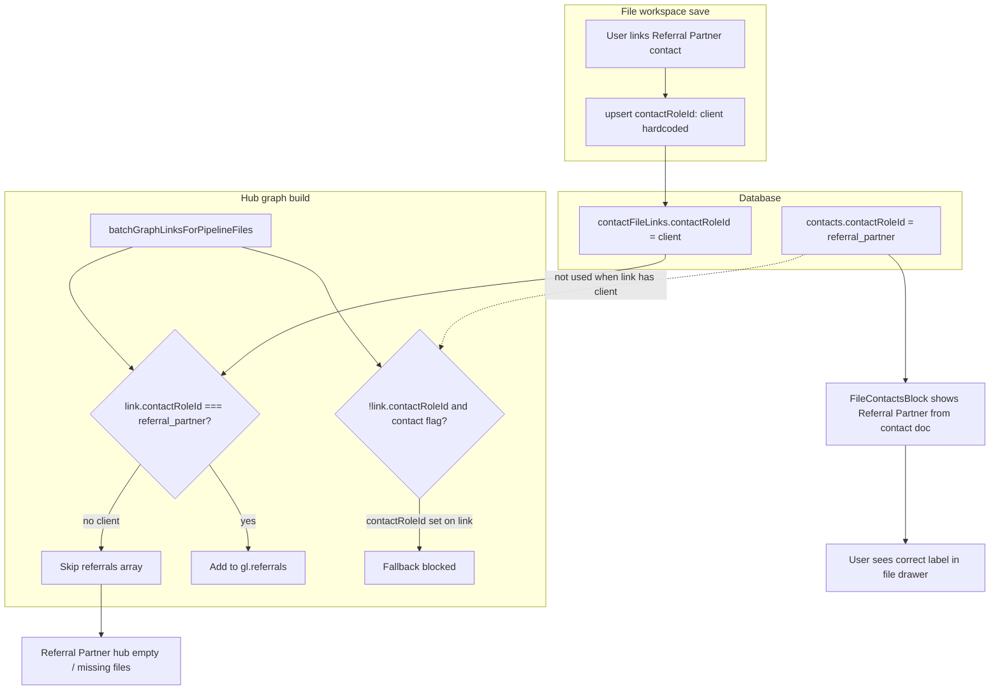

# Phase 25.2a — Referral Partner & Associated Contacts Audit (read-only)

**Date:** 2026-05-28  
**Track:** C — Core CRM Architecture  
**Prerequisite:** [phase25-1b-contact-roles-execution.md](./phase25-1b-contact-roles-execution.md), [phase25-1c-defensive-hardening.md](./phase25-1c-defensive-hardening.md)

**Scope:** Diagnostic only. No code, schema, or query changes in this phase.

---

## Executive summary

After Phase 25.1b/25.1c, CRM contact roles live on `contacts.contactRoleId` and `contactFileLinks.contactRoleId` (stable ids such as `referral_partner`). The **Pipeline Hub “Referral Partner Focus”** view does **not** query contacts directly; it groups files using **`row.graphLinks.referrals`** built server-side in `batchGraphLinksForPipelineFiles`. That builder only treats a file↔contact association as a referral when the **link or contact** carries `contactRoleId === "referral_partner"` (with a narrow fallback), and it **no longer reads** the removed link field `relationshipType: "referral"`.

The **Associated Contacts** block loads links via `contactFileLinks.listByFile` and hydrates names from `contacts.list`, but **every save path from the file workspace hardcodes `contactRoleId: "client"`** on upsert. That overwrites link-level CRM role and prevents `graphLinks.referrals` / `fileReferralPartners` sync for referral contacts linked from a file—even when the contact document is correctly tagged `referral_partner` and the UI displays “Referral Partner” from the **contact** record.

**Primary disconnect:** Hub indexing uses **link-level** `contactRoleId`; file workspace writes **link-level** `client` while displaying **contact-level** role.

---

## 1. File-to-contact associations

### 1.1 Data model

| Piece | Table / field | Purpose |
|-------|----------------|---------|
| Association row | `contactFileLinks` | Many-to-many contact ↔ pipeline file |
| Per-file label | `contactFileLinks.role` (required string) | Free-text role on *this file* (e.g. “co-signer”, “primary borrower”) — **unchanged** by Phase 25 |
| CRM category on link | `contactFileLinks.contactRoleId` (optional string) | Settings-driven role id (`client`, `referral_partner`, …) |
| CRM category on contact | `contacts.contactRoleId` (optional string) | Default org role for the person |
| Legacy (optional in schema for unmigrated rows) | `contactFileLinks.relationshipType` | Deprecated enum `client` \| `referral` \| `lender_rep` — **not used** by current hub graph builder |

Schema: `lender-app/convex/schema.ts` — `contactFileLinks` ~2220–2248.

### 1.2 Fetching links for one file (Associated Contacts block)

| Step | File | Lines (approx.) | Behavior |
|------|------|-----------------|----------|
| Hook | `lender-app/hooks/usePipelineFileWorkspaceData.ts` | 144–177 | `useQuery(api.contacts.list)` for org contacts; `useQuery(api.contactFileLinks.listByFile)` for this `fileId` |
| Query | `lender-app/convex/contactFileLinks.ts` | 77–167 | `listByFile` returns `{ ok, links, warnings? }` or `ACCESS_DENIED`; loads rows via `by_file` index |
| UI wiring | `lender-app/components/PipelineFileWorkspace.tsx` | 4050–4110 | Passes `standaloneContacts`, `associatedContactLinks`, `workspaceContactRoles` into `FileContactsBlock` |
| Roles catalog | `lender-app/components/PipelineFileWorkspace.tsx` | 510–520 | `api.organizationSettings.getContactRoles` for display names |

**Not** using legacy `pipeline.contacts[]` for the block body (only `legacyContactCount` from `p.contacts?.length` for alerts).

### 1.3 Rendering & role display (`FileContactsBlock.tsx`)

| Concern | File | Lines (approx.) | What it does |
|---------|------|-----------------|--------------|
| Hydration | `FileContactsBlock.tsx` | 79–101 | Maps `links` + `contacts` → `hydratedLinks`; missing contact → `"Unknown contact"` |
| CRM role shown | `FileContactsBlock.tsx` | 231–242 | Displays role via **`effectiveContactRoleIdFromDoc(contact)`** — **contact document only**, not `link.contactRoleId` |
| Per-file role edit | `FileContactsBlock.tsx` | 268–288 | Edits free-text `link.role` only; placeholder still says “referral partner…” |
| Link / create | `FileContactsBlock.tsx` | 113–120, 113+ | Requires non-empty **per-file** `role` string; calls parent `onLink` / `onCreateAndLink` |

There is **no** UI to set or change `link.contactRoleId` in the block.

### 1.4 Saving links from the file workspace (root cause for link-level role)

| Action | File | Lines (approx.) | Payload |
|--------|------|-----------------|--------|
| Link existing | `PipelineFileWorkspace.tsx` | 4054–4064 | `contactFileLinks.upsert` with **`contactRoleId: "client"`** (hardcoded) |
| Create + link | `PipelineFileWorkspace.tsx` | 4066–4087 | `contacts.create` then upsert with **`contactRoleId: "client"`** |
| Update link | `PipelineFileWorkspace.tsx` | 4089–4099 | Upsert on role/notes edit with **`contactRoleId: "client"`** again |

Same hardcoded `contactRoleId: "client"` pattern exists in:

- `lender-app/components/NewPipelineFileDialog.tsx` ~220  
- `lender-app/components/intake/Dashboard.tsx` ~206  

### 1.5 Server upsert resolution (`contactFileLinks.upsert`)

`lender-app/convex/contactFileLinks.ts` ~251–307, 354–368:

```ts
const resolvedContactRoleId =
  contactRoleId?.trim() ||
  contact.contactRoleId ||
  DEFAULT_CONTACT_ROLE_IDS.client;
```

Because the workspace **always passes** `contactRoleId: "client"`, the explicit arg wins over `contact.contactRoleId` (e.g. `referral_partner`). Then `syncFileReferralEdgeFromContactLink` runs with that resolved id (`indexedGraphEdgeSync.ts` ~643–672).

### 1.6 Graph edge sync for referrals

`lender-app/convex/indexedGraphEdgeSync.ts`:

- `isReferralContactFileLink` ~404–423 — true when `args.contactRoleId === "referral_partner"` or `contact.contactRoleId === "referral_partner"`, or **legacy** `relationshipType` in `referral` / `introducer` / `broker`.
- `syncFileReferralEdgeFromContactLink` ~643–672 — upserts `fileReferralPartners` only if `isReferralContactFileLink` passes.

When upsert passes `contactRoleId: "client"`, sync uses **client** for the check (not the contact’s referral role), so **no** `fileReferralPartners` row is created/updated.

---

## 2. Referral Partner pipeline hub view

### 2.1 No dedicated “referral pipeline” Convex query

The hub does **not** call `getHubData`, `listReferralPipeline`, or filter contacts by role server-side.

Flow:

1. **`api.pipeline.listTablePreview`** — `lender-app/convex/pipeline.ts` ~710–817  
2. Embeds **`graphLinks`** per file via **`batchGraphLinksForPipelineFiles`** — ~796–817  
3. Client builds **`graphIndex`** from table rows — `PipelinePageClient.tsx` ~784–787  
4. Referral mode renders **`buildReferralFocusTree(graphIndex)`** — ~833–842  

### 2.2 Where `graphLinks.referrals` is built (backend)

**File:** `lender-app/convex/pipelineGraphPreviewLinks.ts`  
**Function:** `batchGraphLinksForPipelineFiles` (~82–447)

Referral entries are assembled in two passes (~359–385):

| Source | Lines | Inclusion rule |
|--------|-------|----------------|
| `fileReferralPartners` junction | 366–371 | Always adds contact id from indexed graph edge |
| `contactFileLinks` for this file | 373–385 | `isReferral` when `link.contactRoleId === "referral_partner"` **OR** (`!link.contactRoleId` **and** `contactReferralFlags.get(cid)`) |

**Contact referral flag** (~198–210):

```ts
contactReferralFlags.set(id, doc.contactRoleId === "referral_partner");
```

Does **not** use `effectiveContactRoleIdFromDoc()` or legacy `labels` / `crmRelationshipTypes` (purged on migrated contacts). Strict equality on stored `contactRoleId` only.

**Removed from referral detection:** reading `link.relationshipType === "referral"` on `contactFileLinks` (Phase 25.1b removed reliance; migration maps old enum to `contactRoleId` once).

### 2.3 Client-side referral grouping (frontend)

| Step | File | Lines (approx.) | Mechanism |
|------|------|-----------------|-----------|
| Index build | `lender-app/lib/pipeline/graphProjection.ts` | 196–251, 239–241 | For each row, `gl.referrals` → `referralToFileIds` / `referralLabels` |
| Tree build | `lender-app/lib/pipeline/graphProjection.ts` | 588–598 | `buildReferralFocusTree` → `buildEntityFocusNodes(index.referralToFileIds, …)` |
| Memo | `lender-app/app/pipeline/PipelinePageClient.tsx` | 833–842 | `referralFocusTree` from `graphIndex` + sort + projection search filter |
| Visible count | `PipelinePageClient.tsx` | 861–872, 901 | `projectionMode === "referral"` → `referralFocusTree.length` |
| Render | `lender-app/components/pipeline/PipelineHubProjectionView.tsx` | 490–505 | `mode === "referral"` maps `referralTree` to `EntitySection` (`data-testid="pipeline-hub-projection-referral"`) |
| Row badges | `lender-app/components/pipeline/PipelineHubRelationshipBadges.tsx` | 47–68 | Shows `gl.referrals` chips from same `graphLinksForRow(row)` |

**Hub table filtering** (`PipelinePageClient.tsx` ~684–768) does **not** filter by referral role; only search, client/project filters, stage, etc. Referral mode is purely **projection layout** over the same `filtered` rows.

**Search in referral mode:** `projectionSearchHaystack` adds referral labels — `graphProjection.ts` ~726–727.

### 2.4 Stable role identifier

Seeded referral role id (Phase 25.1b): **`referral_partner`** (`lib/contact/contactRoles.ts` — `DEFAULT_CONTACT_ROLE_IDS.referralPartner`).

Legacy CRM enum value **`referral`** maps to **`referral_partner`** in `LEGACY_CRM_TO_ROLE` (~45–48). Hub code does **not** filter on the string `"referral"` for contacts; it filters on **`referral_partner`** on link/contact, or `fileReferralPartners` graph edges.

---

## 3. Map the disconnect (why files miss Referral Partners)



| # | Symptom | Cause tied to Phase 25 migration |
|---|---------|----------------------------------|
| 1 | Referral Partner hub groups empty or incomplete | `gl.referrals` only populated when link `contactRoleId === "referral_partner"` or `fileReferralPartners` exists; workspace writes **`client`** on every link upsert |
| 2 | Contact shows “Referral Partner” in file block but file absent from hub | UI reads **contact** role (`effectiveContactRoleIdFromDoc`); hub reads **link** role (forced to `client`) |
| 3 | Post-migration links with only legacy `relationshipType: "referral"` | Migration maps to `contactRoleId` on links (`contactRolesMigration.ts` ~156–174); **re-saving** from file workspace resets link to `client` |
| 4 | `contactReferralFlags` false for unmigrated/missing `contactRoleId` | Preview builder uses strict `doc.contactRoleId === "referral_partner"` (~207), not defensive legacy inference |
| 5 | No fallback when link has explicit `client` | Condition `(!roleId && contactReferralFlags)` (~377–378) fails when link already has `contactRoleId: "client"` |
| 6 | Associated Contacts “not loading” (if still seen) | Separate from referral grouping: `contacts.list` / `listByFile` errors (addressed in 25.1c), `ACCESS_DENIED` on `listByFile`, or contacts missing from org `contacts.list` hydration (link rows without matching contact in map) |

**Not the issue:** Hub does not need to “resolve” display names from `organizationSettings.contactRoles` for filtering—it keys by **contact id** in `referralToFileIds`. Missing files are almost always **missing referral edges in `graphLinks.referrals`**, not label resolution.

---

## 4. Exact reference index (files & lines)

### 4.1 Referral Partner pipeline view — filter / group data

| File | Lines | Role |
|------|-------|------|
| `lender-app/convex/pipeline.ts` | 710–817 | `listTablePreview` attaches `graphLinks` |
| `lender-app/convex/pipelineGraphPreviewLinks.ts` | 198–210 | `contactReferralFlags` from `contactRoleId` |
| `lender-app/convex/pipelineGraphPreviewLinks.ts` | 359–385 | Builds `referrals[]` for each file |
| `lender-app/lib/pipeline/graphProjection.ts` | 239–241 | Fills `referralToFileIds` |
| `lender-app/lib/pipeline/graphProjection.ts` | 588–598 | `buildReferralFocusTree` |
| `lender-app/app/pipeline/PipelinePageClient.tsx` | 784–787 | `buildGraphProjectionIndex(filtered)` |
| `lender-app/app/pipeline/PipelinePageClient.tsx` | 833–842 | `referralFocusTree` |
| `lender-app/app/pipeline/PipelinePageClient.tsx` | 871–872, 901 | Referral visible counts |
| `lender-app/components/pipeline/PipelineHubProjectionView.tsx` | 490–505 | Referral projection UI |
| `lender-app/components/pipeline/PipelineHubRelationshipBadges.tsx` | 68 | Referral badges on rows |

### 4.2 Associated contacts — fetch & save

| File | Lines | Role |
|------|-------|------|
| `lender-app/hooks/usePipelineFileWorkspaceData.ts` | 144–177 | Queries `contacts.list` + `contactFileLinks.listByFile` |
| `lender-app/convex/contactFileLinks.ts` | 77–167 | `listByFile` |
| `lender-app/convex/contactFileLinks.ts` | 251–368 | `upsert` + `resolvedContactRoleId` + referral sync |
| `lender-app/components/pipeline/blocks/FileContactsBlock.tsx` | 79–101, 231–242 | Hydration + CRM display from contact |
| `lender-app/components/PipelineFileWorkspace.tsx` | 4050–4109 | Block props + **hardcoded `contactRoleId: "client"`** |
| `lender-app/convex/indexedGraphEdgeSync.ts` | 404–423, 643–672 | Referral link detection + `fileReferralPartners` sync |

### 4.3 Related intake / new-file paths (same hardcoding)

| File | Lines |
|------|-------|
| `lender-app/components/NewPipelineFileDialog.tsx` | ~220 |
| `lender-app/components/intake/Dashboard.tsx` | ~206 |

---

## 5. Concise summary (Phase 25.1c context)

Phase 25.1c fixed **Contacts page** load by relaxing schema validation and normalizing `contactRoleId` on read. It did **not** align **pipeline hub graph enrichment** or **file workspace upserts** with the new role model.

- **Purged:** `contacts.labels`, `contacts.crmRelationshipTypes`, `contactFileLinks.relationshipType` as active inputs.  
- **Introduced:** `contactRoleId` with canonical referral id **`referral_partner`**.  
- **Still broken paths:**  
  1. **Hub** — `pipelineGraphPreviewLinks.ts` correctly gates on `referral_partner`, but file workspace **forces link `contactRoleId` to `client`**, so referrals never enter `graphLinks.referrals` after link/create/update from a file.  
  2. **Associated Contacts UI** — Can look healthy because it shows the **contact-level** role while persisting the **wrong link-level** role for hub indexing.  
  3. **Optional gap** — `contactReferralFlags` does not use `effectiveContactRoleIdFromDoc`; only matters when `link.contactRoleId` is unset.

**Recommended fix direction (Phase 25.2b+, not in this audit):** Pass `contact.contactRoleId` or user-selected CRM role on upsert instead of hardcoded `"client"`; consider using `effectiveContactRoleIdFromDoc` in `batchGraphLinksForPipelineLinks` when evaluating contacts; optionally surface link-level CRM role in `FileContactsBlock`.

---

## 6. Out of scope (clarification)

| System | Why excluded |
|--------|----------------|
| `fileReferralPartners.relationshipType` (`referral`, `introducer`, `broker`) | Indexed **loan graph** edge semantics, not CRM `contacts` roles |
| `fileClients` / `loanClients` `relationshipType` (`primary`, `coborrower`) | Borrower graph, not standalone CRM contacts |
| Task triage `labels` | Unrelated task labeling system |

---

*End of Phase 25.2a audit — read-only.*
