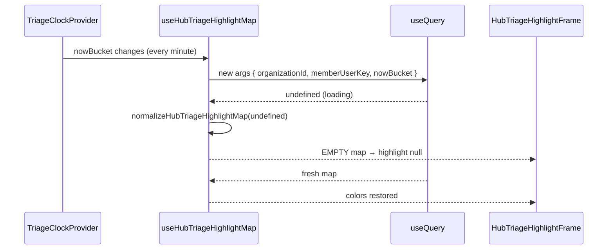

# Phase 29.1 — Task color bubbling flicker audit (read-only)

**Date:** 2026-05-28  
**Status:** Audit complete — **no code shipped**  
**Symptom:** Hub task triage colors (file → project → client) briefly disappear every ~1–3 minutes, then return.

---

## Executive summary

Triage “task colors” on the Pipeline Hub are **not** stored on rows and **not** computed in a client-side `useMemo` rollup. They come from a **single Convex subscription**:

`api.taskHighlights.getHubTriageHighlightMap` → `useHubTriageHighlightMap` → `normalizeHubTriageHighlightMap` → `resolveTriageHighlight` → `HubTriageHighlightFrame`.

The flicker is almost certainly caused by **`useQuery` returning `undefined` during re-subscription**, while the hook **immediately maps that to an empty highlight map**, so every row renders with **no** color for one or more frames.

The **primary scheduled trigger** for re-subscription is **`TriageClockProvider`**, which updates query arguments **every 60 seconds** (`nowBucket`). That matches “every few minutes” in user perception (minute ticks + occasional WebSocket reconnects).

**Recommended fix (client, minimal):** retain the last successful normalized map while `raw === undefined` and the query is still subscribed (not `"skip"`). Optional hardening: stop swallowing errors into an empty server map on transient failures.

---

## 1. Task query subscription (Hub)

### Canonical query (not `api.tasks.listForPipeline`)

Hub hierarchy colors do **not** join tasks in `PipelinePageClient` or `listTablePreview`. Bubbling is entirely server-side in `convex/taskHighlights.ts`.

| Layer | File | Role |
|-------|------|------|
| Convex query | `convex/taskHighlights.ts` → `getHubTriageHighlightMap` | Loads org tasks, filters participation, picks winners per file, bubbles to project/client keys |
| Client hook | `hooks/useHubTriageHighlightMap.ts` | `useQuery` + normalize |
| Lookup | `lib/pipeline/hubTriageHighlight.ts` → `resolveTriageHighlight` | O(1) map lookup by file/project/client id |
| Chrome | `components/pipeline/tasks/HubTriageHighlightChrome.tsx` | Left rail + pill; **renders plain wrapper when `highlight` is null** |

### Hook implementation (state drop point)

```15:27:lender-app/hooks/useHubTriageHighlightMap.ts
export function useHubTriageHighlightMap(
  organizationId: Id<"organizations"> | null | undefined,
  memberUserKey: string | undefined,
): HubTriageHighlightMapView {
  const nowBucket = useTriageClockTime();
  const queryArgs = useMemo(() => {
    const key = memberUserKey?.trim();
    if (!organizationId || !key) return "skip" as const;
    return { organizationId, memberUserKey: key, nowBucket };
  }, [organizationId, memberUserKey, nowBucket]);
  const raw = useQuery(api.taskHighlights.getHubTriageHighlightMap, queryArgs);
  return useMemo(() => normalizeHubTriageHighlightMap(raw ?? undefined), [raw]);
}
```

### What happens when `raw` is `undefined`

```133:140:lender-app/lib/pipeline/hubTriageHighlight.ts
export function normalizeHubTriageHighlightMap(
  map:
    | HubTriageHighlightMapView
    | HubTriageHighlightQueryResult
    | null
    | undefined,
): HubTriageHighlightMapView {
  if (!map) return EMPTY_HUB_TRIAGE_HIGHLIGHT_MAP;
```

`EMPTY_HUB_TRIAGE_HIGHLIGHT_MAP` is three empty objects (`byFileId`, `byProjectId`, `byClientId`). Every `resolveTriageHighlight` call returns `null`, and `HubTriageHighlightFrame` drops the border/badge:

```54:56:lender-app/components/pipeline/tasks/HubTriageHighlightChrome.tsx
  if (!highlight) {
    return <div className={className}>{children}</div>;
  }
```

**Conclusion:** There is **no** “loading” branch that preserves the previous map. Any frame where Convex `useQuery` is `undefined` **fully clears** hub colors.

Convex React behavior (documented): when query **arguments change**, the hook subscribes to a new query and the return value is **`undefined` until the new result loads**. `nowBucket` is in `queryArgs`, so **every minute bucket change forces a loading gap**.

### Subscription sites (duplicate subscriptions)

The same hook runs in multiple surfaces (each independently vulnerable to flicker):

| Consumer | Path |
|----------|------|
| Hub table / hierarchy | `PipelineHubProjectionView.tsx` (~L440) |
| Board | `PipelineBoardView.tsx` (~L389) |
| File workspace header | `PipelineFileWorkspace.tsx` (~L558) |

`PipelinePageClient` does **not** call this hook; it only passes `organizationId` / `memberUserKey` into projection children.

### Tasks on file workspace (separate path)

`FileTasksBlock` loads task **rows** via parent props and uses `useTriageClockTime()` for **client-side** schedule display — **not** for hub bubbling. Do not confuse file-level task lists with hub color subscription.

---

## 2. Bubbling calculation (server, not client `useMemo`)

### Algorithm location

All rollup logic lives in **`buildHubTriageHighlightMap`** (`convex/taskHighlights.ts`):

1. **File:** for each participating task on `relatedFileId`, `pickStrongerEntry` by `severityWeight` (then `sourceTaskId`).
2. **Project:** max among file winners in each `hubProjectKeyFromHierarchy`.
3. **Client:** max among project winners per `hubClientKeyFromHierarchy`.

Client code does **not** re-bubble; it only normalizes Convex `{ files, projects, clients }` → `{ byFileId, byProjectId, byClientId }` and looks up keys.

### Participation filter (legitimate color *changes*, not flicker)

```14:29:lender-app/lib/pipeline/triageHighlightParticipation.ts
export function taskParticipatesInTriageBubble(
  task: Pick<
    Doc<"tasks">,
    "status" | "triageLabelId" | "scheduledTriggerTime"
  >,
  nowBucket: number,
): boolean {
  if (!isTaskStatusOpenForTriage(task.status)) return false;
  if (!task.triageLabelId) return false;
  if (
    task.scheduledTriggerTime != null &&
    task.scheduledTriggerTime > nowBucket
  ) {
    return false;
  }
  return true;
}
```

When `nowBucket` advances across a task’s `scheduledTriggerTime`, colors **should** appear (by design). That is a **state change**, not an empty-map flash. Flicker is **off then same color back** with no task edits — that implicates `undefined` → empty map, not participation logic.

### Server error path (secondary flicker)

```192:209:lender-app/convex/taskHighlights.ts
    try {
      const key = await resolveMemberUserKey(ctx, args.memberUserKey);
      if (!key) return empty;
      await assertOrgMember(ctx, args.organizationId, key);
      const bucket = args.nowBucket ?? args.currentTriageTime ?? Date.now();
      return await buildHubTriageHighlightMap(/* ... */);
    } catch (error) {
      console.error("[getHubTriageHighlightMap] failed", { /* ... */ });
      return empty;
    }
```

Any transient handler failure returns the same shape as “no tasks” → client shows **no colors** until the next successful push. Less frequent than minute re-subscription but same UI effect.

---

## 3. Re-render / refresh triggers

### A. `TriageClockProvider` — **primary suspect (≈60s cadence)**

```24:41:lender-app/components/providers/TriageClockProvider.tsx
  useEffect(() => {
    const sync = () => {
      if (typeof document !== "undefined" && document.visibilityState === "hidden") {
        return;
      }
      const next = roundTriageTimeToNearestMinute(Date.now());
      setCurrentTriageTime((prev) => (prev === next ? prev : next));
    };
    // ...
    intervalId = window.setInterval(sync, TRIAGE_CLOCK_TICK_MS);
```

- `TRIAGE_CLOCK_TICK_MS = 60_000` (`lib/triageClock.ts`).
- Wrapped around all `/pipeline` routes via `app/pipeline/layout.tsx` → `PipelineTriageClockShell`.
- Changing `nowBucket` **changes `queryArgs`** → new Convex subscription → **`useQuery` → `undefined`** → **empty map** → flicker.



### B. Convex WebSocket reconnect — **episodic (minutes-scale)**

`LiveConnectionProvider` tracks `useConvexConnectionState()`. On reconnect, **all** active `useQuery` subscriptions can briefly return `undefined` (same empty-map path). `useLiveConnection` debounces UI “pending” indicators (~280ms) but **does not** protect triage highlights.

No dedicated polling of tasks on `PipelinePageClient` / `PipelineHubHierarchyView`.

### C. Clerk / auth token refresh — **low likelihood here**

`ConvexClientProvider` documents cookie session at the Next.js layer; **no Clerk provider** on the Convex client. `memberUserKey` comes from `useUserPreferences().accountId` (pipeline) or `useActorUserKey()` (board). Session rotation (`previousTokenHash` grace in `convex/auth/sessionQueries.ts`) does not directly reset highlight args unless `accountId` briefly becomes empty (would `"skip"` the query — same empty UI).

### D. Component remount — **not the main flicker mechanism**

`usePipelineLayoutRemountProbe` in `PipelineHubHierarchyView` is **debug-only** (layout forensics). Hierarchy expansion does not unmount the projection view or re-create the triage subscription.

### E. `listTablePreview` refresh — **orthogonal**

`PipelinePageClient` subscribes to `api.pipeline.listTablePreview` separately. Row data can update without clearing triage map **unless** the highlight hook also reloads in the same tick (clock/reconnect).

---

## 4. UI consumption (why flicker is visible)

Example — loan row under a project:

```166:172:lender-app/components/pipeline/PipelineHubHierarchyView.tsx
  const fileHighlight = resolveTriageHighlight(triageHighlights, {
    kind: "file",
    id: String(row._id),
  });
  return (
    <HubTriageHighlightFrame
      highlight={fileHighlight}
```

Project and client sections use the same pattern with `kind: "project" | "client"`. There is **no** CSS transition; highlight is binary present/absent → flicker reads as colors **off** then **on**.

---

## 5. Root cause ranking

| Rank | Mechanism | Evidence | User-visible effect |
|------|-----------|----------|---------------------|
| **1** | `nowBucket` in query args + `normalize(..., undefined)` → empty map | Minute clock + Convex arg-change semantics | Predictable ~60s flashes |
| **2** | `useQuery` `undefined` during any resubscribe (reconnect, deploy, tab focus) | Same hook pattern | Irregular flashes |
| **3** | `getHubTriageHighlightMap` catch → `emptyMap()` | Server logs on failure | Rare full clear |
| **4** | Legitimate schedule boundary | `scheduledTriggerTime` vs `nowBucket` | Color **changes**, not empty flash |

---

## 6. Recommended fixes (blueprint only)

### Fix A — **Sticky last-known map (recommended, client)**

**Where:** `hooks/useHubTriageHighlightMap.ts`

**Pattern:**

- Keep `useRef<HubTriageHighlightMapView>` (or `usePrevious`) of last non-empty normalized map.
- When `queryArgs === "skip"`, return `EMPTY` (or last known — product choice).
- When subscribed and `raw === undefined`, return **last known** map (optionally set `isRefreshing` for a subtle indicator).
- When `raw` is defined, update ref and return normalized map.

Preserves real-time updates: Convex still pushes new maps when tasks/labels change; only masks the **loading gap** between arg changes.

**Does not break:** scheduled label activation (server still recomputes with new `nowBucket`; when data arrives, UI updates).

### Fix B — **Decouple minute clock from subscription identity (structural)**

Options (more invasive):

1. Remove `nowBucket` from query args; evaluate schedule **only** on server with `Date.now()` — loses client/server minute sync for scheduled labels (documented in Phase 21.5).
2. Pass `nowBucket` but use a **stable** query name + server time for participation, client clock for display only.
3. Split query: static map without time + small “scheduled activations” patch query.

Prefer **Fix A** first; smallest diff, aligns with `useLiveConnection` debounce philosophy.

### Fix C — **Server: do not return empty on catch**

Re-throw or return a distinguished error so the client can retain stale data instead of assuming “no highlights.” Pair with Fix A.

### Fix D — **Single provider for hub map (optimization)**

Lift `useHubTriageHighlightMap` to `PipelinePageClient` or a `HubTriageHighlightProvider` so board + hierarchy do not duplicate subscriptions (reduces duplicate flicker work, not root cause).

### Fix E — **Optional: suppress clock tick when tab hidden**

`TriageClockProvider` already skips sync when `document.visibilityState === "hidden"`. Visible tabs still tick — expected.

---

## 7. Validation plan (post-fix)

1. Open Pipeline Hub → Client view with a labeled open task on a file.
2. Confirm rail + pill visible; **wait 2–3 minutes** without interaction.
3. **Expect:** colors stay visible across minute boundaries (no full clear).
4. Mark task done → colors clear **once** (real data change).
5. Optional: throttle network / toggle offline briefly → colors should not flash empty if Fix A applied (may hold stale until reconnect).
6. Scheduled task: set `scheduledTriggerTime` in the future; at boundary, color **appears** without prior empty flash.

---

## 8. Key file index

| Path | Relevance |
|------|-----------|
| `hooks/useHubTriageHighlightMap.ts` | **Primary fix target** |
| `lib/pipeline/hubTriageHighlight.ts` | Empty-map coercion |
| `convex/taskHighlights.ts` | Bubbling + error empty |
| `components/providers/TriageClockProvider.tsx` | 60s arg churn |
| `lib/triageClock.ts` | `TRIAGE_CLOCK_TICK_MS` |
| `lib/pipeline/triageHighlightParticipation.ts` | Legitimate on/off rules |
| `components/pipeline/tasks/HubTriageHighlightChrome.tsx` | Binary highlight render |
| `components/pipeline/PipelineHubProjectionView.tsx` | Hub wiring |
| `app/pipeline/PipelineTriageClockShell.tsx` | Clock scope |
| `docs/phase24-2A-triage-bubbling.md` | Original design |
| `docs/phase24-5-triage-visibility-audit.md` | ACL / visibility |

---

## 9. Constraint compliance

- **Read-only:** no application code or CSS changed in this phase.
- **Real-time preserved:** recommended fix retains Convex subscription; only masks transient `undefined`, not task/label mutations.
