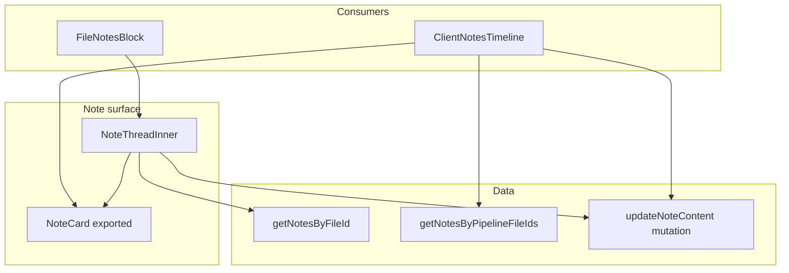

# Phase 30.1 — Admin note editing audit (read-only)

**Date:** 2026-05-28  
**Status:** Audit complete — **no code shipped**  
**Goal:** Blueprint for letting **System Admins** and **Account Owners** edit existing `pipelineFileNotes` body text via shared `NoteCard`, without layout regressions or permission leaks.

---

## Executive summary

| Layer | Today | Gap |
|-------|--------|-----|
| **Backend** | `createNote`, `pinNote`, `unpinNote`, `deleteNote` in `convex/pipelineFileNotes.ts` | No `updateNote` / content patch mutation |
| **Delete ACL** | `viewerCanDeletePipelineFileNote` (author, impersonation, legacy admin/owner, assigned **admin** or **manager**, global admin via impersonation path) | **Broader than edit should be** |
| **Pin ACL** | File **edit** access (`resolvePipelineAccessLevel === "edit"`) | Unrelated to org admin/owner |
| **Query enrichment** | `canDelete`, `canPin` on each note row | No `canEdit` / `canEditContent` flag |
| **UI** | `NoteCard` — `DropdownMenu` with Pin / Delete (`MoreHorizontal`) | No Edit; no inline edit mode |
| **Consumers** | `NoteThread` (file workspace), `ClientNotesTimeline` (hub client notes) | Both import shared `NoteCard`; same handler pattern |

**Recommended v1:** New **`updateNoteContent`** mutation with a **dedicated stricter helper** (not reuse of delete helper as-is). Expose **`canEditContent`** on query rows. Extend **`NoteCard`** with local `isEditing` state + textarea; wire **`onSaveEdit`** from `NoteThreadInner` and `ClientNotesTimeline` only (no prop drilling through hub trees).

---

## 1. Backend audit (`convex/pipelineFileNotes.ts`)

### Existing mutations

| Mutation | File access gate | Role / identity gate |
|----------|------------------|----------------------|
| `createNote` | `assertCanMutatePipelineRow(..., "note_create")` | Author = JWT subject or `memberUserKey` |
| `pinNote` / `unpinNote` | `assertCanMutatePipelineRow(..., "note_pin" \| "note_unpin")` | None beyond file edit |
| `deleteNote` | `assertCanReadPipelineRow` (viewer must **see** the file) | `viewerCanDeletePipelineFileNote` |
| `addNoteLink` / `removeNoteLink` | `assertCanMutatePipelineRow` | File edit |

### Precise delete-role helper (reference for edit design)

```134:170:lender-app/convex/pipelineFileNotes.ts
export async function viewerCanDeletePipelineFileNote(
  ctx: QueryCtx | MutationCtx,
  organizationId: Id<"organizations">,
  memberUserKey: string | undefined,
  note: Doc<"pipelineFileNotes">,
): Promise<boolean> {
  const viewerKey = await resolveViewerKey(ctx, memberUserKey);
  if (note.authorUserKey === viewerKey) return true;

  if (await impersonationGrantsOrgResourceVisibility(ctx, viewerKey, organizationId)) {
    return true;
  }

  const membershipRows = await ctx.db
    .query("organizationMembers")
    .withIndex("by_org_user", (q) =>
      q.eq("organizationId", organizationId).eq("userKey", viewerKey),
    )
    .collect();
  const membership = pickCanonicalOrgMember(membershipRows);
  if (!membership || membership.isActive === false) return false;

  if (membership.role === "owner" || membership.role === "admin") return true;

  let roleKey: string = SYSTEM_ORG_ROLE_KEYS.user;
  if (membership.assignedRoleId) {
    const roleDoc = await ctx.db.get(membership.assignedRoleId);
    if (roleDoc && roleDoc.organizationId === organizationId) {
      roleKey = roleDoc.key;
    }
  }

  return (
    roleKey === SYSTEM_ORG_ROLE_KEYS.admin ||
    roleKey === SYSTEM_ORG_ROLE_KEYS.manager
  );
}
```

**Supporting imports already in module:**

- `resolveViewerKey` (local)
- `pickCanonicalOrgMember` — `./orgMembership`
- `SYSTEM_ORG_ROLE_KEYS` — `../lib/orgRbac`
- `impersonationGrantsOrgResourceVisibility` — `./resourceAccess`

**Related canonical helper (org hierarchy, not yet used by notes):**

```639:663:lender-app/convex/resourceAccess.ts
/** Phase 15 Step 7 — owner or org admin/owner role (not shared editors). */
export async function viewerIsOrgAdminOrOwner(
  ctx: QueryCtx | MutationCtx,
  organizationId: Id<"organizations">,
  memberUserKey: string,
): Promise<boolean> {
  if (await impersonationGrantsOrgResourceVisibility(ctx, memberUserKey, organizationId)) {
    return true;
  }
  // ...
  return membership.role === "admin" || membership.role === "owner";
}
```

**Global system admin elevation:**

```32:38:lender-app/convex/auth/globalAdmin.ts
export function authUserHasGlobalAdminElevation(
  user: Doc<"authUsers"> | null | undefined,
): boolean {
  if (!user) return false;
  if (user.isGlobalAdmin === true) return true;
  if (user.systemRole === "SUPER_ADMIN") return true;
  return false;
}
```

Use via `tryGetAuthUserByPermissionKey(ctx, viewerKey)` (already used elsewhere in org access paths).

### Query enrichment today

```265:302:lender-app/convex/pipelineFileNotes.ts
  const canDelete = await viewerCanDeletePipelineFileNote(...);
  const fileEdit =
    (await resolvePipelineAccessLevel(ctx, file, memberUserKey)) === "edit";
  // ...
  return {
    // ...
    canDelete,
    canPin: fileEdit,
  };
```

- **`canDelete`** — UI delete menu (author + elevated roles).
- **`canPin`** — file edit capability, **not** org admin.

### Schema (`pipelineFileNotes`)

| Field | Editable in v1? |
|-------|------------------|
| `content` | **Yes** (target) |
| `attachments`, links | **No** in v1 (separate mutations exist for links; attachments immutable unless new mutation) |
| `authorUserKey`, `_creationTime` | **No** |
| `isPinned`, `pinnedAt`, `pinnedBy` | Unchanged by text edit |

**No** `editedAt` / `editedBy` on table today. Optional Phase 30.2 migration if audit trail is required. `activityEvents` already defines `note_edited` literal — not wired for pipeline file notes yet; optional emit on patch.

---

## 2. Proposed `updateNoteContent` mutation

### Name and args

```typescript
export const updateNoteContent = mutation({
  args: {
    noteId: v.id("pipelineFileNotes"),
    content: v.string(), // product name: newContent
    ...orgMemberArgs,     // organizationId, memberUserKey?
  },
  // ...
});
```

### Handler sequence (mirror `deleteNote` safety)

1. `note = await ctx.db.get(noteId)` — throw if missing.
2. `assertNoteOrgMatch(note, organizationId)`.
3. `file = await loadPipelineFile(ctx, note.pipelineFileId)`.
4. `assertFileOrgMatch(file, organizationId)`.
5. `await assertCanReadPipelineRow(ctx, file, memberUserKey)` — viewer must already see the note in timelines.
6. `if (!(await viewerCanEditPipelineFileNoteContent(ctx, organizationId, memberUserKey, note))) throw UNAUTHORIZED_EDIT`.
7. `const content = args.content.trim()` — validate non-empty **or** note still has attachments/links (same spirit as `createNote`).
8. `await ctx.db.patch(noteId, { content })`.
9. Return `{ ok: true }` (optional: `noteId`).

**Do not** require `assertCanMutatePipelineRow` for pin/create — org-level edit is intentional even when the user has **view-only** file share (owner correcting audit log). Read gate + edit-role gate is sufficient.

### Proposed `viewerCanEditPipelineFileNoteContent` (new export)

**Stricter than delete** — implements product rule “System Admins and Account Owners only”:

| Actor | Edit content? | Delete note today? |
|-------|---------------|-------------------|
| Note author (standard user) | **No** | **Yes** |
| Assigned **manager** role | **No** | **Yes** |
| Legacy `organizationMembers.role === "owner"` | **Yes** (Account Owner) | Yes |
| Legacy `role === "admin"` | **Yes** (org admin membership) | Yes |
| Assigned role key `admin` (`SYSTEM_ORG_ROLE_KEYS.admin`) | **Yes** | Yes |
| `authUserHasGlobalAdminElevation` | **Yes** (System Admin) | Via impersonation only in delete helper |
| Active org **impersonation** (`impersonationGrantsOrgResourceVisibility`) | **Recommend Yes** (support) | Yes |

**Pseudocode:**

```typescript
const UNAUTHORIZED_EDIT_NOTE =
  "Unauthorized: Only organization owners or administrators can edit this note.";

export async function viewerCanEditPipelineFileNoteContent(
  ctx: QueryCtx | MutationCtx,
  organizationId: Id<"organizations">,
  memberUserKey: string | undefined,
  _note: Doc<"pipelineFileNotes">,
): Promise<boolean> {
  const viewerKey = await resolveViewerKey(ctx, memberUserKey);

  const authUser = await tryGetAuthUserByPermissionKey(ctx, viewerKey);
  if (authUserHasGlobalAdminElevation(authUser)) return true;

  if (await impersonationGrantsOrgResourceVisibility(ctx, viewerKey, organizationId)) {
    return true;
  }

  const membershipRows = await ctx.db
    .query("organizationMembers")
    .withIndex("by_org_user", (q) =>
      q.eq("organizationId", organizationId).eq("userKey", viewerKey),
    )
    .collect();
  const membership = pickCanonicalOrgMember(membershipRows);
  if (!membership || membership.isActive === false) return false;

  if (membership.role === "owner" || membership.role === "admin") return true;

  if (membership.assignedRoleId) {
    const roleDoc = await ctx.db.get(membership.assignedRoleId);
    if (roleDoc?.organizationId === organizationId && roleDoc.key === SYSTEM_ORG_ROLE_KEYS.admin) {
      return true;
    }
  }

  return false;
}
```

**Alternative (narrower):** delegate to `viewerIsOrgAdminOrOwner` + global admin only — excludes assigned RBAC `admin` role users who lack legacy `admin` membership. Prefer explicit helper above for parity with delete’s assigned-role check but **without** author/manager.

### Query changes

In `enrichPipelineFileNoteForViewer`:

```typescript
const canEditContent = await viewerCanEditPipelineFileNoteContent(
  ctx, organizationId, memberUserKey, row,
);
// return { ..., canEditContent }
```

Update:

- `lib/pipeline/pipelineFileNotesTypes.ts` — `canEditContent: boolean` on `PipelineFileNoteView`
- `lib/pipeline/normalizePipelineFileNotes.ts` — default `false` when missing (hydration guard)

Both `getNotesByFileId` and `getNotesByPipelineFileIds` use enrichment — **client hub timeline gets the flag automatically**.

---

## 3. Frontend UI audit (`NoteCard`)

### Location

- **Component:** `lender-app/components/pipeline/notes/NoteThread.tsx` — exported **`NoteCard`** (Phase 28.2 re-use).
- **Menu:** `DropdownMenu` + `MoreHorizontal` ghost button in note **header** (lines ~213–261).
- **Visibility:** `showMenu = note.canPin || note.canDelete` — menu hidden entirely if neither flag.

### Safe placement for “Edit”

Insert **`DropdownMenuItem`** after Pin block, before Delete separator:

1. Pin / Unpin (if `note.canPin`)
2. **Edit note** (if `note.canEditContent`) — icon `Pencil` from `lucide-react`
3. Separator (if both edit and delete)
4. Delete (if `note.canDelete`)

**Conditional hide:** `note.canEditContent === false` → no Edit item (standard users never see it). Server is authoritative; UI must not show Edit based on client-side role guessing.

### Inline edit mode — state plan

**Today:** `NoteCard` is stateless except props; parents hold `deletingId` / `pinningId`.

**Recommended:** **Local state inside `NoteCard`** (lowest blast radius):

```typescript
const [isEditing, setIsEditing] = useState(false);
const [draft, setDraft] = useState(note.content);
```

| Event | Action |
|-------|--------|
| Edit clicked | `setDraft(note.content)`, `setIsEditing(true)`, close dropdown (native on click) |
| Cancel | `setIsEditing(false)`, reset draft |
| Save | Call `onSaveEdit(note._id, draft.trim())`, parent sets `savingEditId`, on success `setIsEditing(false)` |

**Parent props to add:**

```typescript
export type NoteCardProps = {
  // existing...
  savingEditId?: Id<"pipelineFileNotes"> | null;
  onSaveEdit?: (id: Id<"pipelineFileNotes">, content: string) => void | Promise<void>;
};
```

**Busy / menu rules:**

- `busy = deletingId === id || pinningId === id || savingEditId === id`
- While `isEditing`: hide `DropdownMenu` (or disable trigger); show Save/Cancel under textarea
- `showMenu = !isEditing && (note.canPin || note.canDelete || note.canEditContent)`

### Layout swap (minimal CLS)

Replace only the body block:

```267:271:lender-app/components/pipeline/notes/NoteThread.tsx
      {note.content ? (
        <p className="whitespace-pre-wrap text-sm text-foreground/90">
          {note.content}
        </p>
      ) : null}
```

**Edit mode:**

- `textarea` with `OP_INLINE_TEXTAREA_CLASS` + `rows={3}` + `resize-y` (match `NoteComposer`)
- Action row: `Button` size `sm` — Save (primary), Cancel (ghost)
- Wrap in `InlineFieldSync loading={savingEditId === note._id}` for consistency
- Keep **header** (author, time, avatar), **pinned banner**, **`sourceFileLabel`** (client hub), and **`NoteAttachments`** below unchanged
- Empty content notes: still allow edit if attachments/links exist; textarea placeholder “Note body…”

**Mobile:** existing `max-md:break-words` on author line; textarea full width — no new scrollport (workspace scroll rules unchanged).

### Parent wiring (mutations)

**`NoteThreadInner`:**

```typescript
const updateNoteContent = useMutation(api.pipelineFileNotes.updateNoteContent);
const [savingEditId, setSavingEditId] = useState<Id<"pipelineFileNotes"> | null>(null);

const handleSaveEdit = useCallback(async (noteId, content) => {
  setSavingEditId(noteId);
  try {
    await updateNoteContent({ noteId, content, organizationId, memberUserKey });
  } finally {
    setSavingEditId(null);
  }
}, [...]);
```

Extend `handlers` spread into `NoteListSection` / `NoteCard`.

**`ClientNotesTimeline`:** identical mutation + `savingEditId` — **no** changes to `ClientNotesSubsection` or hub props.

---

## 4. Shared component impact



| Surface | Path | Prop drilling? |
|---------|------|----------------|
| File workspace | `PipelineFileWorkspace` → `FileNotesBlock` → `NoteThread` | **No** — org/file ids already on block |
| Client hub | `ClientNotesSubsection` → `ClientNotesTimeline` → `NoteCard` | **No** — org/member on timeline only |
| Board / table | Does not use `NoteCard` today | N/A |

**Phase 28 `sourceFileLabel`:** Unaffected — badge renders above header; edit toggles body only.

**Risk:** None of the hub hierarchy parents need `canEdit` — flag rides on each **note row** from Convex.

---

## 5. Permission matrix (UI vs server)

| User | Sees Edit in menu | Server accepts patch |
|------|-------------------|----------------------|
| Org owner | Yes (`canEditContent`) | Yes |
| Legacy org admin member | Yes | Yes |
| RBAC assigned `admin` role | Yes | Yes |
| Global / SUPER_ADMIN | Yes | Yes |
| Impersonating support | Yes (if policy kept) | Yes |
| Manager | No | No |
| Note author (non-admin) | No | No |
| View-only file share | Yes **if** admin/owner | Yes (read + role) |

---

## 6. Implementation checklist (Phase 30.2)

### Backend

- [ ] Add `viewerCanEditPipelineFileNoteContent` in `pipelineFileNotes.ts` (or re-export from `resourceAccess` if consolidated).
- [ ] Add `updateNoteContent` mutation + `UNAUTHORIZED_EDIT_NOTE` string.
- [ ] Add `canEditContent` to `enrichPipelineFileNoteForViewer`.
- [ ] Types + `normalizePipelineFileNoteRow` default.

### Frontend

- [ ] Extend `NoteCard` — Edit menu item, `isEditing`, textarea, Save/Cancel.
- [ ] Extend `NoteListSection` handler types.
- [ ] Wire `NoteThreadInner` + `ClientNotesTimeline` mutations.
- [ ] Optional: `data-testid="pipeline-note-edit-*"` for governance smoke.

### Out of scope v1

- Editing attachments / links inline
- Author self-edit
- `editedAt` column / activity feed emit (optional follow-up)

### Validation

- `npm run build` from `lender-app/`
- Manual: owner edits note on file + client aggregated timeline; manager/author do not see Edit; save persists after refresh
- `npm run qa:governance` + `npm run deploy:prod` per project rules when shipping

---

## 7. Key files

| Path | Role |
|------|------|
| `lender-app/convex/pipelineFileNotes.ts` | Mutations + enrich + new helper |
| `lender-app/convex/resourceAccess.ts` | `viewerIsOrgAdminOrOwner`, `impersonationGrantsOrgResourceVisibility` |
| `lender-app/convex/auth/globalAdmin.ts` | System admin elevation |
| `lender-app/lib/pipeline/pipelineFileNotesTypes.ts` | `canEditContent` type |
| `lender-app/components/pipeline/notes/NoteThread.tsx` | `NoteCard` + `NoteThreadInner` |
| `lender-app/components/pipeline/notes/ClientNotesTimeline.tsx` | Hub consumer |
| `lender-app/components/pipeline/blocks/FileNotesBlock.tsx` | File workspace entry |
| `lender-app/components/pipeline/notes/NoteComposer.tsx` | Textarea styling reference |

---

## 8. Constraint compliance

- **Read-only:** no application code or CSS modified in this phase.
- **Layout safety:** edit mode scoped to body swap; header/menu/attachments contract preserved.
- **Strict ACL:** edit helper **narrower than delete**; standard users cannot patch even if they craft API calls.
