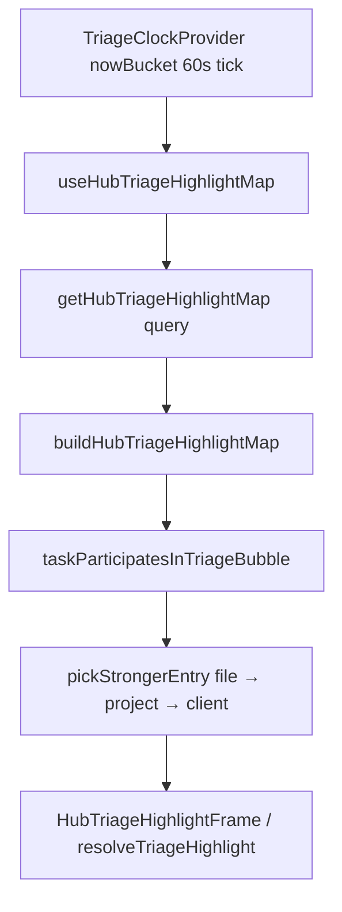

# Phase 32.1 — Task Attempt / Snooze workflow audit (read-only)

**Date:** 2026-06-04  
**Status:** Architectural blueprint only — **no code shipped**  
**Goal:** Safely add “log attempt + note + snooze” and suppress triage bubbling until wake-up, without regressing Phase 24.2A hub highlights or Phase 29.2 sticky-map behavior.

---

## Executive summary

| Area | Finding |
|------|---------|
| **Snooze storage** | Already exists on `tasks` as `snoozedUntil` (Unix ms). Mutations `tasks.snooze` / `tasks.wake` are production-ready. Do **not** add a parallel `snoozeUntil` field. |
| **True age** | Use existing `tasks.createdAt` (preserved on `patch`; new recurrence instances intentionally get a fresh `createdAt`). `_creationTime` is a poor UX choice because it tracks document insert, not business “task born” time. |
| **Attempt count / audit** | **Not implemented today.** Recommend schema extensions on `tasks` + `pipelineFileNotes`, plus one transactional mutation. |
| **Highlight suppression** | Inject snooze gate in **`taskParticipatesInTriageBubble`** (shared participation rule) so `buildHubTriageHighlightMap` and all consumers stay aligned. Mirror the same rule in client triage chrome (`isTaskHighlightActive` / `inFileTaskTriageVisualState`) so file rows do not show active color while snoozed. |
| **UI** | File pipeline: `FileTaskTriageFeedRow` + `FileTasksBlock`. Global tasks: `app/tasks/page.tsx` + `TaskDrawer`. Snooze UI: reuse `SnoozeMenu` patterns; attempt flow needs new sheet/dialog. |
| **Settings** | Extend `organizationSettings` with org-local “next morning” wake time; surface in `OrganizationSettingsPanel` next to triage palette / labels. |

---

## 1. Schema & data model audit

### 1.1 `tasks` table (canonical: `convex/schema.ts` ~1817–2008)

**Existing fields relevant to Phase 32:**

| Field | Type | Role today |
|-------|------|------------|
| `snoozedUntil` | `v.optional(v.number())` | Wake-up instant (ms). UI treats `snoozedUntil > Date.now()` as snoozed. Cleared by `tasks.wake` or left to expire lazily. |
| `createdAt` | `v.number()` | Set on insert; **preserved** on `patch` (`createdAt: existing.createdAt`). Use for **permanent “True Age”** in UI. |
| `updatedAt` | `v.number()` | Mutations bump on every edit — **not** true age. |
| `labelAppliedAt` | `v.optional(v.number())` | When triage label last applied — **not** task birth. Already shown via `LabelAppliedAtCaption`. |
| `triageLabelId` | optional id | Drives hub bubble when open + participating. |
| `scheduledTriggerTime` | optional ms | Deferred triage activation. |
| `relatedFileId` | optional `Id<"pipeline">` | Required for file-scoped attempt notes + hub bubbling. |

**Snooze naming:** Product copy may say “snooze until”; storage remains **`snoozedUntil`** for consistency with `tasks.snooze`, `TaskDrawer`, `SnoozeMenu`, notifications, and pipeline file snooze.

#### Recommended additions (Phase 32.2+)

```ts
// tasks — additive, backward compatible
attemptCount: v.optional(v.number()), // default 0 in app logic; backfill undefined → 0
lastAttemptAt: v.optional(v.number()), // optional UX / sorting; set on each attempt
```

**Do not add `originalCreatedAt` unless product requires “age across recurrence series.”** Today:

- Normal edits keep `createdAt`.
- Recurrence `complete` spawns a **new** task row with `createdAt: now` (intentional new instance).

If “true age” must survive recurrence lineage, add `originalCreatedAt` only on spawn (`originalCreatedAt: t.originalCreatedAt ?? t.createdAt`) — out of scope unless explicitly requested.

#### Existing server API (reuse)

| Mutation | File | Behavior |
|----------|------|----------|
| `snooze` | `convex/tasks.ts` ~1246 | `patch({ snoozedUntil: until, ... })`; validates future `until`. |
| `wake` | `convex/tasks.ts` ~1269 | Clears `snoozedUntil`. |

**New mutation (planned):** `recordTaskAttempt` (single transaction):

1. Validate org + task + file read/mutate ACL.
2. Require non-empty attempt note (or allow attachment/link per note rules).
3. Insert `pipelineFileNotes` row (badged — see §1.2).
4. `patch` task: `attemptCount += 1`, `lastAttemptAt = now`, `snoozedUntil = until` (from preset).
5. `appendTaskFeed` with kind `task_attempt` (optional; complements note audit).
6. Return `{ noteId, attemptNumber, until }`.

Snooze-only path can call existing `tasks.snooze` without a note; attempt path should **always** set snooze when user picks a wake preset (product requirement).

---

### 1.2 `pipelineFileNotes` (canonical: `convex/schema.ts` ~3479–3500)

**Today:** `organizationId`, `pipelineFileId`, `authorUserKey`, `content`, `attachments`, pin fields. **No** task linkage or note classification.

**Recommended additions:**

```ts
// pipelineFileNotes — additive
noteKind: v.optional(
  v.union(
    v.literal("user"),           // default when omitted (legacy rows)
    v.literal("task_attempt"),
  ),
),
linkedTaskId: v.optional(v.id("tasks")),
attemptNumber: v.optional(v.number()), // denormalized 1..N for audit list
```

**Why notes vs only `activityFeed`?**

- `activityFeed` (`appendTaskFeed`) stores short summaries on org/file scope — good for global feed, weak for rich attempt body + attachments + dedicated audit popup.
- File notes already power Phase 19–30 note UX, permissions, and hub client timelines.
- Attempt audit popup = query notes where `linkedTaskId = taskId` AND `noteKind = "task_attempt"`, sorted by `_creationTime` or `attemptNumber`.

**Index recommendation:**

```ts
.index("by_file_task_kind", ["pipelineFileId", "linkedTaskId", "noteKind"])
```

Or `by_linkedTask` on `linkedTaskId` if attempts should appear even when querying by task across files (usually same file as `relatedFileId`).

**Create path:** Extend `createNote` **or** add `createTaskAttemptNote` that:

- Forces `noteKind: "task_attempt"`, `linkedTaskId`, `attemptNumber`.
- Prefixes content with system badge line in UI only (prefer metadata over string parsing).
- Restricts edit/delete: follow Phase 30 note RBAC — likely authors cannot edit system attempt rows; admins may edit body if required (policy TBD in 32.2).

**Display badge (UI):** In `NoteCard` / timeline, when `noteKind === "task_attempt"`, render chip “Task attempt #N” and link to source task title.

---

### 1.3 Alternative considered: `taskAttempts` table

| Approach | Pros | Cons |
|----------|------|------|
| Badged `pipelineFileNotes` | Reuses note infra, file timeline visibility, attachments | Mixes user notes + attempts in same table |
| Dedicated `taskAttempts` | Clean audit schema | Duplicate storage, new UI surface, more migrations |

**Recommendation:** Badged notes + denormalized `tasks.attemptCount` for O(1) counter badge.

---

## 2. Triage & highlight suppression audit

### 2.1 Data flow (hub / board / file workspace)



**Canonical server rollup:** `convex/taskHighlights.ts`

| Function | Lines (approx.) | Role |
|----------|-----------------|------|
| `buildHubTriageHighlightMap` | 96–184 | Loads org tasks, builds `files` / `projects` / `clients` winner maps |
| `taskParticipatesInTriageBubble` | **imported** from `lib/pipeline/triageHighlightParticipation.ts` | **Gate before a task enters rollup** |
| `pickStrongerEntry` | 56–66 | Max `severityWeight` winner per bucket |
| `getHubTriageHighlightMap` | 188–210 | Query wrapper; passes `nowBucket` |

**Critical loop (injection point):**

```134:147:lender-app/convex/taskHighlights.ts
  for (const task of tasks) {
    if (!taskParticipatesInTriageBubble(task, now)) continue;
    if (!task.relatedFileId || !task.triageLabelId) continue;
    // ... buildEntry, pickStrongerEntry into files[fileKey]
```

### 2.2 Participation rule today

`lib/pipeline/triageHighlightParticipation.ts`:

```14:29:lender-app/lib/pipeline/triageHighlightParticipation.ts
export function taskParticipatesInTriageBubble(
  task: Pick<Doc<"tasks">, "status" | "triageLabelId" | "scheduledTriggerTime">,
  nowBucket: number,
): boolean {
  if (!isTaskStatusOpenForTriage(task.status)) return false;
  if (!task.triageLabelId) return false;
  if (
    task.scheduledTriggerTime != null &&
    task.scheduledTriggerTime > nowBucket
  ) {
    return false;
  }
  return true;
}
```

**Does not consider `snoozedUntil` today** — snoozed tasks with labels still bubble to file/project/client headers.

### 2.3 Exact suppression plan (server)

**Primary injection (single source of truth):**

Extend `taskParticipatesInTriageBubble` signature:

```ts
task: Pick<
  Doc<"tasks">,
  "status" | "triageLabelId" | "scheduledTriggerTime" | "snoozedUntil"
>,
nowBucket: number,
```

Add **before** label checks or after open-status check:

```ts
if (
  task.snoozedUntil != null &&
  task.snoozedUntil > nowBucket
) {
  return false;
}
```

Use **`nowBucket`** (minute-rounded evaluation time from `resolveTriageEvaluationTime(nowBucket)` in `buildHubTriageHighlightMap`), not raw `Date.now()` inside the helper, so server and client clocks stay aligned with `TriageClockProvider`.

**Do not** sprinkle snooze checks only inside `pickStrongerEntry` — participation must fail first so suppressed tasks never become `sourceTaskId` on hub pills.

### 2.4 Client-side triage chrome (file row — must match server)

File rows use a **separate** visual engine:

| Layer | File | Function |
|-------|------|----------|
| Active color | `lib/taskHighlightEngine.ts` | `isTaskHighlightActive(task, now)` |
| Row state | `lib/inFileTaskTriageUi.ts` | `inFileTaskTriageVisualState` → `active` / `pending` |

Neither checks `snoozedUntil`. **Plan:** Add snooze guard to `isTaskHighlightActive` (or `inFileTaskTriageVisualState`) so snoozed tasks lose left-border tint and “active” styling while still showing label pill + snooze badge.

### 2.5 Phase 29.2 sticky-map safety

`hooks/useHubTriageHighlightMap.ts` retains last known map while `raw === undefined` during `nowBucket` resubscribe. **Snooze suppression only changes server result content** — it does not alter hook args shape or normalize keys. Safe if:

- Participation change is purely boolean (fewer tasks in rollup).
- No rename of `files` / `projects` / `clients` response keys.
- No removal of `nowBucket` from query args (still drives scheduled label activation).

**Risk to avoid:** Returning `undefined` from query on snooze mutation — keep query stable; rely on Convex reactivity when `tasks` documents patch.

### 2.6 Other task list filters (consistency)

`convex/tasks.ts` already skips snoozed tasks in some list paths (`snoozedUntil > now` ~273). Align product rules:

| Surface | Snoozed task visibility | Triage color |
|---------|-------------------------|--------------|
| Hub header bubble | Hidden from rollup | N/A |
| File task row | Still listed (recommend) | Muted / no active highlight |
| Tasks matrix default views | Often hidden | N/A |
| TaskDrawer | Visible + `SnoozedBadge` | Show snooze state |

---

## 3. Frontend UI integration audit

### 3.1 Primary task surfaces

| Context | Component | Path | Notes |
|---------|-----------|------|-------|
| Pipeline file block | `FileTasksBlock` | `components/pipeline/blocks/FileTasksBlock.tsx` | Sorts/renders `FileTaskTriageFeedRow`; opens `TaskDrawer` via `onOpen` |
| Single task row | `FileTaskTriageFeedRow` | `components/pipeline/tasks/FileTaskTriageFeedRow.tsx` | Checkbox, label pill, meta line — **best place for True Age + Attempt badge + Attempt/Snooze CTA** |
| Task inspector | `TaskDrawer` | `components/TaskDrawer.tsx` | Already has `SnoozeMenu` in header + Schedule section (~794–960) |
| Global tasks page | `app/tasks/page.tsx` | Matrix/list rows with `SnoozeMenu` ~881+ | Attempt workflow may be drawer-only or duplicated later |

### 3.2 Planned UI injections (`FileTaskTriageFeedRow`)

**A. Permanent “True Age”**

- Display: `tasks.createdAt` formatted (e.g. `formatRelativeTimestamp(createdAt, evaluationTime)` or absolute “Created May 12”).
- Placement: meta line under title (~317–339) or new caption next to `LabelAppliedAtCaption`.
- Do **not** use `labelAppliedAt` for age.

**B. Interactive attempt counter**

- Badge: `attemptCount ?? 0` — hide when 0 or show “0 attempts” per design.
- Click: open **Attempt Audit Log** modal/sheet (portal overlay — follow `SnoozeMenu` / `OverlayShell` patterns).
- Data: `useQuery(api.pipelineFileNotes.listTaskAttemptNotes, { taskId, pipelineFileId, ... })` (new query).

**C. “Attempt / Snooze” action**

- Button in row actions (beside delete) or overflow menu.
- Opens **AttemptSnoozeSheet** (new component):
  1. Required textarea (attempt note).
  2. Quick presets: **Next Morning**, **3 Days**, **5 Days**, **1 Week** (compute `until` ms server-side or shared `lib/taskSnoozePresets.ts`).
  3. Optional custom date/time.
  4. Submit → `recordTaskAttempt` mutation.
- Reuse portaled dropdown/overlay discipline from Phase 31.1.

### 3.3 `TaskDrawer` integration

- Add matching **Attempt counter + audit log** in header or Schedule section.
- Wire same mutation; keep existing `SnoozeMenu` for snooze-only (no note).
- Show **True Age** near title or schedule (drawer currently emphasizes `labelAppliedAt` only indirectly).

### 3.4 State management plan (modals)

| State | Owner | Notes |
|-------|-------|-------|
| `attemptAuditOpen` + `auditTaskId` | `FileTasksBlock` or row-local | Lift to block if multiple rows — avoids N modals |
| `attemptSnoozeOpen` + `targetTask` | Same | Pass `pipelineFileId`, `organizationId`, `memberUserKey` |
| `draftNote` / `selectedPreset` | `AttemptSnoozeSheet` internal | Reset on close |
| `saving` / error | Sheet | Disable submit while mutation in flight |
| Convex subscriptions | Existing task list queries | After mutation, `attemptCount` + notes query refresh reactively |

**No global Zustand required** — follow existing block-level patterns (`quickEdit` state in `FileTasksBlock` ~66–69).

### 3.5 Note creation path (today)

`api.pipelineFileNotes.createNote` — file-scoped, no `taskId`. Phase 32 should **not** overload generic composer for system attempts; use dedicated mutation to enforce `noteKind` + linkage.

---

## 4. Settings integration audit

### 4.1 Where triage settings live today

| Setting | Storage | UI | API |
|---------|---------|-----|-----|
| 8 color presets | `organizationSettings.taskColorPresets` | `OrganizationSettingsPanel` + task color section | `getTaskColorPresets` / `updateTaskColorPresets` |
| Triage labels | `organizationTriageLabels` table | `OrganizationTriageLabelsPanel` | `organizationTriageLabels.*` |
| Label severity / sort | per-label fields | Triage labels panel | upsert mutations |

**File:** `convex/organizationSettings.ts` — `ensureOrganizationSettings`, `readTaskColorPresetsForOrg`.

### 4.2 “Default Next Morning Wake-Up Time” (new)

**Recommended schema** on `organizationSettings`:

```ts
taskSnoozeDefaults: v.optional(
  v.object({
    /** IANA timezone, e.g. "America/Chicago" */
    timezone: v.string(),
    /** 0–23 local hour for "Next Morning" preset */
    nextMorningHour: v.number(),
    /** 0–59 */
    nextMorningMinute: v.number(),
  }),
),
```

**Defaults when unset:** `America/Chicago`, `8:00` (matches product example CST).

**UI:** New subsection in `OrganizationSettingsPanel` (admin, `settings.manage`):

- Timezone select (curated list or free-text IANA).
- Time picker for morning hour.
- Helper text: “Used by Task Attempt snooze preset ‘Next Morning’.”

**API:**

- `getTaskSnoozeDefaults` query (or extend existing settings read).
- `updateTaskSnoozeDefaults` mutation patching `organizationSettings`.

**Preset computation (shared):** `lib/taskSnoozePresets.ts`

```ts
computeNextMorning(unixNow, defaults): number
computePlusDays(unixNow, days): number
```

Used by **both** client sheet preview and server `recordTaskAttempt` validation (server wins on mismatch).

---

## 5. Implementation blueprint (Phase 32.2+)

### 5.1 Work packages (ordered)

1. **Schema migration** — `tasks.attemptCount`, `pipelineFileNotes` linkage fields + index; optional `organizationSettings.taskSnoozeDefaults`.
2. **Participation + client highlight** — snooze gate in `taskParticipatesInTriageBubble` + `isTaskHighlightActive`.
3. **Backend mutations/queries** — `recordTaskAttempt`, `listTaskAttemptNotes`; reuse `tasks.snooze` for snooze-only.
4. **Settings UI + preset lib** — org morning time.
5. **File task row UI** — true age, counter, attempt sheet, audit modal.
6. **TaskDrawer parity** — same audit + attempt entry.
7. **QA** — hub bubble clears when snoozed; returns after wake; Phase 29 sticky map no flicker regression; mobile overlays.

### 5.2 Snooze preset mapping (product → ms)

| Preset | Computation |
|--------|-------------|
| Next Morning | Next calendar day (or same day if before cutoff) at `nextMorningHour:minute` in org timezone |
| 3 Days | `now + 3 * 86400000` or end-of-day variant (pick one, document) |
| 5 Days | same |
| 1 Week | `now + 7 * 86400000` |

Align copy with `SnoozeMenu` presets where overlap (“Tomorrow”, “Next week”) but task-attempt flow uses **fixed product set** from spec.

### 5.3 Testing checklist

- [ ] Snoozed labeled task: file/project/client hub colors disappear until `snoozedUntil <= nowBucket`.
- [ ] Wake / expiry: colors return without page reload.
- [ ] Attempt: note appears on file timeline with attempt badge; counter increments.
- [ ] Audit modal lists only `task_attempt` notes for task.
- [ ] `useHubTriageHighlightMap` does not flash empty map on minute tick (Phase 29 regression).
- [ ] Mobile: attempt sheet + audit modal use body portal; no clip inside `HubCollapsibleSubsection`.

### 5.4 Files touched (forecast)

| File | Change |
|------|--------|
| `convex/schema.ts` | New optional fields + index |
| `lib/pipeline/triageHighlightParticipation.ts` | Snooze gate |
| `convex/taskHighlights.ts` | Import extended Pick (no logic duplicate) |
| `lib/taskHighlightEngine.ts` | Snooze gate for row chrome |
| `convex/pipelineFileNotes.ts` | Attempt note mutation + query |
| `convex/tasks.ts` | `recordTaskAttempt` |
| `convex/organizationSettings.ts` | Snooze defaults read/write |
| `components/pipeline/tasks/FileTaskTriageFeedRow.tsx` | Age, badge, CTA |
| `components/pipeline/blocks/FileTasksBlock.tsx` | Modal hosts |
| `components/TaskDrawer.tsx` | Parity |
| `components/settings/OrganizationSettingsPanel.tsx` | Morning time settings |
| `lib/taskSnoozePresets.ts` | **New** shared preset math |

---

## 6. Constraints acknowledged

- **Read-only:** This document is the Phase 32.1 deliverable; implementation is Phase 32.2+.
- **Scroll / overlay:** Attempt audit and snooze sheet must use existing portal overlay patterns (`OverlayShell`, portaled menus) per scroll governance.
- **No duplicate snooze systems:** Use `tasks.snoozedUntil` only; pipeline file `snoozedUntil` is a separate domain (do not merge).
- **Convex deploy:** Schema changes require `convex:deploy:prod` before Vercel when implemented.

---

## 7. Quick answers to spec wording

| Spec term | Canonical mapping in codebase |
|-----------|-------------------------------|
| `snoozeUntil` | **`tasks.snoozedUntil`** |
| `attemptCount` | **New** on `tasks` (denormalized) |
| `originalCreatedAt` | Use **`tasks.createdAt`**; add `originalCreatedAt` only for cross-recurrence lineage |
| Task Attempt note | **`pipelineFileNotes`** with `noteKind: "task_attempt"` + `linkedTaskId` |
| Mute highlight rollup | **`taskParticipatesInTriageBubble`** + client `isTaskHighlightActive` |
| Default 8:00 AM CST | **`organizationSettings.taskSnoozeDefaults`** |
