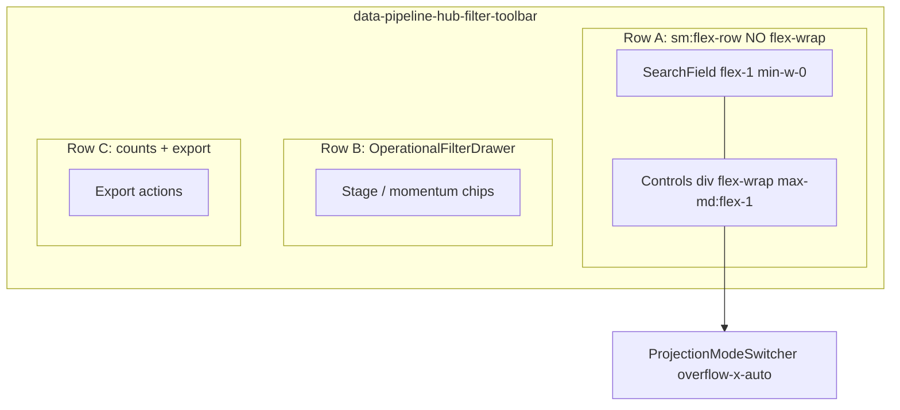

# Phase 36.1 — Pipeline hub header layout audit (read-only)

**Date:** 2026-05-28  
**Status:** Structural forensic audit only — **no code changes**  
**Goal:** Map DOM, flex boundaries, and reuse candidates before a minimal collapsible hub header (Phase 36.2+).

**Primary surface:** `/pipeline` hub table view (`effectiveView === "table"`).  
**Route entry:** `lender-app/app/pipeline/page.tsx` → dynamic `PipelinePageClient` (all hub chrome lives in one client file).

---

## Executive summary

| Finding | Detail |
|--------|--------|
| **Single owner file** | Almost all hub header UI is inline in `app/pipeline/PipelinePageClient.tsx` (~1497–2227), not a dedicated `PipelineHubHeader.tsx`. |
| **“Entity tabs”** | **`ProjectionModeSwitcher`** — 7 hub modes + optional **Events** link (`buildHubProjectionOptions` in `lib/pipeline/hubProjectionUi.ts`). Labels: Client, Project, Loan File, Lender, Referral Partner, Team Member, Task, Events. |
| **Hub search** | **`SearchField`** at toolbar row (~1615–1621); second **`SearchField`** (compact) in list body for projection-local search (~2476–2487). |
| **Secondary controls** | Same toolbar stack: Sort (`ResponsiveToolbarGroup`), Table/Board, Density, Quick presets, Saved views (`<details>`), mobile Cards/Grid, **`PipelineHubMobileFilterSheetTrigger`**, then **`OperationalFilterDrawer`** for stage/momentum chips. |
| **Overlap driver** | From **`sm` (640px)** the search + controls share one **`flex-row` without `flex-wrap`**, while both columns can **`flex-1`** below **`md`**. **`ProjectionModeSwitcher`** tabs are **`shrink-0`** with horizontal scroll — overflow can paint over the adjacent search column. |
| **Existing collapse patterns** | **`OperationalFilterDrawer`** (filters), **`PipelineHubMobileFilterSheet`** (mobile sort/stage/search duplicate), **`ResponsiveToolbarGroup`** (breakpoint hide), **`DropdownMenu`** (`lg:hidden`), native **`<details>`** (saved views, export). No unified “Views & filters” drawer yet. |

**Note:** `lib/pipeline/pipelineHeaderFlex.ts` applies to **pipeline file workspace** chrome (`PipelineFileWorkspace.tsx`), **not** the hub filter toolbar.

---

## 1. Component mapping

### 1.1 Route and page shell

| Layer | File | Lines (approx.) | Role |
|-------|------|-----------------|------|
| Server route | `app/pipeline/page.tsx` | 1–39 | `Suspense` + dynamic import of `PipelinePageClient` |
| Hub client | `app/pipeline/PipelinePageClient.tsx` | 1493–2615 | Entire hub layout, state, toolbar, list, board, mobile sheet |

**Page root** (`data-pipeline-page-root`, ~1497–1504): vertical stack with page title + actions, then hub card.

### 1.2 Page title tier (above filter card)

| Element | Lines | Classes / notes |
|---------|-------|-----------------|
| `<h1>Pipeline</h1>` | 1507–1508 | `text-xl md:text-2xl` |
| Subtitle | 1510–1513 | `hidden md:block` |
| Licenses link | 1517–1527 | `hidden md:inline-flex` |
| Mobile “More” | 1528–1555 | `<details>` dropdown |
| “New…” create | 1556–1594 | `<details>` primary CTA |

This tier is **separate** from the cluttered filter toolbar card below.

### 1.3 Hub filter toolbar card (primary audit target)

**Wrapper** (~1607–1608):

```text
div.flex.flex-col.gap-3
  └─ div.relative.z-20.isolate.rounded-xl.border.shadow-sm
       └─ div[data-pipeline-hub-filter-toolbar].border-b
            └─ div.flex.flex-col.gap-3.p-3
```

**`data-pipeline-hub-filter-toolbar`** (~1610–1611): `relative shrink-0 border-b bg-background` — sticky behavior is **not** on this node; list scroll is **`AppChrome` `<main>`** per comment ~2229–2231.

#### Row A — Search + projection + display controls (~1613–1941)

```text
div.flex.flex-col.gap-2.sm:flex-row.sm:items-center.sm:gap-3     ← collision host
├─ SearchField (containerClassName="flex-1")                      ← ~1615–1621
└─ div.flex.min-w-0.max-md:flex-1.flex-wrap.items-center.gap-2   ← ~1623
   ├─ ProjectionModeSwitcher compact={narrow}                     ← ~1624–1635
   ├─ DropdownMenu className="lg:hidden"                          ← ~1636–1668 (Sort + view overflow)
   ├─ ResponsiveToolbarGroup priority="secondary" (Sort)           ← ~1669–1688 hidden < sm
   ├─ ResponsiveToolbarGroup priority="tertiary" (Table/Board)    ← ~1689–1746 hidden < lg; board hidden when narrow
   └─ div.flex.w-full...lg:w-auto (Density, Quick, Saved views)    ← ~1747–1940
        ├─ Density Analyst/Compact/Comfortable
        ├─ Quick: Funnel scan, By funding
        ├─ <details> Saved views
        ├─ Mobile Cards/Grid tablist (narrow only, md:hidden)
        └─ PipelineHubMobileFilterSheetTrigger (narrow only)
```

| UI block | Component / file | Lines in `PipelinePageClient.tsx` |
|----------|------------------|----------------------------------|
| **Hub search** | `SearchField` from `components/ui/SearchField.tsx` | 1615–1621 |
| **Entity / projection tabs** | `ProjectionModeSwitcher` from `components/ui/ProjectionModeSwitcher.tsx` | 1624–1635 |
| Options builder | `buildHubProjectionOptions` — `lib/pipeline/hubProjectionUi.ts` | 942–948 (call), 49–80 (builder) |
| **Sort** | `<select>` inside `ResponsiveToolbarGroup` | 1669–1687 |
| **Table / Board** | `role="tablist"` buttons + `SettingsLink` | 1694–1745 |
| **Overflow menu (tablet)** | `DropdownMenu` | 1636–1668 |
| **Density** | Inline button group | 1751–1802 |
| **Quick column presets** | Buttons → `applyColumnPreset` | 1808–1827 |
| **Saved views** | `<details>` + dropdown panel | 1829–1891 |
| **Mobile row layout** | Cards / Grid tablist | 1892–1930 |
| **Mobile filters entry** | `PipelineHubMobileFilterSheetTrigger` | 1932–1937 |

#### Row B — Stage / momentum filter drawer (~1942–2096)

```text
div.max-md:min-w-0
└─ OperationalFilterDrawer (activeCount, summaryPills, onClearAll)
     └─ stage chips + momentum + archived/snoozed toggles (~1950–2093)
```

| UI block | File | Lines |
|----------|------|-------|
| **Filter drawer** | `components/ui/OperationalFilterDrawer.tsx` | 1943–2096 (usage) |
| Stage chips | Inline map over `stageIndex.tree` | 1952–2016 |
| Momentum chips | `CLIENT_MOMENTUM_FILTER_OPTIONS` | 2017–2041 |

#### Row C — Counts + export (~2097–2223)

| UI block | Lines |
|----------|-------|
| Result count + funding total | 2098–2108 |
| Desktop export buttons | 2112–2164 (`hidden md:flex`) |
| Mobile export `<details>` | 2166–2220 |

### 1.4 Below the toolbar card (not header, but related search)

| Element | Lines | Notes |
|---------|-------|-------|
| **`OperationalOrientationStrip`** | 2238–2256 | Sticky optional; shows mode + crumbs + **search hint** (read-only echo of `search` / `projectionSearch`) |
| **Hierarchy filter `<select>`s** | 2267–2409 | Client / project / involvement / capital — **second filter band**, not in toolbar card |
| **Projection search** | 2476–2487 | Compact `SearchField` when table has data; scopes projection tree only |

### 1.5 Supporting components (extracted logic)

| File | Purpose |
|------|---------|
| `components/ui/SearchField.tsx` | Icon + `opSearchFieldClass()`; wrapper `relative min-w-0` + optional `containerClassName` |
| `components/ui/ProjectionModeSwitcher.tsx` | Horizontal tab strip; `overflow-x-auto touch-pan-x`; buttons `shrink-0` |
| `components/ui/ResponsiveToolbarGroup.tsx` | `primary` / `secondary` (`hidden sm:flex`) / `tertiary` (`hidden lg:flex`) |
| `components/pipeline/PipelineHubMobileFilterSheet.tsx` | Bottom/sheet filters + **duplicate** hub `SearchField` when open |
| `lib/useNarrowViewport.ts` | `narrow` === `max-width: 767.98px` (aligns with Tailwind `max-md`) |

---

## 2. CSS collision analysis

### 2.1 Layout model (simplified)



### 2.2 Why search overlaps entity tabs

| # | Mechanism | Evidence |
|---|-----------|----------|
| 1 | **Forced single row from 640px** | Parent ~1614: `sm:flex-row sm:items-center` — default `flex-wrap: nowrap`. Search and controls stay side-by-side until parent width is exhausted. |
| 2 | **Competing flex growth &lt; 768px** | `SearchField` `containerClassName="flex-1"` (~1616). Controls wrapper `max-md:flex-1` (~1623). Between **640px–767px** both columns grow equally while content minimum width exceeds half viewport. |
| 3 | **Tabs do not shrink** | `ProjectionModeSwitcher` buttons: `shrink-0` (`ProjectionModeSwitcher.tsx` ~147). Seven modes + Events ≈ **~700–900px** intrinsic width before scroll. |
| 4 | **Scrollport inside flex child** | Switcher inner `overflow-x-auto` (~97) scrolls **internally** but the flex item’s box can still bleed visually (no `overflow-hidden` on Row A parent or controls column). |
| 5 | **`compact={narrow}` only shortens labels below 768px** | `narrow` true → `shortLabel` (e.g. “Loans”) — helps but **7+ tabs** still overflow a ~50% width column. |
| 6 | **Clutter stacks in same flex-wrap bucket** | Density / Quick / Saved views live in nested `div` with `w-full` below `lg` (~1748) — wraps **within** controls column, increasing vertical clutter; does not fix horizontal search/tab collision on tablet row. |

### 2.3 Breakpoint matrix (hub toolbar)

| Viewport | `narrow` | Row A layout | Projection tabs | Sort | Table/Board | Density block |
|----------|----------|--------------|-----------------|------|-------------|---------------|
| &lt; 640px | yes | **column** (search full width) | Below search, wraps | In `DropdownMenu` only | In dropdown; `narrow` disables board item | `w-full` + border-t |
| 640–767px | yes | **row** (collision zone) | Beside search, horizontal scroll | `sm:flex` select visible | Hidden (`narrow && hidden`) | `w-full` wrap in controls |
| 768–1023px | no | row | Beside search | Visible | Hidden until `lg` | `w-full` until `lg` |
| ≥ 1024px | no | row | Beside search | Visible | Visible tablist | `lg:w-auto` inline |

### 2.4 Z-index / stacking

- Toolbar card: `relative z-20 isolate` (~1609).
- Orientation strip: `relative z-0` (~2234).
- Overlap is predominantly **layout overflow**, not z-index fighting — unless dropdowns (`absolute` saved views ~1844) open over neighbors.

### 2.5 Search field sizing

- `SearchField` root: `relative min-w-0` + `flex-1` container.
- Input: `w-full` via `opSearchFieldClass()` — correct shrink **if** parent width is honored.
- Failure mode: parent flex item assigned ~50% viewport while sibling projects wider content → input column visually **under** scrolling tabs.

---

## 3. Collapsible feasibility check

### 3.1 State already in `PipelinePageClient.tsx`

| State | Lines (approx.) | Use today |
|-------|-----------------|-----------|
| `narrow` | 394 (`useNarrowViewport`) | Forces table view; compact projection labels; hides board tabs; enables mobile filter trigger |
| `hubMobileFilterSheetOpen` | 418–421 | Mobile filter sheet |
| `view` / `effectiveView` | 395 | Table vs board |
| `projectionMode` | (with URL persistence) | Entity tab selection |
| `search`, `projectionSearch` | — | Two search scopes |
| `sort`, `savedViews`, density via `settings.tableDensity` | — | Toolbar controls |
| Filter sets (`statusFilter`, `stageFilter`, …) | — | `OperationalFilterDrawer` + mobile sheet |

### 3.2 Reusable UI patterns (in-repo)

| Pattern | Location | Fit for Phase 36.2 “Filters & Views” drawer |
|---------|----------|---------------------------------------------|
| **`OperationalFilterDrawer`** | `components/ui/OperationalFilterDrawer.tsx` | **Best template:** md+ inline expand; &lt;md bottom sheet; `open` / `onOpenChange`; focus trap. Today wired only for **stage/momentum** chips, not Views/Sort/Density. |
| **`PipelineHubMobileFilterSheet`** | `PipelineHubMobileFilterSheet.tsx` | Overlaps conceptually — already holds search, sort, stages on mobile. Extending vs merging needs a product decision to avoid **duplicate search** (toolbar + sheet). |
| **`ResponsiveToolbarGroup`** | `ResponsiveToolbarGroup.tsx` | Breakpoint-based hide — can stay for **primary** strip (search + projection) while tertiary moves to drawer. |
| **`<details>`** | Toolbar saved views, export, page “New…” | Lightweight disclosure; already used for Saved views (~1829). |
| **`DropdownMenu`** | `lg:hidden` hub display (~1636) | Partial overflow bucket — not a full drawer. |
| **`HubCollapsibleSubsection`** | `components/pipeline/HubCollapsibleSubsection.tsx` | **List row** subsections only — not for global toolbar. |
| **`CollapsibleSection`** | `components/CollapsibleSection.tsx` | Generic; not used on hub header today. |
| **Radix `Popover`** | Used elsewhere (e.g. triage) | Possible for compact “Views” menu; drawer pattern already established via `OperationalFilterDrawer`. |

### 3.3 Recommended leverage for 36.2 (design-only)

1. **Promote Row A to a dedicated component** (e.g. `PipelineHubToolbar.tsx`) — same file split optional; keeps `PipelinePageClient` state owners.
2. **Primary row (always visible):** search + `ProjectionModeSwitcher` (full width on `max-md`, or stacked).
3. **Secondary bucket (collapsible):** Sort, Table/Board, Density, Quick, Saved views, Export — reuse **`OperationalFilterDrawer`** API or sibling `PipelineHubViewsSheet` modeled on mobile filter sheet.
4. **Do not duplicate** hub `SearchField` inside mobile sheet if toolbar search remains visible — sheet should focus on filters/views only (align with Phase 35.2 single search standard).
5. **Fix collision first-class:** add `flex-wrap` or `max-md:flex-col` on Row A host (~1614); cap projection strip `max-w-full overflow-hidden` on sm–md.

---

## 4. Findings blueprint — files/lines to modify (Phase 36.2+)

**Do not edit in 36.1** — targets for implementation pass:

| Priority | File | Lines / symbol | Change intent |
|----------|------|----------------|---------------|
| P0 | `app/pipeline/PipelinePageClient.tsx` | 1613–1941 | Restructure Row A: stack search/tabs on `max-md` or `max-lg`; move secondary controls into drawer; reduce `flex-1` competition |
| P0 | `app/pipeline/PipelinePageClient.tsx` | 1747–1940 | Relocate Density / Quick / Saved views / mobile layout toggles into collapsible “Views” region |
| P1 | `components/ui/ProjectionModeSwitcher.tsx` | 81–105, 145–151 | Optional `className` / `max-w-full overflow-hidden` on outer shell; consider `flex-1 min-w-0` when in toolbar |
| P1 | `components/ui/OperationalFilterDrawer.tsx` | — | Extend title/trigger copy (“Filters & views”) or add variant; optional controlled `open` from hub |
| P1 | `components/pipeline/PipelineHubMobileFilterSheet.tsx` | 67+ | Reconcile with unified drawer — remove redundant search if toolbar stays |
| P2 | `components/ui/ResponsiveToolbarGroup.tsx` | — | Reassign hub controls to `primary` vs `secondary` after drawer move |
| P2 | `app/pipeline/PipelinePageClient.tsx` | 1636–1668 | Shrink or remove `DropdownMenu` once drawer holds same actions |
| P2 | `app/pipeline/PipelinePageClient.tsx` | 1943–2096 | Keep stage chips in filter drawer OR merge chip row into one drawer with clear sections |
| P3 | `app/pipeline/PipelinePageClient.tsx` | 2238–2256 | Orientation strip: optional trailing slot for collapsed toolbar summary |
| P3 | `app/pipeline/PipelinePageClient.tsx` | 2476–2487 | Projection search — keep separate; document in UX copy |
| — | `lib/pipeline/hubProjectionUi.ts` | 49–80 | Only if tab labels/counts change |
| — | `lib/pipeline/pipelineHeaderFlex.ts` | — | **Out of scope** (file workspace) |

### 4.1 Suggested DOM target (Phase 36.2)

```text
[data-pipeline-hub-filter-toolbar]
├─ Tier 1 (always): SearchField full width
├─ Tier 2 (always): ProjectionModeSwitcher full width max-w-full overflow-hidden
├─ Tier 3 (trigger): "Views & filters" → OperationalFilterDrawer or new sheet
│    ├─ Sort, view mode, density, quick presets, saved views
│    └─ (optional) link to stage chips OR keep Row B separate
└─ Tier 4: OperationalFilterDrawer (stage/momentum) — unchanged or merged
```

### 4.2 Tests to touch after implementation

| Test helper / spec | Reason |
|--------------------|--------|
| `tests/helpers/mobile/pipelineHubReady.ts` | `pipeline-hub-orientation`, hierarchy shell visibility |
| `tests/mobile/pipeline/pipeline-hub-mobile.spec.ts` | Mobile toolbar / filter trigger |
| `tests/visual/mobile-shell.spec.ts` | Screenshot baseline for hub chrome |

### 4.3 Governance reminders (implementation phase)

- **Scroll:** No nested full-page `overflow-y` on hub; keep `AppChrome` `<main>` owner (`docs/scroll-architecture-rules.md`).
- **Mobile QA:** Required after header layout change (`docs/mobile-testing-rules.md`, `npm run qa:governance`).
- **Material / tokens:** Toolbar controls via existing `Button`, `OP_*` tokens (`docs/material-design-system.md`).

---

## 5. Related audit references

- **Search styling (complete):** `docs/phase35-1-search-optimization-audit.md`, `docs/phase35-2-search-implementation.md`
- **Hub scroll contract:** `lender-app/AGENTS.md` (§ `/pipeline` hub)
- **Layout shift debug:** `lib/debug/pipelineHubLayoutShiftTracker.ts` (attached to hub list root)

---

## 6. Audit checklist (36.1)

- [x] Located hub header render path (`PipelinePageClient.tsx`, not `page.tsx` markup)
- [x] Identified entity tabs (`ProjectionModeSwitcher` + `hubProjectionUi`)
- [x] Identified hub search (`SearchField` ~1615)
- [x] Mapped secondary controls (sort, view, density, quick, saved views, exports, mobile sheet)
- [x] Explained overlap (flex-row + dual flex-1 + shrink-0 tabs)
- [x] Listed collapsible reuse (`OperationalFilterDrawer`, mobile sheet, `ResponsiveToolbarGroup`, `<details>`)
- [x] Blueprint for 36.2 file/line targets — **no code modified**
