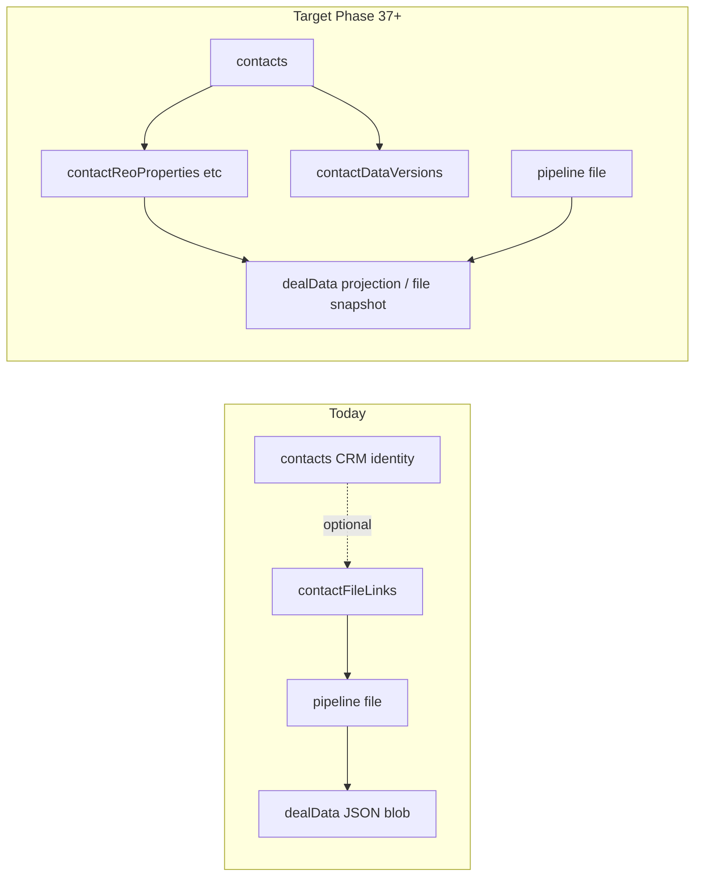

# Phase 37.1.A — Database Bridge Pre-Audit (Contact-First Foundation)

**Date:** 2026-06-22  
**Status:** Read-only audit (no code changes)  
**Goal:** Map where “sticky” borrower/entity data lives today and where Contact-First relational tables must be injected, including version-history strategy for in-place editing.

---

## Executive summary

Today, **all sticky financial / entity data is file-scoped** — embedded in `pipeline.dealData` (intake-shaped JSON, same shape as `intakeSheets`). The global **`contacts`** table is a **CRM identity record only** (name, methods, roles, notes). It has **no** REO, PFS, business entity, guarantor, or debt schedules.

There is **no FK** from `dealData.borrowers[]` / `guarantors[]` / `business.owners[]` to `contacts._id`. Linking is optional via **`contactFileLinks`** (many-to-many file ↔ contact) with a free-text `role`.

**Version history for deal edits** is append-only in `pipelineFileActivity`, but **`deal_patch` rows are explicitly non-undoable** (no `undoSpec`). **`contactActivity`** is an event log only — no rollback payloads.

**Recommendation:** Introduce normalized **contact-owned** tables + a dedicated **`contactDataVersions`** store for section-level snapshots. Keep `dealData` as a **file projection / cache** during migration, not the long-term source of truth for sticky fields.

---

## 1. Contact schema map (`contacts`)

**Source:** `convex/schema.ts` — `contacts` table (~L2125–2233)

### Current fields (identity & CRM)

| Field | Purpose |
|-------|---------|
| `name` | Display name |
| `email`, `phone` | Legacy primary (kept in sync with arrays) |
| `emails[]`, `phones[]` | Multi-method contact methods (Phase 24) |
| `notes` | Free-text CRM notes |
| `contactRoleIds[]` | Master CRM roles (Phase 25.7b) |
| `contactRoleId` | Deprecated single role mirror |
| `labels`, `crmRelationshipTypes` | Deprecated (migration-era) |
| `companyName`, `companyKey` | Account grouping |
| `emailKey` | Dedup within org |
| `preferredEmailId`, `preferredPhoneId`, `preferredContactMethod` | Comms prefs |
| `organizationId` | Tenant scope |
| `demoBundleId` | Demo workspace |
| `globalSearchText` | Search index blob |
| `createdAt`, `updatedAt` | Timestamps |

**Indexes:** `by_updatedAt`, `by_organization_updatedAt`, `by_organization_emailKey`, `by_org_demoBundle`, search indexes on `globalSearchText`.

### Relational tables touching contacts (not sticky data)

| Table | Relationship |
|-------|----------------|
| `contactFileLinks` | M2M contact ↔ pipeline file (`role`, `contactRoleId`, `notes`) |
| `contactLenderLinks` | M2M contact ↔ lender |
| `contactActivity` | Append-only CRM activity (notes, calls, link events) |
| `libraryDocumentLinks` | Optional `contactId` on document library links |
| `contactMultiMethodsMigrationLog` | One-off email/phone migration rollback metadata |

### What is **missing** on `contacts`

- No REO, assets, liabilities, income, business entity, guarantor profiles
- No `contactId` on intake sub-shapes inside `dealData`
- No document type taxonomy (ID, DD214, etc.) — only generic library titles
- No version / snapshot columns

### Related but distinct: `clients` (hub hierarchy)

**Source:** `convex/schema.ts` — `clients` (~L893–910)

Normalized **client hub** entity (parent of `projects` and loan files via `pipeline.clientId` / `projectId`). Fields: `displayName`, `primaryContactName/Email/Phone`, `companyName`, ownership keys — **not** a substitute for per-person sticky financials.

**Implication:** Contact-First sticky data targets **`contacts`** (people/reps). **`clients`** remain the deal hierarchy shell; bridge logic must not conflate “client hub row” with “borrower PFS owner.”

---

## 2. Legacy file data map (`pipeline.dealData`)

### Storage model

| Location | Type | Notes |
|----------|------|-------|
| `pipeline.dealData` | `v.optional(v.any())` | Canonical file workspace JSON |
| `intakeSheets` | Typed table (`intakeSchemaPart.ts`) | Legacy mirror; `patchDeal` syncs when `intakeSheetId` set |
| Validators | `intakePatchableFields` | Typed patch surface for `patchDeal` / `intakeSheets.patch` |

**Canonical doc:** `lib/deal/canonicalDataModel.ts` — when `dealData` exists, borrower/property/business/guarantors/reo/assets/etc. are read/written via **`patchDeal`**, not scattered pipeline columns.

**Legacy file contacts (non-deal):** `pipeline.contacts[]` — simple `{ name, email?, phone?, company? }` array on the pipeline row (L1394–1401). Separate from CRM `contacts` table.

### Sticky field inventory (dealData / intakeSheets)

Validators defined in **`convex/intakeSchemaPart.ts`**; patchable via **`convex/intakePatchable.ts`**.

#### Schedule of REO

| Key | Shape | Validator |
|-----|-------|-----------|
| `reo` | `reoRow[]` | Address, usage, market value, mortgage balance/payment, rate, taxes, insurance, HOA, rents, APN, etc. |

**UI:** `components/intake/IntakeSections2.tsx` — “Schedule of Real Estate Owned”  
**Tab:** `dealTabGroups` → Commercial / Hard Money → `reo`

#### Personal Financial Statement (PFS) — person-level

| Key | Shape | Contents |
|-----|-------|----------|
| `borrowers[]` | `borrower` | Name, phones, email, SSN, DOB, employer, FICO, etc. |
| `incomeRows[]` | `incomeRow` | Per-borrower income lines |
| `assets[]` | `assetRow` | Description, estimated value |
| `liabilities[]` | `liabilityRow` | Description, monthly payment, balance |
| Root flags | strings | `citizenship`, `defaultJudgments`, `bkHistory`, `bkDate`, `latePaymentsLast12` |
| `dependentsCount`, `dependentsAges` | strings | Household |

**UI:** `IntakeEditor.tsx` — Borrowers, Income, Assets & Liabilities, Household tabs

#### Business / Entity information

| Key | Shape | Contents |
|-----|-------|----------|
| `business` | `businessState` | Legal name, DBA, EIN, formation, industry, revenue, MCA fields, etc. |
| `business.owners[]` | `businessOwner` | `name`, `title`, **`ownershipPct`**, SSN, FICO |

**UI:** `IntakeSectionsBiz.tsx` — “Business / Entity” + owners grid

#### Assets & liabilities / business debt (no separate “Schedule of Business Debt” table)

| Key | Shape | Role |
|-----|-------|------|
| `liabilities[]` | `liabilityRow` | General debt schedule (PFS) |
| `weightedInterest[]` / `weightedInterestInstances[]` | debt blend tool | “Weighted interest rate average” — imports from liabilities |
| `business.existingMCABalance`, `existingMCACount`, `mcaPaymentsPerMonth`, etc. | strings on `businessState` | MCA / business debt **summary fields**, not row-level schedule |
| `dti.debts` | object | Scenario calculator debt buckets (cars, revolving, installment, other) |

**Finding:** There is **no** dedicated `scheduleOfBusinessDebt` or `businessDebt[]` schema key. Business debt is represented **indirectly** via liabilities, weighted-interest rows, and scalar MCA fields on `business`.

#### Guarantor / ownership percentages

| Key | Shape | Ownership field |
|-----|-------|-----------------|
| `guarantors[]` | `guarantor` | **`ownershipPct`**, role, FICO, liquid assets, net worth, PII |
| `business.owners[]` | `businessOwner` | **`ownershipPct`** (entity cap table) |

**UI:** `IntakeSectionsBiz.tsx` — Guarantors section; Business owners section

These arrays are **name-based**, not linked to `contacts._id`.

#### Contact-specific documents (IDs, DD214s)

| System | Storage |
|--------|---------|
| `libraryDocuments` + `libraryDocumentVersions` | Versioned blobs in Convex `_storage` |
| `libraryDocumentLinks` | Links document to **one of** `pipelineFileId`, `contactId`, or `taskId` |

**Finding:** Documents **can** attach to a CRM contact today via `libraryDocumentLinks.contactId`. There is **no** schema field for document class (`drivers_license`, `dd214`, `voided_check`, etc.) — only free-text `libraryDocuments.title`. **No codebase references to DD214** were found (grep clean).

#### Other file-scoped sections (out of Phase 37.1 sticky scope but co-located)

`loans[]`, `subjectProperty`, `commercial`, `hardMoney`, `cover`, `scenario`, calculators (`dtiInstances`, `comparisonInstances`, …), `fees`, `workflow` — remain file/deal context unless explicitly promoted later.

---

## 3. Audit / history infrastructure

### `pipelineFileActivity` (file-scoped)

**Source:** `convex/schema.ts` L1713–1755; logic in `convex/pipelineFileActivity.ts`

| Capability | Support |
|------------|---------|
| Append-only audit | Yes — `kind`, `keys[]`, `summary`, `at` |
| `deal_patch` logging | Yes — `patchDeal` writes keys touched (L1146–1154 `pipeline.ts`) |
| **`undoSpec` rollback** | **Partial** — pipeline fields, drawer layout, block overrides, contact links, lender state |
| **`deal_patch` undo** | **No** — rows have **no** `undoSpec`; explicitly excluded in `undoMostRecentForFile` (L305) |

**Implication:** File-level REO/PFS edits today leave an **audit trail without reversible payload**. Cannot restore prior REO array from activity alone.

### `contactActivity` (contact-scoped)

**Source:** `convex/schema.ts` L2310–2332; `convex/contactActivity.ts`

| Kind | Purpose |
|------|---------|
| `note`, `call`, `email`, `meeting` | Manual CRM log |
| `file_linked`, `file_unlinked`, `lender_linked`, `lender_unlinked` | Link events |
| `system` | Automated |

**No** `undoSpec`, **no** JSON snapshots, **no** `keys[]` for field-level diff. **`detail`** is optional free text only.

### Other rollback patterns

| Artifact | Scope |
|----------|-------|
| `contactMultiMethodsMigrationLog` | Pre-migration email/phone arrays only |
| `pipelineFileActivity.undoSpec` | File workflow — not deal JSON |
| `lib/pipelineFileUndo.ts` | UndoSpec kinds — **no** `deal_data` or `contact_section` kind |

### Verdict: can existing activity tables support contact version rollback?

| Requirement | `pipelineFileActivity` | `contactActivity` |
|-------------|------------------------|-------------------|
| Log “user edited REO on contact” | Only if edit still goes through `patchDeal` on a file | Possible as `system` + summary text |
| Store **previous REO array** before delete | **No** (deal_patch has no payload) | **No** |
| In-place undo on contact profile | **No** | **No** |

**Conclusion:** A **new** version store is required — e.g. **`contactDataVersions`** (recommended name below). Optionally extend `contactActivity` with `kind: "data_patch"` **pointers** to version rows, but do not store large JSON only in `detail` (size / query limits).

---

## 4. Data flow & redundancy (why Contact-First)

**Redundancy today:** Same borrower REO/PFS copied per file in each `dealData`. Editing on File B does not update File A. `contactMigration.ts` extracts **names only** from `dealData.borrowers[]` / `cover.borrowers` into standalone contacts — **not** financial sticky fields.

---

## 5. Proposed schema update plan (execution phase — not implemented)

Design principles:

1. **Normalize repeating rows** (REO lines, asset/liability lines) into child tables keyed by `contactId`.
2. **Scope by organization** (`organizationId`) on every table for tenant isolation.
3. **Version every mutating patch** to child tables via `contactDataVersions`.
4. **Keep `dealData` as file projection** during migration; add sync layer “hydrate from contact / publish to file.”
5. **Do not** overload `contacts` row with large JSON blobs — use child tables.

### 5.1 Extend `contacts` (minimal columns)

Add only **summary / cache** fields, not full schedules:

| New field | Type | Purpose |
|---------|------|---------|
| `stickyDataMigratedAt` | `optional number` | Migration checkpoint |
| `primaryStickyProfileVersion` | `optional number` | Monotonic version counter |
| `lastStickyEditAt` | `optional number` | Sort / activity feed |

Optional: `linkedBorrowerLabel` for legacy name matching during backfill.

### 5.2 New tables

#### `contactReoProperties` (Schedule of REO)

One row per property; maps 1:1 from `reoRow` fields.

| Column | Notes |
|--------|-------|
| `organizationId`, `contactId` | Required FKs |
| `sortOrder` | Stable UI order |
| All `reoRow` fields | Typed columns (strings/numbers as today) |
| `sourceFileId` | `optional Id<"pipeline">` — provenance from migration |
| `archivedAt` | Soft delete |
| `createdAt`, `updatedAt` | |

**Indexes:** `by_contact`, `by_org_contact`, `by_contact_sort`

#### `contactIncomeRows`, `contactAssets`, `contactLiabilities` (PFS lines)

Mirror `incomeRow`, `assetRow`, `liabilityRow` validators as columns.

| Table | Extra |
|-------|-------|
| `contactIncomeRows` | `borrowerLabel` (legacy “Borrower 1”) until FK to co-borrower contact |
| `contactAssets` / `contactLiabilities` | Same org/contact/sortOrder/archived pattern |

#### `contactFinancialProfile` (PFS header — person-level flags)

Single row per contact (or sparse columns on `contacts` if preferred):

| Fields from deal root | `citizenship`, `defaultJudgments`, `bkHistory`, `bkDate`, `latePaymentsLast12`, `dependentsCount`, `dependentsAges` |
| Fields from `borrower` | `ssn`, `dob`, `fico`, employer block — **PII-sensitive**; consider encryption policy |

Alternative: store employer/PII only on `contacts` identity where already appropriate.

#### `contactBusinessEntities` (Business / Entity)

One row per entity a contact is associated with (borrower may have multiple over time; start with `isPrimary` flag).

| Column | Maps from `businessState` |
|--------|---------------------------|
| `legalName`, `dba`, `ein`, `entityType`, … | Scalar business fields |
| `annualRevenue`, MCA fields, etc. | Financials block |

#### `contactBusinessOwnership` (entity cap table)

| Column | Maps from `businessOwner` |
|--------|---------------------------|
| `businessEntityId` | FK |
| `ownerContactId` | **Optional** FK to `contacts` when resolved |
| `name`, `title`, `ownershipPct`, `ssn`, `fico` | Legacy fallbacks |

#### `contactGuarantorProfiles`

| Column | Maps from `guarantor` |
|--------|----------------------|
| `contactId` | Guarantor as contact |
| `role`, `ownershipPct`, `liquidAssets`, `netWorth`, … | |
| `relatedBusinessEntityId` | Optional FK |

**De-duplication rule (execution):** Merge `business.owners[]` and `guarantors[]` when same person (email/SSN/name match) → one contact, multiple relationship rows.

#### `contactDebtScheduleRows` (explicit business debt — new)

Covers gap where today only `liabilities[]` + MCA scalars exist.

| Column | Purpose |
|--------|---------|
| `creditorName`, `balance`, `monthlyPayment`, `ratePct`, `debtType` | Row-level business debt |
| `includeInWeightedBlend` | Replaces weighted-interest “include” flag |

Option: migrate `weightedInterestInstances[].data.rows` here on backfill.

#### `contactDocumentMetadata` (typed docs)

Extend library pattern without breaking existing docs:

| Column | Purpose |
|--------|---------|
| `libraryDocumentId` | FK to blob |
| `contactId` | FK |
| `documentType` | Enum: `government_id`, `dd214`, `voided_check`, `tax_return`, `other` |
| `expiresAt`, `notes` | |

#### `contactDataVersions` (version history — **required**)

| Column | Type | Purpose |
|--------|------|---------|
| `organizationId` | Id | Tenant |
| `contactId` | Id | Owner |
| `section` | union | `reo`, `pfs`, `business_entity`, `business_ownership`, `guarantor`, `debt_schedule`, `financial_profile`, `document_meta` |
| `operation` | union | `create`, `update`, `delete`, `bulk_replace`, `rollback` |
| `entityId` | optional string | Child row id when row-level |
| `before` | optional any | JSON snapshot pre-change |
| `after` | optional any | JSON snapshot post-change |
| `actorUserKey` | string | |
| `relatedFileId` | optional Id | When edit originated from file workspace |
| `at` | number | |
| `version` | number | Monotonic per contact (or per section) |

**Indexes:** `by_contact_at`, `by_contact_section_at`, `by_org_contact_version`

**Rollback UX:** Restore `before` snapshot into live tables + append new version row with `operation: "rollback"`.

### 5.3 Bridge / projection tables (file side — Phase 37.2+)

| Table | Purpose |
|-------|---------|
| `contactFileStickySnapshots` (optional) | Cached materialization of contact sticky data onto a file at link time |
| `dealDataContactRefs` (optional) | Maps `dealData.borrowers[i]` → `contactId` inside file JSON during transition |

Short term: **`patchDeal`** continues to accept legacy keys; server **merges** from contact tables when `contactFileLinks` + ref map exist.

### 5.4 Migration outline (execution — not run)

1. For each org, scan `pipeline.dealData` on files with `contactFileLinks`.
2. Match `borrowers[0]` / `guarantors[]` / `business.owners[]` to linked contacts (name/email).
3. Insert child rows + initial `contactDataVersions` (`operation: bulk_replace`, `relatedFileId`).
4. Mark `contacts.stickyDataMigratedAt`.
5. Dual-write period: edits update contact tables **and** mirror into `dealData` until UI cutover.

### 5.5 What **not** to migrate to contact scope (initial cut)

- `loans[]`, `subjectProperty`, `commercial`, `hardMoney`, `cover`, `fees`, `workflow` — **file/deal context**
- `scenario`, DTI/comparison/payoff calculator instances — file analysis tools
- `pipeline.fundingAmount`, lender list, fee shell — per `canonicalDataModel.ts`

---

## 6. Injection points (files to touch in execution)

| Layer | Files |
|-------|-------|
| Schema | `convex/schema.ts`, new `convex/contactStickyData/*.ts` validators |
| Mutations | New `convex/contactStickyData.ts` (CRUD + version append) |
| File bridge | `convex/pipeline.ts` (`patchDeal`), `convex/dealDataMerge.ts` |
| UI | `IntakeEditor.tsx`, `IntakeSections2.tsx`, `IntakeSectionsBiz.tsx`, `FileContactsBlock.tsx` |
| Migration | New operator mutation akin to `contactMigration.ts` |
| Activity | Extend `contactActivity` kinds OR mirror high-level summaries from `contactDataVersions` |
| Docs | `libraryDocuments` link + `contactDocumentMetadata.documentType` |

---

## 7. Open decisions (for Phase 37.1.B)

1. **One contact vs co-borrower contacts:** Is each `borrowers[]` entry a separate `contacts` row (recommended) or embedded sub-doc?
2. **Business entity ownership:** Store entities org-wide or per contact?
3. **PII policy:** SSN/DOB on child tables vs encrypted blob vs existing patterns.
4. **File override:** Allow file-specific REO edits that **do not** write back to global contact (snapshot-only mode)?
5. **`clients` vs `contacts`:** Whether hub `clients` get a `primaryContactId` FK to sticky owner contact.

---

## 8. Audit constraints

- **No application code was modified** in this phase.
- Findings sourced from: `convex/schema.ts`, `convex/intakeSchemaPart.ts`, `convex/intakePatchable.ts`, `lib/deal/canonicalDataModel.ts`, `convex/pipelineFileActivity.ts`, `lib/pipelineFileUndo.ts`, `convex/contactActivity.ts`, `convex/contactMigration.ts`, intake UI components.

---

## 9. Quick reference — legacy key → proposed home

| Legacy `dealData` key | Proposed contact home |
|-----------------------|------------------------|
| `reo[]` | `contactReoProperties` |
| `assets[]`, `liabilities[]`, `incomeRows[]` | `contactAssets`, `contactLiabilities`, `contactIncomeRows` |
| `borrowers[]` + root PFS flags | `contactFinancialProfile` + identity on `contacts` |
| `business` | `contactBusinessEntities` |
| `business.owners[]` | `contactBusinessOwnership` |
| `guarantors[]` | `contactGuarantorProfiles` |
| `weightedInterest*` / MCA scalars | `contactDebtScheduleRows` + entity financial fields |
| Library docs on contact | `contactDocumentMetadata` + existing `libraryDocumentLinks` |
| All mutations | `contactDataVersions` (before/after snapshots) |
