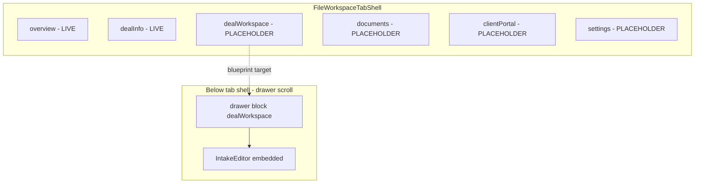
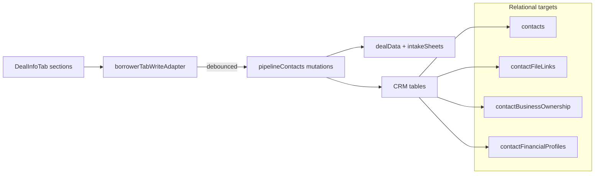

# Phase 37 — Macro-Progress & Structural Gap Audit

**Date:** 2026-06-23  
**Status:** Read-only audit — **no application code modified**  
**Scope:** Cross-reference active Phase 37 migration progress against the master 6-tab blueprint.  
**Inspected:** `FileWorkspaceTabShell`, `fileWorkspaceTabRouting`, `PipelineFileWorkspace`, `DealInfoTab`, `borrowerTabWriteAdapter`, `pipelineContacts`, `lib/contacts/*`, `fileWorkspaceLegacyVisibility`.

**Related artifacts:** `docs/phase37-2-ui-audit.md`, `docs/phase37-3-tab1-audit.md`, `docs/phase37-3-deal-info-audit.md`, `docs/phase37-1-data-bridge-audit.md`.

---

## 1. Executive summary

| Layer | Blueprint target | Current state |
|-------|------------------|---------------|
| **Global Banner (5 pillars)** | Sticky command center above tabs | **Live** — `GlobalBanner` in workspace chrome; partial duplication in legacy mobile header + `IntakeEditor` identity grid |
| **6-tab shell** | Unified file workspace navigation | **Partial** — shell + nav live; **2 of 6 tabs** have real panels (`overview`, `dealInfo`); **4 are placeholders** |
| **Tab 2 Deal Info** | People + financials with contact-first dual-write | **Mostly live** — 6 collapsible sections mounted; **4 of 6 write paths** dual-write to CRM; REO + household still legacy |
| **Tab 3 Deal Workspace** | Dedicated tab for remaining deal sections | **Not mounted in tab shell** — legacy **drawer block** `dealWorkspace` hosts `IntakeEditor` (~12 visible deal tabs after circuit breaker) |
| **Relational CRM bridge** | Live UI → `contacts` + sticky tables | **Active for identity + partial PFS**; **REO + business debt + household** not bridged from file UI |
| **Circuit breakers** | Hide migrated surfaces in legacy hosts | **Both flags `true`** — overview drawer blocks + 6 deal tabs hidden in legacy accordion |

**Overall alignment estimate:** ~55–60% of the Tab 1–2 migration surface is live; Tab 3–6 shell exists but content migration is early-stage.

---

## 2. Global Banner check (5 pillars)

The blueprint refers to five persistent header fields (client, file, project, funding, stage). All are implemented in **`GlobalBanner`**.

| Pillar | Render location | Editable | Data source | Visibility |
|--------|-----------------|----------|-------------|------------|
| **Client name** | `GlobalBanner.tsx` L90–101 (`pipeline-global-banner-client`) | Nav link (not inline edit) | `globalBannerSwitchRow.clientDisplayName` assembled in `PipelineFileWorkspace.tsx` L1743–1755 | **Visible** in sticky banner |
| **File name** | `GlobalBanner.tsx` L103–124 (`pipeline-global-banner-file-name`) | `InlineText` → `commitPipelineFileName` | `pipelineRow.fileName` L1751 | **Visible** |
| **Project name** | `GlobalBanner.tsx` L126–138 (`pipeline-global-banner-project`) | `InlineText` → `commitGlobalBannerProjectName` | Hub projection `projectDisplayTitle` L1748–1749; commits via `patchProjectMut` / `patchHubProjectMut` L1777–1798 | **Visible** |
| **Funding amount** | `GlobalBanner.tsx` L142–174 (`pipeline-global-banner-funding`) | `InlineNumber` → `commitPipelineFundingAmount` or block-bus fallback L2472–2476 | `fileDetailsLoanAmount` + optional `fileDetailsBusFund.display` L1757–1758 | **Visible** |
| **Pipeline stage** | `GlobalBanner.tsx` L176–196 (`pipeline-global-banner-stage`) | `PipelineStageSelector` compact | `pipelineRow.stageId` / `subStageId` L1759–1760 | **Visible** |

### Mount point & scroll contract

```
PipelineFileWorkspace.tsx
└── PipelineFileWorkspaceShell
    └── chrome (L2464–2986)
        └── GlobalBanner (L2466–2477)     ← sticky z-50, data-testid="pipeline-global-banner"
        └── legacy chrome (L2478+)        ← data-testid="pipeline-legacy-chrome" (mobile duplicate title/stage)
```

- **Banner wiring:** `globalBannerPipelineData` memo L1737–1775; passed to `GlobalBanner` L2466–2477.
- **Tab shell placement:** `FileWorkspaceTabShell` is **`scrollLead`** below header L2987–2993 — banner stays outside tab panel scroll.

### Gaps / duplication (not blockers, but not 100% clean)

| Issue | Location | Notes |
|-------|----------|-------|
| **Duplicate file name + stage on mobile** | `PipelineFileWorkspace.tsx` L2483–2556 (`pipeline-workspace-header-mobile`) | Legacy tier below banner repeats editable file name and stage |
| **Duplicate client / project / file name in deal sandbox** | `IntakeEditor.tsx` L515–534 | Identity grid still editable inside drawer `dealWorkspace` block |
| **Funding also in fileDetails drawer block** | `PipelineFileWorkspace.tsx` (~L3259–3373 per phase37-2 audit) | Third edit surface for funding on same route |

**Verdict:** All five pillars are **fully visible and functional** in `GlobalBanner`. Legacy duplicates remain for backward compatibility and mobile layout — not yet consolidated.

---

## 3. Six-tab completeness ledger

### 3.1 Tab shell infrastructure

| Artifact | Path | Lines (approx) | State |
|----------|------|----------------|-------|
| Tab ids + labels | `FileWorkspaceTabShell.tsx` L7–25 | 6 tabs defined | **Complete** |
| Controlled tab state | `PipelineFileWorkspace.tsx` L622–624 | `workspaceActiveTab` default `"overview"` | **Complete** |
| Panel routing | `FileWorkspaceTabShell.tsx` L72–79 | Only `overviewPanel` + `dealInfoPanel` wired | **Partial** |
| Placeholder fallback | `FileWorkspaceTabShell.tsx` L27–40 | `TabPlaceholder` for tabs 3–6 | **Stub** |
| Deep-link routing | `fileWorkspaceTabRouting.ts` | Overview + Deal Info anchors | **Partial** (no tab-3+ anchors) |



---

### 3.2 Tab 1 — File Overview (`overview`)

**Panel:** `OverviewTab.tsx` mounted via `overviewTabPanel` in `PipelineFileWorkspace.tsx` L2327–2424.

| Section | Anchor id | Component | Live? | Collapsed default? |
|---------|-----------|-----------|-------|-------------------|
| **Notes** | `pipeline-overview-notes` L106 | `FileNotesBlock` L110–116 | **Yes** | **No** — always expanded (`OverviewSection`) |
| **File history** | `pipeline-overview-activity` L127 | `PipelineFileActivityPanel` L131 | **Yes** | **No** |
| **Associated contacts** | `pipeline-overview-contacts` L135 | `FileContactsBlock` (injected) L139 | **Yes** | **No** |
| **Tasks** | `pipeline-overview-tasks` L144 | `FileTasksBlock` L149–163 | **Yes** | **No** |
| **Lenders** | `pipeline-overview-lenders` L167 | `LenderSummaryBlock` L172–179 | **Yes** (summary); full drawer via “Manage lenders” L2419–2422 | **No** |

**Comms gap:** Blueprint mentions comms in overview context; **no comms section in `OverviewTab`**. Messaging lives in **workspace quick panels** instead:

| Comms surface | Path | Lines |
|---------------|------|-------|
| File messaging | `FileMessagingPanel` | `PipelineFileWorkspace.tsx` L3016–3023 |
| Outbound email | `UnifiedCommunicationPanel` | L3033–3037 |

**Legacy circuit breaker:** `HIDE_LEGACY_OVERVIEW_DRAWER_BLOCKS = true` (`fileWorkspaceLegacyVisibility.ts` L8). Drawer copies of notes/contacts/tasks/lenders hidden via `hideLegacyOverviewBlock` L627–629; stubs at L3593, L4114, L4524, L4678.

**Verdict:** Tab 1 is **functionally live** for notes, tasks, lenders, contacts, activity. **Comms not migrated into tab.** Sections are **not** collapsed-by-default (unlike Tab 2 standard).

---

### 3.3 Tab 2 — Deal Info (`dealInfo`)

**Panel:** `DealInfoTab.tsx` mounted L2427, wired L2992.

All six sections use **`CollapsibleSection`** with `defaultOpen={false}`, `lazyMount`, `variant="card"`, `animated` (`DealInfoTab.tsx` L44–48).

| Section | Anchor | Component | Write adapter | Dual-write? | CRM tables touched |
|---------|--------|-----------|---------------|-------------|-------------------|
| **Borrowers** | `pipeline-deal-info-borrowers` L127 | `BorrowersSection` L131 | `contactFirstUpdate` | **Yes** | `contacts`, `contactFileLinks` |
| **Guarantors** | `pipeline-deal-info-guarantors` L135 | `GuarantorsSection` L139 | `contactFirstUpdate` | **Yes** | `contacts`, `contactBusinessOwnership`, `contactFinancialProfiles` (scalars) |
| **Household** | `pipeline-deal-info-household` L143 | `HouseholdSection` L147 | `updateLegacy` | **No** — `patchDeal` only | — |
| **Income** | `pipeline-deal-info-income` L151 | `IncomeSection` L155 | `contactFirstUpdate` | **Yes** | `contactFinancialProfiles.income[]` per borrower index |
| **Assets & Liabilities** | `pipeline-deal-info-assets` L159 | `AssetsSection` L163 | `contactFirstUpdate` | **Yes** (assets + liabilities keys) | `contactFinancialProfiles.assets[]` / `.liabilities[]` (primary borrower) |
| **Schedule of REO** | `pipeline-deal-info-reo` L167 | `ReoSection` L171 | `updateLegacy` | **No** — `patchDeal` only | — |

**Business debt — not in Tab 2:** There is **no** Business Debt section in `DealInfoTab`. MCA / business debt fields live under the **`business`** deal tab inside `IntakeEditor` → `BusinessSection` (`IntakeSectionsBiz.tsx` L158–177, scalar fields on `dealData.business`). Relational target is `contactBusinessDebtSchedules` via `contactDataBridge.saveContactBusinessDebt` — **not wired from file workspace UI**.

**Legacy circuit breaker:** `HIDE_LEGACY_BORROWERS_DEAL_TABS = true` (`fileWorkspaceLegacyVisibility.ts` L34). Six deal tab ids filtered in `IntakeEditor.tsx` L453–455 via `isLegacyBorrowersDealTabHidden`.

**Adapter intercept map** (`borrowerTabWriteAdapter.ts`):

| Draft key | Handler | Mutation |
|-----------|---------|----------|
| `borrowers` | L632–638 | `saveBorrowerIdentityDualWrite` |
| `guarantors` | L642–648 | `saveGuarantorIdentityDualWrite` |
| `incomeRows` | L652–658 | `saveIncomeDualWrite` |
| `assets` | L662–668 | `saveAssetsAndLiabilitiesDualWrite` |
| `liabilities` | L672–678 | `saveAssetsAndLiabilitiesDualWrite` |
| *all other keys* | L682 | `update` → legacy `patchDeal` |

Save indicator merges: `borrowerSaving`, `guarantorSaving`, `incomeSaving`, `assetsSaving` (`DealInfoTab.tsx` L81–89).

**Verdict:** Tab 2 structure is **complete** (6 collapsibles, lazy mount). Dual-write coverage: **4/6 sections**. REO + household remain legacy. Business debt is **out of scope** for this tab (still in Tab 3 sandbox).

---

### 3.4 Tab 3 — Deal Workspace (`dealWorkspace`)

| Blueprint element | Status | Evidence |
|-------------------|--------|----------|
| **Tab shell panel** | **Placeholder only** | `FileWorkspaceTabShell.tsx` L78 — `TabPlaceholder` for `dealWorkspace` |
| **Actual content host** | **Legacy drawer block** | `PipelineFileWorkspace.tsx` L3642–3668 — `CollapsibleSection` `sid === "dealWorkspace"` → `IntakeEditorLazy embedded` |
| **17-section sandbox** | **~12 sections visible** | 18 deal tabs in `dealTabGroups.ts`; 6 hidden by circuit breaker → **12 remain** in `IntakeEditor` accordion |
| **Sub-Tab A: Workspace / Sub-Tab B: Calculators** | **Not built at file-tab level** | No sub-nav in `FileWorkspaceTabShell`; calculators live inside deal tab `analysis` → `DealAnalysisWorkspace` (`IntakeEditor.tsx` L124–125) |
| **Inline layout toggle (blueprint)** | **Partial — deal-level only** | `DealWorkspaceLayoutSettings` in `IntakeEditor.tsx` L133–209 (“Deal sections layout” — reorder/hide deal tabs, not file-tab sub-nav) |

**Remaining visible deal tabs** (after `isLegacyBorrowersDealTabHidden`):

`cover`, `scenario`, `overview`, `business`, `property`, `loans`, `commercial`, `hardmoney`, `analysis`, `fees`, `workflow`, `notes`

**Hidden from sandbox (migrated to Tab 2):** `borrowers`, `guarantors`, `household`, `income`, `assets`, `reo` (`fileWorkspaceLegacyVisibility.ts` L37–44).

**Verdict:** Tab 3 **shell id exists but content is not migrated**. Users reach the sandbox via **drawer block “Deal workspace”**, not the third top-level tab. Sub-navigation stub **not implemented**.

---

### 3.5 Tab 4 — Documents (`documents`)

| Surface | State | Path |
|---------|-------|------|
| Tab shell | **Placeholder** | `FileWorkspaceTabShell.tsx` L27–38 |
| Quick panel | **Live infrastructure** | `LibraryDocumentsPanel` in `PipelineFileWorkspace.tsx` L3047–3056 (`quick-panel-documents`) |
| Drawer block | **Not a registered tab block** | Documents via quick panel + org library context |

**Verdict:** **Placeholder tab**; functional document UI exists in **collapsed quick panel**, not in tab body.

---

### 3.6 Tab 5 — Client Portal (`clientPortal`)

| Surface | State | Path |
|---------|-------|------|
| Tab shell | **Placeholder** | `FileWorkspaceTabShell.tsx` |
| Quick panel | **Live** | `ClientPortalInviteBlock` L3004–3007 |

**Verdict:** **Placeholder tab**; portal invite works from quick panel.

---

### 3.7 Tab 6 — Settings (`settings`)

| Surface | State | Path |
|---------|-------|------|
| Tab shell | **Placeholder** | `FileWorkspaceTabShell.tsx` |
| Related live UI | Drawer blocks + layout strip | `people`, `archive`, `dangerZone`, drawer layout controls L3088+ |

**Verdict:** **Placeholder tab**; file admin/settings scattered in legacy drawer + layout strip.

---

## 4. Database integrity & data flows

### 4.1 Dual-write mutations (`convex/pipelineContacts.ts`)

| Mutation | Phase | Legacy patch keys | Relational sync |
|----------|-------|-------------------|-----------------|
| `saveBorrowerIdentityDualWrite` | 37.3.C.C.1 L416 | `borrowers` | `contacts` upsert/patch; `contactFileLinks` |
| `saveGuarantorIdentityDualWrite` | 37.3.C.C.2 L908 | `guarantors` | `contacts`; `contactBusinessOwnership`; `contactFinancialProfiles` (liquidAssets/netWorth scalars) L893–898 |
| `saveIncomeDualWrite` | 37.3.E.1 L1082 | `incomeRows` | `contactFinancialProfiles.income[]` per borrower tag index L1028–1072 |
| `saveAssetsAndLiabilitiesDualWrite` | 37.3.E.2 L1272 | `assets`, `liabilities` (optional either) | Primary borrower `contactFinancialProfiles.assets[]` / `.liabilities[]` L1224–1265 |

All mutations: conflict check via `expectedUpdatedAt`; legacy patch mirrors intake sheet when linked; activity log + global search refresh.

### 4.2 Parsing boundary utilities (`lib/contacts/`)

| File | Role |
|------|------|
| `borrowerIdentityFromDeal.ts` | Borrower row → contact identity; file-link role; email/name matching |
| `guarantorIdentityFromDeal.ts` | Guarantor row → contact identity; guarantor-specific matching |
| `incomeFromDeal.ts` | Borrower tag → index; group `incomeRows`; normalize to `contactStickyIncomeRowV` |
| `pfsFromDeal.ts` | Normalize `assets` / `liabilities` rows to sticky PFS shapes |
| `borrowerTabWriteAdapter.ts` | Client debounce + draft-only optimistic path + mutation routing |

### 4.3 Relational table live-update matrix

| Table | Live UI writes (file workspace) | Write path | Notes |
|-------|-----------------------------------|------------|-------|
| **`contacts`** | **Yes** | Borrower + guarantor dual-write | Create on identity if missing (borrower L233–287, guarantor create path L620+) |
| **`contactFileLinks`** | **Yes** | Borrower dual-write `upsertContactFileLink` L193–230 | Overview `FileContactsBlock` also mutates links directly (separate from deal adapter) |
| **`contactBusinessOwnership`** | **Yes (guarantors only)** | `upsertGuarantorBusinessOwnership` L735–759 | Requires `deal.business.legalName` → business entity |
| **`contactFinancialProfiles`** | **Yes (partial)** | Income (per borrower), PFS arrays (primary), guarantor scalars | Full profile not atomically synced; patches are field-scoped |
| **`contactReoProperties`** | **No** | — | Only `contactDataBridge.ts` + backfill migration; REO UI uses `updateLegacy` → `patchDeal` only |
| **`contactBusinessDebtSchedules`** | **No** | — | CRM bridge exists (`contactDataBridge.saveContactBusinessDebt`); file UI writes `dealData.business` scalars only |

### 4.4 Data flow diagram (Tab 2 dual-write path)



### 4.5 Prerequisite for CRM sync

Income, assets, and liabilities relational sync **skips silently** when primary/co-borrower contact cannot be resolved (`resolveContactForBorrowerIndex` returns null). Borrower identity dual-write should run first to establish `contactFileLinks`.

---

## 5. Circuit breakers & legacy visibility

| Flag | File | Value | Effect |
|------|------|-------|--------|
| `HIDE_LEGACY_OVERVIEW_DRAWER_BLOCKS` | `fileWorkspaceLegacyVisibility.ts` L8 | `true` | Hides notes, contacts, tasks, lenders drawer blocks (L11–16) |
| `HIDE_LEGACY_BORROWERS_DEAL_TABS` | L34 | `true` | Hides 6 deal tabs in `IntakeEditor` accordion (L37–44) |
| Lenders exception | `PipelineFileWorkspace.tsx` L627–629 | `legacyLendersExpanded` | Temporarily reveals full lenders drawer when user clicks “Manage lenders” from summary |

**Rollback:** Set either flag to `false` to restore legacy copies without removing Tab 1/2 panels.

---

## 6. Gap analysis vs master blueprint

| Blueprint item | Status | Gap |
|----------------|--------|-----|
| Sticky Global Banner (5 pillars) | **Done** | Dedupe mobile legacy header + IntakeEditor identity grid |
| 6-tab navigation chrome | **Done** | — |
| Tab 1 Overview content | **Done** | Add comms; consider collapsed-by-default parity with Tab 2 |
| Tab 2 Deal Info (people + financials) | **~67% dual-write** | REO, household, business debt not bridged |
| Tab 3 Deal Workspace tab body | **Not started** | Move `IntakeEditor` host from drawer block into `dealWorkspace` tab panel |
| Sub-tab Workspace / Calculators | **Not started** | Split `analysis` + remaining sections under Tab 3 sub-nav |
| Tab 4 Documents | **Placeholder** | Promote `LibraryDocumentsPanel` |
| Tab 5 Client Portal | **Placeholder** | Promote `ClientPortalInviteBlock` |
| Tab 6 Settings | **Placeholder** | Consolidate drawer admin blocks |
| `contactReoProperties` live sync | **Not started** | Phase 37.3.E.3 |
| Business debt relational sync | **Not started** | Map `dealData.business` MCA fields → `contactBusinessDebtSchedules` |
| Read path contact-first | **Not started** | UI still reads `dealData` draft everywhere; CRM is write mirror only |

---

## 7. Next logical slices (recommended order)

### Immediate (complete Tab 2 financial stack)

1. **Phase 37.3.E.3 — REO dual-write**
   - Intercept `reoRows` (or equivalent key) in `borrowerTabWriteAdapter.ts`
   - Add `saveReoDualWrite` in `pipelineContacts.ts` → `contactReoProperties`
   - Wire `ReoSection` to `contactFirstUpdate` in `DealInfoTab.tsx` L171
   - Add `lib/contacts/reoFromDeal.ts` normalization helper (mirror `incomeFromDeal.ts`)

2. **Phase 37.3.E.4 — Household dual-write (optional/deferred)**
   - Map `household` / dependents to appropriate contact or file-scoped CRM shape (confirm schema ownership in governance docs first)

### Short-term (Tab 3 realignment)

3. **Phase 37.3.F — Mount Deal Workspace in tab shell**
   - Pass `dealWorkspacePanel={<IntakeEditor embedded />}` to `FileWorkspaceTabShell`
   - Collapse or hide drawer block `dealWorkspace` when tab panel live (`fileWorkspaceLegacyVisibility` pattern)
   - Introduce sub-nav: **Workspace** (remaining deal sections) vs **Calculators** (`analysis` tab content)

4. **Phase 37.3.G — Business debt bridge**
   - Dual-write `dealData.business` MCA/debt scalars → `contactBusinessDebtSchedules` (entity-scoped)
   - Likely stays under Tab 3 `business` section until business block migrates

### Medium-term (Tabs 4–6 + read path)

5. **Promote quick panels → tab panels** for Documents, Client Portal
6. **Settings tab** — migrate `people`, archive, licensing, danger zone from drawer
7. **Contact-first read path** — hydrate `DealInfoTab` draft sections from CRM where link exists (reverse of current write-only mirror)
8. **Overview comms** — add `FileMessagingPanel` / `UnifiedCommunicationPanel` section to `OverviewTab` or dedicated comms anchor
9. **Banner deduplication** — remove redundant identity fields from `IntakeEditor` header when `GlobalBanner` is present on file route

### Validation gates (per governance)

- `npm run build` after each slice
- `npm run qa:governance` before marking user-facing work complete
- `npm run deploy:prod` + Convex prod deploy for new mutations
- Manual Convex dashboard check: legacy `dealData` + target CRM row after each dual-write slice

---

## 8. File reference index

| Concern | Primary path | Key lines |
|---------|--------------|-----------|
| 6-tab shell | `components/pipeline/FileWorkspaceTabShell.tsx` | L7–14 ids; L72–79 routing |
| Tab state | `components/PipelineFileWorkspace.tsx` | L622–624, L2987–2993 |
| Global Banner | `components/pipeline/GlobalBanner.tsx` | L53–200 |
| Banner data | `components/PipelineFileWorkspace.tsx` | L1737–1775, L2466–2477 |
| Tab 1 panel | `components/pipeline/tabs/OverviewTab.tsx` | L93–184 |
| Tab 2 panel | `components/pipeline/tabs/DealInfoTab.tsx` | L66–175 |
| Write adapter | `lib/contacts/borrowerTabWriteAdapter.ts` | L632–682 intercepts |
| Dual-write mutations | `convex/pipelineContacts.ts` | L416, L908, L1082, L1272 |
| Section anchors | `lib/pipeline/fileWorkspaceTabRouting.ts` | L6–22, L54–61 |
| Circuit breakers | `lib/pipeline/fileWorkspaceLegacyVisibility.ts` | L8–53 |
| Legacy sandbox | `components/intake/IntakeEditor.tsx` | L452–590 |
| Deal tab registry | `lib/file/dealTabGroups.ts` | L7–54 (18 tabs) |
| Drawer deal host | `components/PipelineFileWorkspace.tsx` | L3642–3668 |

---

*End of audit — generated read-only per Phase 37 macro-alignment directive.*
