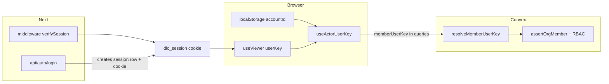
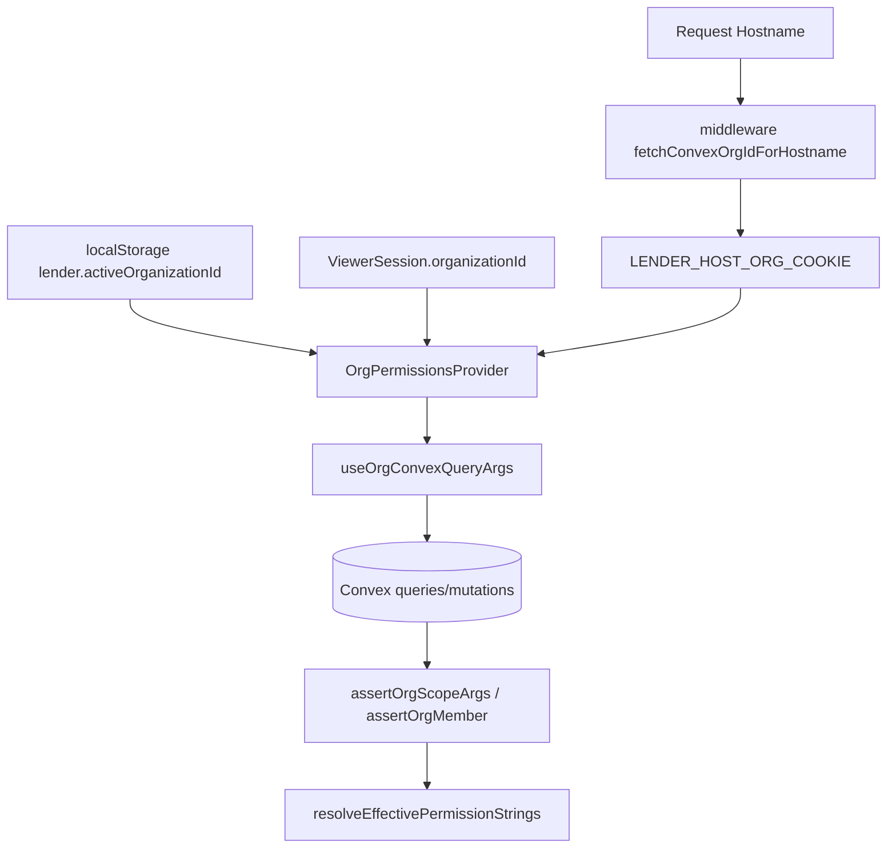

# System data mind map (code-traced)

This document maps **where data lives** and **how it connects** in the Loan Flow / Direct Lending Connection stack. Every table and ownership field listed here is taken from `lender-app/convex/schema.ts` and `lender-app/convex/intakeSchemaPart.ts`. Flow descriptions cite concrete modules under `lender-app/`.

For an interactive graph, open [system-data-mindmap.html](./system-data-mindmap.html) in a browser.

---

## 1. System hierarchy (logical)

```text
Internet
└── Vercel (Next.js 15 App Router)
    ├── middleware.ts — session gate, host→org cookie
    ├── app/** — RSC + client pages
    ├── app/api/auth/* — login, logout, signup, reset (Convex-backed + env legacy)
    └── Browser
        ├── Cookies: dlc_session, dlc_csrf, lender host-org (optional)
        ├── localStorage / sessionStorage — UX state, accountId, org hint, purge markers
        └── ConvexReactClient — queries/mutations/actions → Convex deployment
            └── Convex persistence (tables below + _storage blobs)
```

---

## 2. Auth boundary and session persistence

**Server (Next.js)**

| Mechanism | Location | Data |
|-----------|----------|------|
| Route protection | `lender-app/middleware.ts` | Reads `SESSION_COOKIE_NAME` (`dlc_session`), calls `verifySession` |
| Session verification | `lender-app/lib/sessionAuth.ts`, `lender-app/lib/session/loadViewer.ts` | Validates cookie → `ViewerSession` (userKey, email, organizationId, workspaceRole, …) |
| Login | `lender-app/app/api/auth/login/route.ts` | Convex password verify + session creation; optional env `APP_AUTH_*` legacy path; CSRF same-site check |

**Client**

| Mechanism | Location | Data |
|-----------|----------|------|
| Viewer context | `lender-app/lib/sessionContext.tsx` (consumed via `useViewer`) | Hydrated session profile for UI |
| Actor key for Convex | `lender-app/lib/useActorUserKey.ts` | `viewer.userKey` **or** `userPreferencesContext` `accountId` |
| Stable pre-auth device id | `lender-app/lib/userAccountIdentity.ts` | `localStorage` key `dlc.user-account-id.v1` |

**Convex (no JWT provider in production path per provider comment)**

| Mechanism | Location | Data |
|-----------|----------|------|
| Identity resolution | `lender-app/convex/viewerIdentity.ts` `requireIdentity`, `resolveMemberUserKey` in `lender-app/convex/organizationAccess.ts` | Order: JWT subject (if ever present) → explicit `memberUserKey` arg → `platformUserKeyFallback()` from `APP_AUTH_USER_KEY` on Convex |
| Accounts | `authUsers` | `normalizedUsername`, password hash, `defaultOrganizationId`, `isGlobalAdmin`, `systemRole`, `primaryOwner` |
| Sessions | `authSessions` | `userId` → `authUsers`, hashed tokens, rotation, `credentialVersion` |

**Auth resolution flow (mermaid)**



---

## 3. Organization and permission resolution

**Org id priority (client)** — documented in `lender-app/lib/useOrgPermissions.ts` (re-export from `orgPermissionsContext`):

1. Host-mapped cookie (`lender-app/lib/hostOrgCookie.ts`, set from `middleware.ts` via `fetchConvexOrgIdForHostname`)
2. `localStorage` `lender.activeOrganizationId` (`lender-app/lib/activeOrganizationId.ts`, `sessionUiClient.tsx`, recovery helpers)
3. Viewer session `organizationId`

**Convex membership and RBAC**

| Concept | Tables / code |
|---------|----------------|
| Membership | `organizationMembers`: `organizationId`, `userKey`, `role`, optional `assignedRoleId` |
| Roles | `organizationRoles` (per-org keys + permission arrays) |
| Deny list | `organizationPermissions` |
| Enforcement | `lender-app/convex/organizationAccess.ts`, `organizationRbac.ts`, `lib/orgRbac.ts` catalog |

**Ownership path for org-scoped rows**

- Most tenant data carries optional or required `organizationId` (`organizations` document id).
- `organizationMembers.userKey` must match the **`memberUserKey`** sent from the client (`useOrgConvexQueryArgs`: `activeOrganizationId` + `useActorUserKey()`).

**Organization resolution flow (mermaid)**



---

## 4. Convex storage map — all persisted tables

The following **75 tables** are registered in `defineSchema`: **73** declared inline in `lender-app/convex/schema.ts` plus **`intakeSheets`** and **`shareLinks`** supplied from `lender-app/convex/intakeSchemaPart.ts`. (including `intakeSheets` / `shareLinks` from `intakeSchemaPart.ts`).

**Core product & directory**

| Table | Primary ownership / scope keys (from schema) |
|-------|-----------------------------------------------|
| `lenders` | Optional `organizationId`; global catalog when unset |
| `lenderStats` | Singleton aggregate |
| `lenderCandidates` | No org field in schema (global discovery cache) |
| `discoveryRuns` | Global |
| `lenderAttachments` | `lenderId`; optional `organizationId` (denormalized) |
| `savedFilterPresets` | Optional `organizationId` |

**Pipeline & deal**

| Table | Scope / ownership |
|-------|-------------------|
| `pipeline` | Optional `organizationId`; `ownerUserKey` (preferences / auth user key); `dealData`; optional `intakeSheetId`; embedded `lenders[]`, `selectedLenderId` |
| `pipelineFileShares` | `fileId`, `userKey`, `createdByUserKey` |
| `pipelineFileActivity` | `fileId`; optional `contactId`, `lenderId` |
| `pipelineFileUserTemplates` | `accountId` |
| `pipelineGlobalBlockConfig` | Singleton |
| `intakeSheets` | **No `organizationId`**; indexed by `ownerName`, `clientName`; linked from `pipeline.intakeSheetId` |
| `shareLinks` | `intakeId` → `intakeSheets` |

**Tasks & notifications**

| Table | Scope / ownership |
|-------|-------------------|
| `tasks` | Optional `organizationId`; `assigneeId` / `sharedWithIds` strings; FKs `relatedFileId`, `relatedContactId`, `parentTaskId` |
| `taskNotifications` | `userKey`, `taskId` → `tasks`, optional `actorUserKey` |
| `userNotifications` | `userKey`; optional `taskId`, `fileId`; `actorUserKey` |
| `taskAttachments` | `taskId`; optional `organizationId`; `storageId` → `_storage` |

**CRM**

| Table | Scope / ownership |
|-------|-------------------|
| `contacts` | Optional `organizationId`; `demoBundleId` |
| `contactFileLinks` | `contactId`, `fileId` |
| `contactLenderLinks` | Contact ↔ lender |
| `contactActivity` | `contactId`; optional `actorUserKey`, `relatedFileId`, `relatedLenderId` |

**Activity & audit**

| Table | Notes |
|-------|--------|
| `activityFeed` | `scopeKind` `org` \| `user`, `scopeId` string, `actorKey`, optional entity ids |
| `securityAuditLog` | Security events |
| `clientPortalAudit` | Portal audit |

**Preferences & onboarding (per-account string id)**

| Table | Key field |
|-------|-----------|
| `userPreferences` | `accountId` |
| `navigationUserConfig` | `accountId` |
| `userOnboarding` | `userKey` (legacy; merged in queries with preferences) |
| `userSimpleWorkflows` | `accountId` |

**Org metadata & billing**

| Table | Key fields |
|-------|------------|
| `organizations` | Tenant root; optional `clerkOrganizationId` (legacy, documented optional); Stripe/plan fields |
| `organizationMembers` | `organizationId`, `userKey`, `role`, `assignedRoleId` |
| `organizationRoles`, `organizationPermissions` | Per-org RBAC |
| `organizationNavigationPolicy` | Enforced nav ids |
| `organizationCustomDomains` | Hostname → `organizationId` |

**Auth**

| Table | Key fields |
|-------|------------|
| `authUsers`, `authSessions`, `authPasswordResetTokens`, `authEmailVerificationTokens`, `authRateBuckets` | Native auth |

**Documents & signatures**

| Table | Key fields |
|-------|------------|
| `libraryDocuments` | `organizationId` optional; `createdByUserKey` |
| `libraryDocumentVersions` | `documentId`, `_storage` |
| `libraryDocumentLinks` | Document ↔ file/contact/task |
| `signatureEnvelopes`, `signatureSigners`, `signatureAuditEvents` | E-sign |

**Client portal (isolated product surface)**

| Tables | Purpose |
|--------|---------|
| `clientPortalIdentities`, `clientPortalGrants`, `clientPortalSessions`, `clientPortalMagicLinks`, `clientPortalUploads`, `clientPortalRequests`, `clientPortalUpdates`, `clientPortalAudit`, `portalAuthThrottle` | External borrower/partner flows; not workspace cookie auth |

**Integrations & email**

| Tables | Purpose |
|--------|---------|
| `integrationApiKeys`, `integrationOAuthClients`, `integrationAccessTokens`, `integrationConnectors`, `integrationJobs`, `integrationSyncCursors`, `integrationRateLimitBuckets` | Third-party connectors |
| `organizationIntegrationWorkflows` | Org automation |
| `systemEmailEvents`, `systemEmailLog`, `emailInboxSyncPreferences` | Mail |
| `outboundWebhookSubscriptions`, `outboundWebhookDeliveries`, `outboundWebhookDeliveryLogs` | Webhooks |
| `fileMessages`, `fileMessageAttachments` | Per-file messaging |

**Operations / migrations**

| Table | Purpose |
|-------|---------|
| `dataBackupSnapshots`, `dataBackupParts` | Backup |
| `dataMigrationRuns`, `dataMigrationRollbackChunks` | Migration bookkeeping |
| `ledger`, `payments` | Funded deals; `ledger.fileId`, `payments` denormalize `fileId` |

**Search indexes**

Global search uses **`globalSearchText`** fields and Convex `searchIndex` definitions on `pipeline`, `tasks`, `contacts`, and `lenders` (not a separate table) — see `lender-app/convex/schema.ts`.

---

## 5. Foreign-key-style relationships (schema `v.id` only)

Solid arrows in [system-data-mindmap.html](./system-data-mindmap.html) connect documented `v.id` references. Examples:

- `pipeline.intakeSheetId` → `intakeSheets`
- `pipeline` lender arrays / `selectedLenderId` → `lenders`
- `ledger.fileId` / `payments.fileId` → `pipeline`
- `payments.ledgerId` → `ledger`
- `tasks.relatedFileId` → `pipeline`; `relatedContactId` → `contacts`; `parentTaskId` → `tasks`
- `contactFileLinks` → `contacts` + `pipeline`
- `organizationMembers.organizationId` → `organizations`; `assignedRoleId` → `organizationRoles`
- `authSessions.userId` → `authUsers`
- `shareLinks.intakeId` → `intakeSheets`
- Library chain: `libraryDocumentVersions.documentId` → `libraryDocuments`; versions reference `_storage`

---

## 6. Frontend state map (non-Convex persistence)

Verified `localStorage` / `sessionStorage` touchpoints (grep in `lender-app`):

| Area | Storage | Module / usage |
|------|---------|----------------|
| Account id | localStorage | `userAccountIdentity.ts`, preferences sync |
| Active org hint | localStorage | `activeOrganizationId.ts`, `sessionUiClient.tsx`, `orgRbacRuntimeSnapshot.ts` |
| Navigation prefs | localStorage | `NavigationConfigProvider.tsx`, `navRecency.ts` |
| Responsive nav | localStorage | `ResponsiveNavProvider.tsx` |
| Tasks matrix / daily plan | localStorage | `app/tasks/page.tsx` |
| Pipeline hub / views / mobile | localStorage | `pipelineHubPersistence.ts`, `PipelinePageClient.tsx` sort key |
| Drawer layout | localStorage | `pipelineDrawerLayoutStorage.ts` (cloud prefs also on Convex `userPreferences` / per-file `fileDrawerLayout`) |
| Deal analysis layout | localStorage | `dealAnalysisLayoutStorage.ts` |
| User settings blob | localStorage | `userSettingsStorage.ts` |
| Color scheme | localStorage | `colorScheme.tsx`, `colorSchemeInit.ts` |
| SaaS sidebar | localStorage | `AppChrome.tsx` |
| Inspector width | localStorage | `RecordInspectorShell.tsx` |
| Pipeline file workspace utilities | localStorage | `PipelineFileWorkspaceShell.tsx` |
| Client portal token | localStorage | `clientPortalSession.ts` |
| Debug logs | localStorage | `debugClientLog.ts` |
| Legacy auth purge version | localStorage | `purgeLegacyAuthBrowserStorage.ts` |
| One-shot dismissals | sessionStorage | `DealBlockAiAssistPanel.tsx`, `pipelineDrawerSuggestionDismiss.ts`, etc. |
| Last nav route | sessionStorage | `navRoutePersistence.ts` |

**Hydration**: `lender-app/lib/auth/clientHydration.ts` documents keeping cookie/localStorage reads off SSR paths where needed.

---

## 7. Data flow lifecycle (representative)

### 7.1 Pipeline file

| Stage | Path |
|-------|------|
| Create | Client → `convex/pipeline.ts` mutations (with org args) |
| Storage | `pipeline` row; optional `dealData`; optional `intakeSheets` link |
| Read | `PipelinePageClient.tsx` / file workspace → `useQuery` with `useOrgConvexQueryArgs` |
| Permissions | `organizationAccess.assertOrg*` + file-level share checks |
| Update | `pipeline.patch`, `patchDeal`, activity feed writers |
| Archive | `archivedAt` soft-archive; `snoozedUntil` hide |

### 7.2 Tasks

| Stage | Path |
|-------|------|
| CRUD | `convex/tasks.ts` |
| Scope | `organizationId` + Matrix UI local prefs in `app/tasks/page.tsx` |

### 7.3 Lenders & contacts

| Stage | Path |
|-------|------|
| List/mutate | `convex/lenders.ts`, `convex/contacts.ts` with org filtering |

---

## 8. Dependency graph (engineering)

```text
Next middleware ──► session cookie
session cookie ──► sessionContext / viewer
viewer + localStorage ──► useActorUserKey + active org ──► useOrgConvexQueryArgs
useOrgConvexQueryArgs ──► Convex queries/mutations
Convex organizationAccess ──► organizationMembers + organizationRoles
Entity tables ──► optional organizationId + userKey/accountId string fields
```

---

## 9. Known risks (traced — not speculative)

| Risk | Evidence |
|------|----------|
| **Dual actor identity** | `useActorUserKey` prefers `viewer.userKey` else `accountId` from local storage; `userPreferences.accountId` and `organizationMembers.userKey` must align after auth migrations |
| **Legacy unscoped rows** | `organizationAccess.ts` comment: missing `organizationId` = migration-safe default read path |
| **intakeSheets without org** | Schema has no `organizationId`; scoping is indirect via `pipeline.intakeSheetId` |
| **Clerk artifact field** | `organizations.clerkOrganizationId` still optional in schema (legacy) |
| **Convex dev fallback identity** | `viewerIdentity.ts` can synthesize identity from `APP_AUTH_*` env when JWT absent — must match deployment alignment |
| **localStorage org vs server** | Multiple recovery paths (`OrgScopeRecoveryBanner.tsx`, `invariants/authRecovery.ts`) imply past drift |
| **assigneeId / sharedWithIds** | String ids on `pipeline` / `tasks`; schema comments say future `v.id("users")` — not migrated |

---

## 10. Recommended cleanup opportunities

1. **Single canonical user key**: Ensure all new writes use `authUsers` id as `userKey` / `accountId` and document the deprecation path for random UUID `accountId` rows.
2. **intake org linkage**: If compliance requires tenant isolation at intake level, add optional `organizationId` with backfill from linked `pipeline`.
3. **Remove or null Clerk fields**: After operational confirmation, strip `clerkOrganizationId` from codebase and schema in a planned migration.
4. **Inventory string assigneeId**: Either formalize as `authUsers` id or namespace to avoid collisions.

---

## 11. How to validate this document

1. Open `lender-app/convex/schema.ts` and confirm every table name in section 4.
2. Open cited files (`middleware.ts`, `sessionAuth.ts`, `organizationAccess.ts`, `useOrgConvexQueryArgs.ts`) and confirm flow sections.
3. Run repo-wide search for additional `defineTable` — there must be none outside `schema.ts` / `intakeSchemaPart.ts`.

---

## Appendix — complete Convex table roster (75)

**Inline `defineTable` names in `lender-app/convex/schema.ts` (73, file order):**

`lenders`, `lenderStats`, `pipelineGlobalBlockConfig`, `userPreferences`, `navigationUserConfig`, `organizationNavigationPolicy`, `userOnboarding`, `userSimpleWorkflows`, `organizations`, `authUsers`, `authSessions`, `authPasswordResetTokens`, `authEmailVerificationTokens`, `authRateBuckets`, `organizationCustomDomains`, `organizationMembers`, `organizationRoles`, `organizationPermissions`, `pipelineFileUserTemplates`, `lenderCandidates`, `discoveryRuns`, `lenderAttachments`, `savedFilterPresets`, `pipeline`, `pipelineFileShares`, `pipelineFileActivity`, `ledger`, `payments`, `tasks`, `taskNotifications`, `userNotifications`, `taskAttachments`, `contacts`, `contactFileLinks`, `contactLenderLinks`, `contactActivity`, `activityFeed`, `libraryDocuments`, `libraryDocumentVersions`, `libraryDocumentLinks`, `signatureEnvelopes`, `signatureSigners`, `signatureAuditEvents`, `clientPortalIdentities`, `clientPortalGrants`, `clientPortalSessions`, `clientPortalMagicLinks`, `clientPortalUploads`, `clientPortalRequests`, `clientPortalUpdates`, `fileMessages`, `fileMessageAttachments`, `clientPortalAudit`, `securityAuditLog`, `portalAuthThrottle`, `dataBackupSnapshots`, `dataBackupParts`, `integrationApiKeys`, `integrationOAuthClients`, `integrationAccessTokens`, `integrationRateLimitBuckets`, `integrationConnectors`, `integrationJobs`, `integrationSyncCursors`, `organizationIntegrationWorkflows`, `systemEmailEvents`, `systemEmailLog`, `emailInboxSyncPreferences`, `outboundWebhookSubscriptions`, `outboundWebhookDeliveries`, `outboundWebhookDeliveryLogs`, `dataMigrationRollbackChunks`, `dataMigrationRuns`.

**Plus `lender-app/convex/intakeSchemaPart.ts` (2):** `intakeSheets`, `shareLinks`.

---

_Generated from live code in `lender-app/`. Interactive graph: [system-data-mindmap.html](./system-data-mindmap.html). Executive scores: [system-architecture-summary.md](./system-architecture-summary.md)._
